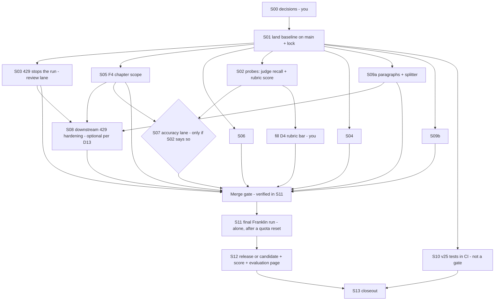

# v25 pipeline completion — roadmap and session prompts

Written 2026-09-23 from a verified assessment, then adversarially reviewed (4 reviewers) and corrected.
Everything here is paste-ready: each task is one fresh Claude Code session, started in `~/ChapterFlow`, with the prompt text between
`---PROMPT---` and `---END---` in `prompts/<task>.md`. Sessions hand off through `status/<task>.md`; the shared brief is `CONTEXT.md`;
your choices live in `DECISIONS.md`.

## The end state ("the whole pipeline work is complete")
1. All pipeline fixes on `origin/main`; the v25 suite runs in CI and is green.
2. The run-blocking wedges fixed (usage-limit blocks burning review budgets; the unlocated QC blocker; the panel rule); the rest of the
   hardening done (S08) or registered as deferred with a trigger.
3. A Franklin run on main code promoted through every gate (panel → fresh QC with the source-fidelity judge → rubric) — or, if a gate
   outcome is final for the candidate, your fallback D12 applied and the best candidate evaluated.
4. Release package built (or candidate assembled), scored with the same instruments as rev-6, accuracy re-audited, evaluation page
   delivered, `publish-final` command handed to you (release mode only).
5. Workspace cleaned, deferred items registered, memory and docs current.

Honest odds: every stage after the reader panel has never run on current code, and on the last run's history the recommended panel rule
(D2-A2) passed about 2 of 13 panels (2 of the last 7). Expect several review rounds and at least one surprise in fresh QC. The biggest unknown is the
rubric gate (80, with every factor ≥ 70): the panel's own numbers sit at ~76 and fresh readers scored rev-6 ~12 points lower, so
S02 measures it before any big spend. A promoted book is possible but not assured; D12 defines what you get if it is not.

## How to run it
1. Open `DECISIONS.md`. Fill the `CHOICE:` lines yourself, or run **S00** (interactive, ~20 min). `ACCEPT_RECOMMENDED_DEFAULTS: yes` lets
   sessions use the recommended option for anything you leave blank (D4 has no default below a probe score of 75).
2. Start a fresh session per task with the model named in the task file (Opus 5.5/5 or Sonnet 5 — never Fable for implementation), paste
   the prompt, and let it run. Each prompt loads its own skills first and works autonomously.
3. Follow the waves below. Never run more than 3 sessions at once (the weekly Claude limit is shared with the pipeline and every session).
4. When a session ends, read the first line of its `status/<task>.md`: `RESULT: DONE`, `NOT NEEDED`, `BLOCKED` (with the exact question),
   `NEEDS-OWNER`, `WAITING-FOR-RESET` or `PARTIAL`.
5. After S02 finishes, open `status/S02.md` and fill D4 (S11 will not launch without it).
6. Merges: per D10 sessions merge their own reviewed PRs, or list them for you.
7. If you choose D1 = B (stop at evaluation): run S01, S02, S04 (it does only the scoring fix), then S12 (CANDIDATE mode on the current draft), then S13.

## Dependency graph

## Waves (never more than 3 sessions at once)
| Wave | Sessions | Starts when | Wall time |
|---|---|---|---|
| 0 | S00 (you, optional) then **S01** | now | ~3 h |
| A | **S03**, **S05**, **S06** | S01 DONE | ~4–6 h |
| B | S02, S04, **S09a** | as Wave A sessions finish | ~3–5 h |
| C | S09b, S10, then S08 (only if D13 keeps it; after S03, S05, S09a merged) | as slots free up | ~3–6 h |
| D | S07 (only if S02 requires it) | S02 + S05 done | 0 or ~5 h |
| E | **S11** alone (Mac awake, terminal open) | all above merged, D4 filled, within 24 h after a Tuesday 23:00Z reset | 1.5–3 days |
| F | S12, then S13 | S11 finished (promoted, or D12-A) | ~6 h |
Bold = on the critical path. Realistic calendar: 7–10 days if S11 promotes inside one quota week; add a week for each further quota week S11 needs.

## Tasks
| Id | Task | Model | Depends on | Output |
|---|---|---|---|---|
| S00 | Owner decisions walkthrough | Sonnet/Opus, interactive | – | DECISIONS.md filled |
| S01 | Adversarially check the 3 hand-resolved commits, land the tested tree on main, move checkout to main, commit plan+kit docs, PAUSE autoresume | Opus | D1, D7, D10 | main = tested tree; docs PR |
| S02 | Probe: source-fidelity judge recall/precision on 4 audited chapters; rubric score on the current draft (≤15 model calls) | Opus | S01 | numbers for D4 and S07 |
| S03 | Defect #20: provider-blocked reviews stop the run, never burn successors; provider text journaled | Opus | S01 | PR |
| S04 | Driver: provider-block scan, knobs, autoresume forwarding, scoring workflow args; RUNBOOK.md | Sonnet + Opus review | S01 | tools + runbook |
| S05 | F4 gets a chapter location so QC repair can act (+BP15 per D5) | Opus | S01, D5 | PR |
| S06 | Panel blocks only on corroborated findings (per D2), replay-proven on the 14 stored panels | Opus | S01, D2, D3 | PR |
| S07 | Source-fidelity judge tuning — conditional | Opus | S02, S05 | PR, NOT NEEDED, or NEEDS-OWNER |
| S08 | Downstream lanes: 429s stop not burn; QC-repair judge walk; dispute successor; QC-repair re-review — optional | Opus | S03, S05, S09a merged; D13 | PR or NOT NEEDED |
| S09a | Paragraphs in deep/full reads (writer + gate); memorable-line splitter | Opus | S01 | PR |
| S09b | Franklin fact pins re-keyed to the 19-chapter map + pins for verified errors + span test | Opus | S01 | PR |
| S10 | v25 suite in CI | Sonnet + Opus review | S01 | PR + green job |
| S11 | Merge gate, final run, ride to promotion (fixing wedges via PRs) | Opus | all above, D4, D6, D12, D13 | promoted book or D12-A |
| S12 | Release (D14) or candidate assembly; 6-reader + book-score + accuracy audit; evaluation page | Opus | S11 | Artifact page |
| S13 | Closeout: hygiene, deferred register, changelog, memory | Sonnet/Opus | S12 | final report |

## Quota plan (the binding constraint)
- Last week: ~$1,600 API-equivalent in total; the pipeline used 52%, orchestration sessions 48%.
- Engineering waves A–D: roughly 7–9 PRs × $40–90 of session quota plus ≤55 probe/tuning model calls — plan for one quota week.
- S11: fresh compile ~$120, ~$32 per review-repair round, fresh QC ~190 calls, each QC-repair link ~263 calls ($60–90). With several review
  rounds and 2–4 QC-repair links, plan for $700–1,100 of pipeline quota. Start right after a reset with nothing else running, including
  other projects' agent workflows. If the cap hits, the driver stops on PROVIDER BLOCK and S11 waits for the next reset.
- S12 scoring: ~$60–120 of session quota.

## Skills wired into the prompts
| Skill | Used in | Why |
|---|---|---|
| `workflow-authoring` | S01, S03–S09b, S11, S12 | author/run workflows, incl. `templates/adversarial-fix-workflow.js` |
| `superpowers:test-driven-development` | S03, S05–S09b | RED first, observed failing |
| `superpowers:systematic-debugging` | S02, S03, S04, S08, S11 | root cause before fixes; live wedges |
| `superpowers:verification-before-completion` | every task | evidence before any "done" |
| `engineering-skills:adversarial-reviewer` | S01, S03–S10 | reviewers that default to refute |
| `engineering-advanced-skills:spec-driven-workflow` | S06 | acceptance table before the gate change |
| `engineering-skills:senior-prompt-engineer` | S02, S07, S09a | judge eval set; writer-contract wording |
| `engineering-advanced-skills:runbook-generator` | S04 | operator runbook |
| `engineering-advanced-skills:ci-cd-pipeline-builder`, `github-actions-hardening`, `github-actions-efficiency` | S10 | safe, efficient CI job |
| `engineering-advanced-skills:self-eval` | S02, S12 | honest self-scoring |
| `superpowers:finishing-a-development-branch` | S01, S13 | integration and cleanup discipline |
| `loop` | S11 | self-paced riding of a multi-day run |
| `prep-compact` | S11 | handoff before context compaction |
| `book-score` | S12 | catalog-comparable scorecard |
| `artifact-design`, `dataviz`, `humanizer` | S12 | the owner-facing evaluation page |
| `engineering-advanced-skills:tech-debt-tracker`, `engineering-advanced-skills:changelog-generator`, `si:memory-review` | S13 | deferred register, changelog, memory |
Deliberately NOT used: `superpowers:brainstorming` / `writing-plans` / `executing-plans` (the prompts are the approved design; sessions must
not interview an absent owner), Workflow `isolation:'worktree'` (would put worktrees under ~/ChapterFlow), and `superpowers:using-git-worktrees`
locations (worktrees go through `wt.sh`).

## Stop conditions you will see
- BLOCKED: a precondition or decision is missing — the status file names it.
- NEEDS-OWNER: a gate outcome or a result needs your call (e.g. rubric below what D4 allows; S07 found no variant that meets the bar).
- WAITING-FOR-RESET: S11 will not start the final run outside the post-reset window.
- No session weakens a gate without a DECISIONS entry, runs `publish-final`, or writes to `~/cf-canary` except through the driver.

## Files
- `CONTEXT.md` — shared brief (non-negotiables, verified state, blockers with file:line, paths, mechanics, traps, status protocol)
- `DECISIONS.md` — your choices D1–D14
- `prompts/S00…S13` — the session prompts
- `templates/adversarial-fix-workflow.js` — the reusable implement → 2 reviewers → ship workflow
- `tools/detqc.mts` (model-free fresh-QC replay), `tools/corrob.py` (panel corroboration recount)
- `assessment/reports/` — the 13 evidence reports; `assessment/draft-rr21/` — the current draft rendered (worth reading before D1);
  `assessment/data/`
- `status/` — one file per finished session
