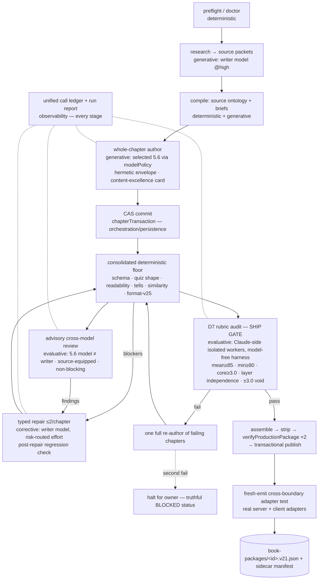

# ChapterFlow V25 — S-Tier Implementation Master Plan

**Status:** AWAITING OWNER APPROVAL — planning only; no implementation has begun.
**Date:** 2026-07-16
**Author:** Claude Fable 5 (orchestrator), from the accepted 2026-07-16 architecture audit (verdict **C — Simplify**).
**Authoritative entry point.** Supporting files: `V25_MODEL_BAKEOFF_PROTOCOL.md`, `V25_DECISION_LEDGER.md`, `V25_EXECUTION_STATUS.md`, `V25_OWNER_DECISIONS.md` (same directory). Everything else lives in this document.

---

## 1. Executive summary

The accepted audit found: sound generation-side foundations (author-first architecture, fail-closed publish machinery proven by 140 shipped packages, IMP-00/01/02/03/07/08/10/12 primitives, the D7 rubric-audit instrument, content-excellence writer stack) buried under a runaway qualification/attestation meta-layer (≈1,578 paid calls, zero books, zero complete role sets), an invalid internal quality signal (D3 rank inversion vs the owner rubric), and defaults that ignore the validated architecture (plain `book-run` still executes the blinded-panel-rejected v23 compiler; the production author route bypasses central routing and the hermetic envelope).

**This program converts V25 into the smallest pipeline that provably produces S-tier books**, defined in measurable D7 close-read units (§14), operable end-to-end from one terminal command (§WP-601), with model policy decided by a controlled Sol/Terra/Luna bakeoff (§10) — and with **GPT-5.5 removed from the target architecture entirely** (owner directive; historical 5.5 results remain as evidence only).

Major moves:
- **Simplify:** retire readiness/qualification identity campaigns from the ship path; single authoring architecture (author-first); one consolidated deterministic floor; thin the forward attestation/materializer stacks; delete superseded instruments and hygiene residue.
- **Repair:** wire D7 as the ship gate; route the author through central model policy inside the hermetic envelope; reconcile contradictory quiz-tell thresholds; add the missing fresh-emit cross-boundary schema test; unified call ledger (codex + Claude-side + latency).
- **Complete:** `generate-book` terminal contract with resume, bounded repairs, truthful exit codes; failure-injection hardening; pilot + release gate.
- **Decide by evidence:** staged Sol/Terra/Luna bakeoff on 3 fixed owner-audited chapters with sealed baselines (67.7/68.8/70.8), blinded, D7-scored, 9 preserved sample chapters for direct owner evaluation, pre-registered tie-breaks, hard call ceiling 150.

Execution: 9 lanes, 8 phases, 42 work packages (4 control-plane + 38 implementation; index §7, full schemas §8), gated integration (§9.5), Sonnet-5-xhigh/Opus-4.8-xhigh assignment policy with mandatory escalation (§12).

**Approval gate:** nothing in §8 executes until the owner approves this plan (§16).

---

## 2. Repository synchronization and isolation record

| Item | Value |
|---|---|
| Remote | `origin = https://github.com/WillSoltani/ChapterFlow.git` (fetched + pruned 2026-07-16T07:00:10-0300) |
| Authoritative V25 ref | `origin/feat/v25-pipeline-live` (open PR #401 → main, non-draft, MERGEABLE) — **not** `main`; confirmed newest by commit graph and PR state |
| Base SHA (exact) | `97b78bf710e3ac434ff78acb2eee655051d433b4` — "feat(v25): P5 v6 — packet-E assembly re-slot ruling (readiness-scoped)" |
| Dedicated branch | `plan/v25-s-tier-implementation` (created from the base SHA) |
| Dedicated worktree | `/private/tmp/cf-v25-s-tier-plan` (created 2026-07-16T07:01-0300; clean checkout; all planning artifacts created here) |
| Owner's active checkouts | `~/ChapterFlow-books` (feat/v25-pipeline @ 96ba28179) and `~/ChapterFlow` (web/native-bearer-auth) — **untouched** |

**Existing worktrees inspected (collision register):**

| Worktree | Branch/state | Collision risk |
|---|---|---|
| `/private/tmp/ChapterFlow-books-v25-live` | `feat/v25-pipeline-live` @ 97b78bf71 | **ACTIVE** — another session advanced this branch during planning (v5 erratum + v6 ruling, PR updated 2026-07-16T09:44Z). This program never writes there. Integration only via fetched refs. |
| `/private/tmp/ChapterFlow-books-v25-recovery` | `recovery/v25-pipeline-repair` @ 97b78bf71 | Active/shared — never touched |
| `/private/tmp/cf-evidence-branch` | `evidence/v25-retained-2026-07-15` @ 5ed8aed40 | PR #405 **MERGED** 2026-07-15; branch retained — never touched |
| `/private/tmp/cf-validation`, `/private/tmp/chapterflow-v25-suite-p2`, `/private/tmp/imp24b-full-suite.oxUpcT` | detached | Read-only leftovers — never touched |

**Material changes since the accepted audit (reconciled per the finding-update rule):**
1. Live advanced `577def421` → `97b78bf71`: P5 **v5** ran 84/84 calls, `BLOCKED_ROLE_READINESS` again — but **source primary qualified for the first time ever** (`gpt-5.6-sol@xhigh`, identity-scoped), reader primary `gpt-5.6-sol@high`, quiz `gpt-5.6-sol@xhigh`; audit/adjudicator roles NOT_READY. **v6** (packet-E ruling) is committed and may run in the other session → audit finding V25-01 updated: "source never qualified" is stale; the P0 (no complete frozen role set, no books, re-spend-per-identity) stands. Consequence for this plan: the identity-scoped v5 role selections become the *initial advisory-reviewer* configuration (WP-403), and campaign freeze timing is owner decision **D-1**.
2. PR #405 (evidence split) **MERGED**; #401 still carries residual raw evidence and grew to +803,642 lines / 1,794 files (v5/v6 artifacts) → finding V25-07 partially addressed; residue disposition = owner decision **D-4**.
3. The v5 result doc is committed at the base SHA (the v4-era subject/result mismatch, finding V25-06, did not recur at this head).

**Branch/worktree lifecycle policy (binding on every implementation agent):** every WP executes in this worktree or a short-lived WP branch cut from the approved integration SHA recorded in `V25_EXECUTION_STATUS.md`; one purpose per branch; no concurrent edits to the same files without explicit orchestrator coordination; no branch deleted before integration-or-rejection is verified and recorded; no worktree removed before its evidence is preserved; re-fetch + base-change assessment before every integration gate; never modify the owner's checkouts, the live/recovery worktrees, or shared branches; no force-push; no destructive resets.

---

## 3. Current-to-target delta

| Component | Current state (evidence) | Problem | Target state | Action (WPs) |
|---|---|---|---|---|
| Default architecture | `book-run` → autopilot default `"compiler"` (v23); author path behind `--author` | Panel-rejected path is the default | Author-first is the only production architecture; compiler/legacy behind regression flag, deleted at Phase 8 | 201, 207 |
| Author model route | Author writer already spawns through the hermetic envelope (`spawnCodexAgent` → `resolveRoute`, codexAgent.ts:478), but `AUTHOR_WRITER_MODEL`/`EFFORT` env pins (authorRun.ts:506-507; also authorRepair.ts:453-454) override the policy DECISION as `call-explicit`; the genuinely unenveloped stack is the claude-CLI provider-router path (`providers/router.ts`, `claudeClient.ts`) used by the v23 compiler agents, `agents/categorizer.ts`, and `critics/semantic/quizKeyJudge.ts` (audit V25-04, refined by drafter verification) | Two routing decision surfaces; one unenveloped call path; 5.5 baseline | All model calls resolve through `modelPolicy` inside a hermetic envelope; 5.6-only production matrix | 301, 302, 304, 501 |
| Ship gate | Reviewer-lane composite (invalid vs owner rubric); role qualification never converges | Optimizes a proxy; gate authority hostage to non-convergent campaigns | D7 Claude-side close-read gate (mean≥85/min≥80, layer independence, calibration void); reviewer lanes advisory | 401, 403, 202 |
| Deterministic checks | 65 critics, overlapping gate re-runs, tellRate↔lengthTell contradiction | Duplicated, contradictory, cannot rank | One consolidated floor pass, thresholds reconciled to owner norms, floor = gate not ranker | 205, 402 |
| Qualification meta-layer | V3 + P5 identity campaigns (~16k+ LOC, ≈1,578 calls, all BLOCKED) | Structurally non-convergent; consumes all budget | Retired from ship path; archived read-only; advisory roles seeded from v5 selections | 202, 203, 204 |
| Schema safety | Publish verifier structural only; no fresh-emit consumer test | Two hand-maintained adapters can drift silently | Fresh-emit → real server+client adapter CI test; semantic quiz-key check in D7 path | 101, 401 |
| CLI | ~110 verbs incl. `book-run`/`pipeline`/`flow`/autopilot variants | No single truthful end-to-end command | `generate-book` consolidated contract (resume, validate-only, exit codes) | 601–604 |
| Telemetry | Default path near-zero; tokens unmeterable; Claude-side calls unledgered | Cost/efficiency undecidable | Unified per-run ledger: every call (codex + Claude), latency, stage, outcome | 503 |
| Model policy | 5.5 baseline everywhere; SOL dormant; terra/luna one line | Violates owner directive; zero 5.6 authoring evidence | 5.6-only matrix; staged bakeoff decides writer + efforts; fail-closed unsupported-config | 302, 501, 502, 701–705 |
| Reader rendering (app) | One tier per mode, defaults fastRead | ~85% of authored prose unreachable by default | D10 progressive rendering (Standard=fast+deep, Challenge=all three) | 405 |

---

## 4. Accepted-finding disposition matrix

| Finding | Severity | Disposition | Work packages | Note |
|---|---|---|---|---|
| V25-01 zero books / role-set non-convergence | P0 | **Remove** (retire campaigns from ship path) + **validate experimentally** (bakeoff replaces qualification as the model-evidence source) | 202, 701–705 | Updated: v5 seeded advisory roles (see §2); freeze timing = owner D-1 |
| V25-02 invalid internal composite vs owner rubric | P1 | **Repair** (D7 = ship gate) | 401, 403 | Reader-lane composite demoted to advisory |
| V25-03 serial layers / one-tier render | P1 | **Repair** (app-side D10) + **prevent** (D8 layer independence at author time) | 405, 303, 401 | No catalog regeneration |
| V25-04 wrong default architecture; split routing | P1 | **Repair** + **consolidate** | 201, 301, 304 | |
| V25-05 qualification/attestation sprawl | P2 | **Simplify** (archive, dedup materializers, thin seals) | 202, 203, 204 | Deletion only after Phase-8 gate (owner D-5) |
| V25-06 HEAD artifact-integrity slip (v4) | P1 | **Repair** (process rule: result docs commit with their run) | 002 conventions; verified not recurring at base SHA | |
| V25-07 unreviewable PR payload | P1 | **Repair** (finish evidence split) | 004 + owner D-4 | #405 merged; residue remains |
| V25-08 no cross-boundary schema test | P1 | **Repair** | 101 | |
| V25-09 zero 5.6 authoring evidence; terra/luna unknown | P1 | **Validate experimentally** | 502, 701–705 | Bakeoff is the only admissible evidence source |
| V25-10 sol source-blind reviewer false-positives; sol-as-gold-evaluator residue | P1 | **Repair** (source-equipped advisory lanes; D7 replaces gold evaluator; delete residue) | 305, 403, 204 | Newer instrument shows sol roles can qualify — instrument mattered |
| V25-11 tellRate↔lengthTell contradiction | P2 | **Repair** | 402 | No safety gate weakened |
| V25-12 content-excellence unproven | P2 | **Validate experimentally** | 303, 701, 703 | Screening doubles as band-reachability keystone |
| V25-13 screening scores misused as targets | P2 | **Repair** (targets restated in D7 units only) | §14; 701 | |
| V25-14 root/package boundary; suite branch sensitivity | P2 | **Repair** (verify fixed; hermetic publish tests) | 104 | |
| V25-15 telemetry gaps; unledgered Claude calls | P2 | **Repair** | 503 | |
| V25-16 unpinned reviewer scales | P3 | **Repair** (schemas pin scales) | 403 | |
| V25-17 score-only remediation ledger | P3 | **Defer** (do not schedule work from it; regenerate per-book only on revisit) | — | Justification: no consumer in this program |
| V25-18 hygiene residue | P3 | **Remove** (partially stale on live base: zz-bakeoff fixtures and the v24 `archive/` are NOT present at 97b78bf71 — checkpoint-branch artifacts; and `config/source-reality-legacy-exemptions.json` is empty but LOAD-BEARING (validated at promote/publish-preflight) — must NOT be deleted) | 206 (re-verifies at dispatch) | Drafter-verified 2026-07-16 |
| Owner: no GPT-5.5 | directive | **Replace** | 302, 501, 504, 702 | Historical evidence untouched |
| Owner: terminal end-to-end | directive | **Complete** | 601–604, 802 | |
| Owner: 3×3 sample chapters | directive | **Complete** | 701, 703, 704 | |
| Owner: no unbounded loops / smallest architecture | directive | **Repair + verify** (caps: repair ≤2, re-author ≤1, probe ≤3/model, ceiling 150; static loop-bound check at every gate) | 404, 601, 801; gates G1–G8 | |
| Owner: V21 schema + 140 historical books untouched | directive | **Verify** (fresh-emit adapter test; D7/publish never retro-apply; hash checks on historical trees) | 101, 401, 405, 804 | |

No P0/P1/architectural finding lacks a disposition.

---

## 5. Target architecture

One authoring architecture; deterministic floor as gate (never ranker); model judgment only where deterministic logic cannot measure (D7); every loop bounded; every call ledgered.

**Stage contracts** (classification per operation):

| Stage | Class | Input → Output | Model | Validation | Retry/repair | Persistence | Failure behavior | Consumer |
|---|---|---|---|---|---|---|---|---|
| preflight/doctor | deterministic | CLI args/config → run plan | — | config, worktree cleanliness, base SHA, model support, fixtures | none | none | exit 2, no run created | orchestrator |
| research | generative | source material → source packets | writer model @high | coherence gate | ≤1 re-pass | state/research | halt `RESEARCH_INCOMPLETE` | compile |
| compile | det.+gen. | packets → sourceUsePlan + briefs | writer model @high (briefs) | contract-validate | ≤1 | state | halt | write |
| write | generative | brief + projection → chapter candidate | **selected 5.6** @ routed effort | schema-enforced output (`--output-schema`) | via repair policy | candidate workspace | candidate rejected, recorded | CAS |
| CAS commit | orch./persist. | candidate → canonical | — | validated CAS, read-back hash | n/a | state/chapters | mid-kill safe (atomic) | floor |
| floor | deterministic | chapter → verdict + blockers | — | consolidated single pass | n/a | gate attempts | blockers → repair | repair / review / D7 |
| repair | corrective | blockers → typed patch | writer model, risk-routed | floor re-run + untouched-units byte-check | **cap 2/chapter**, then ≤1 regen | patch ledger | exhaustion → halt `REPAIR_EXHAUSTED` | floor |
| advisory review | evaluative | chapter (+source evidence) → findings | 5.6 model ≠ writer where supported (WP-403 note: if the writer resolves to sol and terra/luna are unsupported, the lane runs sol at a different effort with reduced finding weight — evaluator independence is guaranteed by the Claude-side D7 gate, not this lane) | pinned-scale output schema | none (advisory) | review ledger | unavailable → recorded skip, never blocks | repair queue |
| **D7 ship gate** | evaluative | chapter set → sealed D7 receipt | Claude-side workers (zero codex) | bit-compatible rubric-v2 port; blind pair + adjudication | 1 full re-author, then halt | sealed receipts | fail → `BLOCKED_QUALITY_BAR` | publish |
| publish | det./persist. | chapters → v21 package | — | verify ×2, strip list, sidecar manifest | n/a | book-packages/ + state | fail-closed abort | app/S3 |
| cross-boundary test | deterministic | fresh package → adapter round-trip | — | real server + client adapters | n/a | CI artifact | publish flagged/rolled back | release gate |
| ledger/report | observability | all stages → per-run ledger | — | completeness check at run end | n/a | durable logs | missing entries = run defect | operator |

**Explicit classifications:** retain unchanged — CAS, publish, source ontology, typed repair core; modify — floor (consolidate), review (advisory rescope), author route (central+hermetic), CLI; merge — critics/gate re-runs; remove — qualification campaigns from ship path, superseded instruments, compiler/legacy defaults; new (justified) — cross-boundary test (V25-08), unified ledger (V25-15), D7 wiring (V25-02: check exists, wiring missing). Deterministic-from-model conversions: none needed beyond existing floor. Model-to-advisory conversions: reviewer lanes (V25-01/02).

---

## 6. Removal and simplification inventory

| Item | Disposition | WP |
|---|---|---|
| Readiness/qualification identity campaigns (P5 v1–v6, V3 stack) in the ship path | Retire + archive read-only; no new identities | 202 |
| Duplicate forward materializers (`forwardLiveArtifactMaterializer` vs `V3`, `forwardLocalActivationMaterializer` vs `V2`), singleton instrument seal | Dedup; thin to what the pilot actually uses; versioned manifest only if a seal survives | 203 |
| Stage-Q v2, closed raw drivers, `legacyReaderReviewAdapter` (ship84), `forwardGoldEvaluatorInstrument` (sol-as-gold-evaluator) | Delete (proof-of-non-use first) | 204 |
| Overlapping critics/gates (65 critics; ship/book/final/composite re-runs) | Consolidate into one floor pass mapped to D7 dimensions | 205 |
| v23 compiler default + v22 legacy path | Retire behind regression flag; write authority narrowed; delete at Phase-8 gate (owner D-5) | 201, 207 |
| GPT-5.5 in production matrices/judges/fallbacks/docs | Replace with 5.6-only + static forbidden-model checks | 501 |
| zz-bakeoff fixtures at package root, `archive/` docs, stale identity strings (README "v22", AGENTS.md "v24"), empty legacy exemptions | Sweep | 206 |
| Residual raw evidence in PR #401 | Move to evidence branch (owner D-4) | 004 |

---

## 7. Work-package index

| WP | Title | Lane | Phase | Diff. | Model | Depends on | Parallel | Gate |
|---|---|---|---|---|---|---|---|---|
| 001 | Plan docs + control plane | 0 | 0 | S | orchestrator | — | — | G0 |
| 002 | Execution status, ledger conventions, worktree registry | 0 | 0 | S | orchestrator | 001 | — | G0 |
| 003 | Finding-traceability gate | 0 | 0 | S | orchestrator | 001 | — | G0 |
| 004 | P5 freeze coordination + PR-payload reconciliation | 0 | 0 | M | orchestrator + owner | D-1, D-4 | — | G0 |
| 101 | Fresh-emit cross-boundary adapter test | 1 | 1 | M | sonnet-5@xhigh | 001 | yes | G1 |
| 102 | Internal contract freeze + contract-validate extension | 1 | 1 | M | opus-4.8@xhigh | 001 | yes | G1 |
| 103 | Run-state/resume audit + mid-kill CAS test | 1 | 1 | M | sonnet-5@xhigh | 001 | yes | G1 |
| 104 | Root/package boundary proof + hermetic publish tests | 1 | 1 | M | sonnet-5@xhigh | 001 | yes | G1 |
| 201 | Default architecture flip to author-first | 2 | 2 | H | opus-4.8@xhigh | **301**, 102 | no | G2 |
| 202 | Qualification/readiness retirement (QUARANTINE: gate verbs, archive, CLOSED docs; physical deletion deferred to WP-804) | 2 | 2 | H | opus-4.8@xhigh | D-1, 201 | no | G2 |
| 203 | Forward attestation/materializer thinning | 2 | 2 | H | opus-4.8@xhigh | 202 | no | G2 |
| 204 | Superseded instrument deletion | 2 | 2 | M | sonnet-5@xhigh | 202 | yes | G2 |
| 205 | Critic/gate consolidation → single floor pass | 2 | **4** | H | opus-4.8@xhigh | **401, 402** | no | **G4** |
| 206 | Hygiene sweep (re-verify V25-18 items at dispatch; legacy-exemptions config is load-bearing — never delete) | 2 | 2 | S | sonnet-5@xhigh | — | yes | G2 |
| 207 | Compiler/legacy retirement + write-authority narrowing | 2 | 5→8 | H | opus-4.8@xhigh | 201, 601; deletion: 802, D-5 | no | G5→G8 |
| 301 | Author route via modelPolicy (kill env-pin surface in authorRun.ts AND authorRepair.ts) | 3 | **2** | H | opus-4.8@xhigh | 302 | no | G2 |
| 302 | 5.6 writer/repair profiles + provenance | 3 | 1 | H | opus-4.8@xhigh | 102 | no | G1 |
| 303 | Content-excellence regression anchors | 3 | 3 | M | sonnet-5@xhigh | 701 | yes | G3 |
| 304 | Hermetic envelope for ALL model calls | 3 | 3 | H | opus-4.8@xhigh | 301 | no | G3 |
| 305 | Source ontology contract + source-equipped reviewers | 3 | 3 | M | opus-4.8@xhigh | 102 | yes | G3 |
| 401 | D7 ship-gate wiring | 4 | 4 | H | opus-4.8@xhigh | 201, 701, 102 | no | G4 |
| 402 | Floor threshold reconciliation | 4 | 2 | M | opus-4.8@xhigh | 102, D-9a | yes | G2 |
| 403 | Advisory cross-model review lane | 4 | 4 | H | opus-4.8@xhigh | 305, 202 | no | G4 |
| 404 | Bounded-repair verification + regression checks | 4 | 4 | M | sonnet-5@xhigh | 301 | yes | G4 |
| 405 | D10 app-side progressive rendering (separate web-app PR) | 4 | any | M | opus-4.8@xhigh | D-6 | yes (separate repo area) | G4 |
| 501 | GPT-5.5 purge + forbidden-model static checks | 5 | 1 | M | opus-4.8@xhigh | 302, D-9b | no | G1 |
| 502 | 5.6 capability probe protocol (build Phase 2, execute Phase 6) | 5 | 2→6 | S | sonnet-5@xhigh | D-3 (execution) | yes | G6 |
| 503 | Unified call ledger (codex + Claude + latency) | 5 | 5 | M | sonnet-5@xhigh | 002 | yes | G5 |
| 504 | Fallback policy without 5.5; fail-closed configs | 5 | 5 | M | opus-4.8@xhigh | 302, 501 | yes | G5 |
| 601 | `generate-book` terminal command (REDEFINES the existing verb, cli.ts:5764, currently bound to the legacy compiler) | 6 | 5 | H | opus-4.8@xhigh | 201, 301, 401, 602 | no | G5 |
| 602 | Deterministic preflight/doctor | 6 | 5 | M | sonnet-5@xhigh | 201, 301 | no | G5 |
| 603 | Progress/logs/artifacts + operator doc | 6 | 5 | S | sonnet-5@xhigh | 601 | yes | G5 |
| 604 | CLI test suite | 6 | 5 | M | sonnet-5@xhigh | 601–603 | no | G5 |
| 701 | Fixed 3-chapter corpus + sealed baselines packet | 7 | 3 | M | sonnet-5@xhigh | 001, D-7 | yes | G3 |
| 702 | Bakeoff harness re-point (judge → D7; blinding; no 5.5) | 7 | 6 | H | opus-4.8@xhigh | 401, 501, 701 | no | G6 |
| 703 | Stage-1 screening (band-reachability keystone) | 7 | 6 | H | opus-4.8@xhigh | 702, 502, D-3 | no | G6 |
| 704 | Stage-2 confirmation + Stage-3 variance + 9-sample packet | 7 | 6 | H | opus-4.8@xhigh | 703 | no | G6 |
| 705 | Model-policy decision + routing config | 7 | 7 | H | opus-4.8@xhigh | 704 | no | G7 |
| 801 | Failure-injection suite | 8 | 6 | M | sonnet-5@xhigh | 601–604 | yes | G8 |
| 802 | Pilot full-book at D7 gate | 8 | 8 | H | opus-4.8@xhigh | 705, 801 | no | G8 |
| 803 | Release-readiness packet + final acceptance | 8 | 8 | M | orchestrator | 802 | no | G8 |
| 804 | Lifecycle closure + retired-path deletion (owner D-5) | 8 | 8 | M | sonnet-5@xhigh | 803 | no | G8 |

---

## 8. Detailed work packages

### Lane 0 — Planning and control plane (orchestrator-owned)

> Schema deviation (deliberate): WP-001–004 are control-plane packages executed by the orchestrator, not dispatched to implementation agents; they carry an abbreviated schema. All 38 implementation WPs (101–804) carry the full required schema.

#### WP-001 — Plan documents and control plane
- **Lane:** 0 · **Phase:** 0 · **Difficulty:** S · **Risk:** low
- **Assigned model:** orchestrator (Claude Fable 5) · **Parallel:** n/a
- **Isolation:** dedicated worktree `/private/tmp/cf-v25-s-tier-plan` · **Base:** 97b78bf71
**Objective:** This master plan plus the four supporting files exist, internally consistent, committed on `plan/v25-s-tier-implementation`.
**Why:** program prerequisite; audit acceptance.
**Scope:** `docs/v25/implementation/*` only. **Out of scope:** all source code.
**Dependencies:** none. **Likely files:** this directory.
**Implementation instructions:** produced in this phase. **Removal:** none.
**Tests:** internal-consistency verification pass (dependency graph acyclic; every P0/P1 finding dispositioned; every WP has model, acceptance, red-team, stop conditions; no 5.5 in target architecture).
**Self-evaluation:** the §16 checklist. **Red-team:** independent consistency verifier (performed — see §16).
**Evidence:** commit SHA of the plan. **Acceptance:** owner approval requested with exact paths/SHA. **Stop:** any contradiction with repository evidence → record in ledger, do not paper over. **Escalation:** owner. **Status:** complete-pending-approval.

#### WP-002 — Execution status, ledger conventions, worktree registry
- **Lane:** 0 · **Phase:** 0 · **Difficulty:** S · **Risk:** low · **Assigned model:** orchestrator · **Parallel:** n/a
- **Isolation:** planning worktree · **Base:** 97b78bf71
**Objective:** `V25_EXECUTION_STATUS.md` tracks every WP status, every branch/worktree with purpose+owner+base SHA, every integration SHA; result-doc-commits-with-its-run rule (prevents V25-06 recurrence) is binding.
**Why:** V25-06; V25-15; prompt requirements.
**Scope/instructions:** file exists (created); orchestrator updates it before/after every wave; every implementation agent's required evidence includes its row. **Acceptance:** no WP dispatched without a registry row; no result doc committed apart from its run artifacts. **Status:** complete-pending-approval.

#### WP-003 — Finding-traceability gate
- **Lane:** 0 · **Phase:** 0 · **Difficulty:** S · **Risk:** low · **Assigned model:** orchestrator · **Parallel:** n/a
**Objective:** §4 matrix stays total: any plan deviation names affected findings/WPs and lands in the decision ledger; no P0/P1 finding may lose its disposition silently.
**Why:** drift prevention (prompt). **Acceptance:** every accepted deviation has ledger entry with reason/evidence/impact. **Status:** active for program duration.

#### WP-004 — P5 campaign freeze coordination + PR-payload reconciliation
- **Lane:** 0 · **Phase:** 0 · **Difficulty:** M · **Risk:** medium · **Assigned model:** orchestrator + owner · **Parallel:** n/a
**Objective:** the in-flight P5 v6 campaign (other session) is concluded or frozen per owner decision D-1 before Lane 2 begins; residual raw evidence in PR #401 dispositioned per D-4.
**Why:** V25-01/05/07; active collision risk (§2).
**Scope:** coordination + evidence-branch moves only; never touches the live/recovery worktrees. **Dependencies:** owner decisions D-1, D-4.
**Stop conditions:** any need to modify the live worktree or interrupt a running campaign → owner. **Status:** blocked on D-1/D-4.

### Lane 1 — Integration contracts & boundaries

#### WP-101 — Fresh-emit cross-boundary adapter test (pipeline → real web consumers)
- **Lane:** 1 — Integration contracts & boundaries · **Phase:** 1 · **Difficulty:** M · **Risk:** medium
- **Assigned model:** sonnet-5@xhigh · **Parallel:** yes (owns a NEW web-app test file + a pipeline emit-fixture harness; must not edit adapter source)
- **Isolation:** dedicated worktree/branch `wp-101-fresh-emit-adapter` (one worktree per session — multi-session pbxproj/checkout collision trap) · **Base:** integration HEAD at dispatch (Lane-0 WP-002 registry)
**Objective:** Prove a freshly emitted pipeline v21 package round-trips through BOTH real consumer adapters (server + client) with zero field loss, rejection, or misroute.
**Why (traceability):** V25-08 (no test drives a FRESH emission through the REAL adapters; publish verifier is structural only). Verified: only `scripts/book/prompts/chapterflow-v24-author-pipeline/tests/publish-final.test.ts` touches an adapter, and the app-side tests (`app/app/api/book/_lib/v21-adapter.test.ts`, `validate-book-package.test.ts`, `app/book/data/bookPackages.slim-contract.test.ts`) exercise only hand-crafted fixtures or already-shipped packages, never a fresh emission.
**Scope:** New test(s) that (1) obtain a fresh pipeline emission (the `book-packages/<id>.v21.json` bytes produced by `promoteBook.ts`, from the WP-701 fixture book), (2) feed those exact bytes through the server path `validateBookPackage` → `isV21Raw`/`adaptV21ToV13` + `enforceSemanticRules` + `enforceV21QuizFieldRules` (`app/app/api/book/_lib/validate-book-package.ts`), (3) feed the same bytes through the client path `normalizeAnyPackage` → `normalizeV21Package` + `extractV21ChapterExtras` (`app/book/data/book-package-core.ts`, `app/book/lib/v21-adapter.ts`), (4) assert field-parity for every emitted field (breakdown tiers→easy/medium/hard, quiz correctIndex present+in-range, examples, implementationPlan, reviewCards, keyTakeaway, experiencePlan/behaviorLoop survival). A small deterministic emit-fixture builder under the pipeline tests dir is allowed.
**Out of scope:** Editing ANY adapter/validator source (`validate-book-package.ts`, either `v21-adapter.ts`, `book-package-core.ts`); changing the V21 external schema; semantic quiz-key correctness (that is the D7 gate, WP-401) — this test documents that a wrong-but-in-range key passes structural adapters, it does not fix it.
**Dependencies:** WP-102 (frozen internal emission contract = the parity reference), WP-701 (fixed 3-chapter corpus provides the canonical fresh-emit fixture), WP-002 (test/ledger conventions). Fallback: bootstrap against existing `book-packages/*.v21.json` if WP-701 not landed (documented, not acceptance-sufficient).
**Likely files:** NEW `app/app/api/book/_lib/fresh-emit-adapter.test.ts` (server, `tsx --test`); NEW `scripts/book/prompts/chapterflow-v24-author-pipeline/tests/fresh-emit-web-adapter.test.ts` OR reuse `publish-final.test.ts` emit harness; read-only refs: `app/app/api/book/_lib/validate-book-package.ts:1316`, `app/app/api/book/_lib/v21-adapter.ts:360`, `app/book/lib/v21-adapter.ts:342`, `app/book/data/book-package-core.ts:301`, `scripts/book/prompts/chapterflow-v24-author-pipeline/src/promoteBook.ts:739`.
**Implementation instructions:** 1. After the test runs, a byte-identical fresh emission MUST pass `validateBookPackage` without throwing `BookApiError(422)`. 2. The SAME bytes MUST pass `normalizeAnyPackage(raw,"direct")` yielding 3 non-empty tiers and every quiz question with `correctIndex` a number in `[0, choices.length)`. 3. Every field the pipeline emits MUST be asserted either present-after-adapt or explicitly documented-as-dropped (no silent field the adapter neither keeps nor is asserted about). 4. A deliberately mutated emission with an OUT-OF-RANGE correctIndex MUST make the test fail on BOTH paths (proves the assertion has teeth). 5. Respect the server-only import trap: server test imports only `_lib/*-core`-style modules, no `server-only` chain.
**Removal/simplification:** none.
**Tests required:** `fresh-emit passes server validateBookPackage`; `fresh-emit normalizes client-side to 3 tiers + in-range keys`; `field-parity: emitted experiencePlan/behaviorLoop survive server adapt`; `negative: out-of-range correctIndex fails both adapters`; `negative: missing top-level schemaVersion misroutes to v13 and fails`.
**Agent self-evaluation checklist:** [ ] test consumes REAL emission bytes, not a hand-built object; [ ] both server AND client paths asserted; [ ] every emitted field covered; [ ] negative mutation actually fails; [ ] no adapter source edited.
**Red-team verification:** Confirm the "fresh emission" is genuinely produced by `promoteBook`/assembler (not a copied fixture the pipeline never wrote); confirm the test would FAIL if the adapter dropped `experiencePlan`; confirm no hidden `try/catch` swallows a 422; confirm the server test does not import a `server-only` module (would throw at import, masking a green); confirm the wrong-but-in-range key is only DOCUMENTED, not silently treated as caught.
**Required evidence:** branch, start/end SHA, new test file paths, `npm run test`/`tsx --test` output for the new tests, the emitted fixture bytes' sha256, out-of-scope confirmation (adapter source unchanged: `git diff --stat`).
**Acceptance criteria:** Binary: new tests exist and pass; they consume a real pipeline emission; both consumer paths asserted; a mutated out-of-range key fails; no file under the adapter set changed.
**Stop conditions:** Halt if no fresh emission fixture is obtainable and the documented `book-packages/*.v21.json` fallback cannot be justified as representative — do not fabricate an emission.
**Escalation criteria:** Sonnet → Opus if field-parity reveals an actual adapter defect (missing passthrough) requiring an adapter change (out of this WP's scope; becomes a new finding).
**Status:** not started

#### WP-102 — Internal emission-contract freeze + `contract-validate` extension
- **Lane:** 1 — Integration contracts & boundaries · **Phase:** 1 · **Difficulty:** M · **Risk:** medium
- **Assigned model:** sonnet-5@xhigh · **Parallel:** yes (additive contract + CLI verb extension; no existing descriptor edits)
- **Isolation:** dedicated worktree/branch `wp-102-internal-contract-freeze` · **Base:** integration HEAD at dispatch (Lane-0 WP-002 registry)
**Objective:** Freeze the pipeline's internal V21 emission shape as a versioned contract and make `contract-validate` fail closed on emission-shape drift.
**Why (traceability):** V25-08 (publish verifier is structural only), V25-05 (contract sprawl); the emitted `ChapterV21`/book-package shape is the load-bearing interface to the web adapters (WP-101) yet is not in the frozen manifest. Verified: `src/contracts/index.ts:87` `contractFreezeDivergences`, `src/contracts/contract-manifest.json` (16 contracts), `src/cli.ts:4498` `runContractValidate` / `:5808` case, `src/runtimeSchemas.ts:207` `validateChapterV21`.
**Scope:** (1) Add an emission-shape descriptor (the exact fields the web adapters consume — the union of keys `adaptV21ToV13`/`normalizeV21Package` read) as a new frozen contract descriptor registered in `ALL_CONTRACTS`, with a version + regenerated `contract-manifest.json` via `generateManifest.ts`. (2) Extend `runContractValidate` to also validate a sample fresh emission against `validateChapterV21` + the new emission descriptor, failing non-zero on drift. (3) Document the parity rule (a field allowed by the pipeline emission must be accepted by the web adapters) in `CONTRACTS.md`.
**Out of scope:** Editing any EXISTING contract descriptor (would move a hash and break the freeze test); changing `validateChapterV21` semantics; the V21 external schema; web adapter code.
**Dependencies:** WP-002 (contract-change conventions), WP-101 (consumes this descriptor as its parity reference — coordinate the field list). Feeds WP-101, WP-401.
**Likely files:** NEW `scripts/book/prompts/chapterflow-v24-author-pipeline/src/contracts/emissionPackage.ts`; EDIT `src/contracts/index.ts:38-55` (add to `ALL_CONTRACTS` + re-export), `src/contracts/contract-manifest.json` (regenerate), `src/contracts/CONTRACTS.md` (parity row), `src/cli.ts:4498-4531` (`runContractValidate` extension); read-only: `src/runtimeSchemas.ts:207`, `src/verifyProductionPackage.ts:393`.
**Implementation instructions:** 1. After this WP, `contract-validate` MUST exit non-zero when a fresh emission carries a field name the frozen emission descriptor does not list, OR a required field is absent. 2. The freeze test (`tests/contracts-freeze.test.ts`) MUST pass with the new descriptor and MUST fail if the descriptor is edited without a version bump. 3. No pre-existing `contractHash` may move (additive-only registration, mirroring the IMP-20/IMP-24 additive notes). 4. `CONTRACTS.md` states the emission↔web-adapter parity contract explicitly. 5. The emission descriptor field list MUST be derivable from the keys `adaptV21ToV13` + `normalizeV21Package` actually read (no invented fields).
**Removal/simplification:** none (additive). Do NOT remove superseded instrument contracts here — that is WP-204.
**Tests required:** `contracts-freeze passes with emission descriptor registered`; `contracts-freeze fails on emission descriptor edit w/o version bump`; `contract-validate exits non-zero on drifted emission fixture`; `contract-validate exits zero on a conformant fresh emission`; `no pre-existing contractHash moved` (assert the other 16 hashes unchanged).
**Agent self-evaluation checklist:** [ ] new descriptor registered additively; [ ] manifest regenerated by the tool, not hand-edited; [ ] contract-validate now covers emission shape; [ ] parity rule documented; [ ] existing 16 hashes unchanged.
**Red-team verification:** Confirm the descriptor field set matches what the web adapters actually read (not a superset that would let a dropped field pass); confirm the manifest was regenerated by `generateManifest.ts` (timestamp/freeze preserved) not hand-edited; confirm no existing descriptor was touched; confirm `contract-validate` genuinely returns non-zero (not just logs) on drift.
**Required evidence:** branch, SHAs, changed files, `contract-validate` stdout before/after on a conformant and a drifted fixture, `contracts-freeze` test output, diff showing 16 prior hashes unchanged.
**Acceptance criteria:** Binary: emission descriptor frozen + registered; manifest regenerated; `contract-validate` fails on drift and passes on conformance; freeze test green; no existing hash moved.
**Stop conditions:** Halt if the emission field set cannot be pinned from the adapters without ambiguity — record the ambiguity rather than guessing a field.
**Escalation criteria:** Sonnet → Opus if freezing exposes a genuine emission↔adapter mismatch requiring a schema decision.
**Status:** not started

#### WP-103 — Run-state/resume audit + mid-kill CAS integration test
- **Lane:** 1 — Integration contracts & boundaries · **Phase:** 1 · **Difficulty:** H · **Risk:** high
- **Assigned model:** opus-4.8@xhigh · **Parallel:** yes (test + audit; source edits only if a resume defect is confirmed)
- **Isolation:** dedicated worktree/branch `wp-103-resume-cas` · **Base:** integration HEAD at dispatch (Lane-0 WP-002 registry)
**Objective:** Prove that killing a book run mid-chapter never corrupts canonical bytes and that resume re-authors exactly the missing chapters and nothing else.
**Why (traceability):** V25-03/directive-4 (no unbounded loops; truthful resume), directive-3 (resume is part of the one terminal command). Verified two resume paths: author-first `doAuthorWrite` writes only `missing = expected.filter(n => !chapterExists)` (`authorRun.ts:1712`); v23 `generateBook` resumes via `generateChapter` cache (`generateBook.ts`). CAS commit + crash recovery exist in `chapterTransaction.ts` (`commitChapterCandidate:303` CAS `stale_base`, `recoverIncompleteCommits:614`, pending-manifest bracket).
**Scope:** (1) Audit both resume paths for correctness of the "already authored" predicate and the mid-write kill windows. (2) Add an integration test that: mints an attempt, simulates a kill between the atomic rename and bracket-close (leaves a `pending`/`pending_required_evidence` manifest), then asserts `recoverIncompleteCommits` resolves deterministically (committed vs aborted_recovered vs reconciliation_required) and that a subsequent `mintChapterAttempt` for the same chapter recovers before minting. (3) Add a resume test asserting a run over a book with N-1 committed chapters authors ONLY the 1 missing chapter (author-first path). (4) If the audit finds a real resume defect (e.g. a partially-written non-CAS artifact treated as complete), file it; fix only within the run-state seam.
**Out of scope:** Redesigning the CAS protocol; changing the default architecture (WP-201); the terminal command itself (WP-601); publish (WP-104). No new retry loops.
**Dependencies:** WP-601 (verb retirement waits for the redefined generate-book); WP-201 (author-first becomes the shipped resume path), WP-002 (worktree/run-state conventions). Uses existing `tests/chapter-transaction.test.ts`, `tests/book-run-progress.test.ts`, `tests/author-write-restore.test.ts` as siblings.
**Likely files:** NEW `scripts/book/prompts/chapterflow-v24-author-pipeline/tests/resume-mid-kill-cas.itest.ts`; read-only: `src/orchestrator/chapterTransaction.ts:120/303/614`, `src/orchestrator/authorRun.ts:1708-1712`, `src/generateBook.ts:96-136`; edit ONLY if a defect is confirmed, within `authorRun.ts`/`generateBook.ts` resume predicate.
**Implementation instructions:** 1. After this WP, a test MUST exercise a kill between canonical rename and bracket-close and assert `recoverIncompleteCommits` picks exactly one of {committed, aborted_recovered, reconciliation_required} per the canonical-hash-vs-manifest rule, with no data loss. 2. A resume test MUST assert only the missing chapter is (re)authored — a committed chapter's bytes are untouched (hash-stable across the resumed run). 3. A stale-base attempt MUST resolve to `stale_base` with canonical bytes unchanged (no overwrite, no auto-retry). 4. No test may introduce an unbounded loop or a sleep-until-pass; kill is simulated via manifest-state injection, not real signals where avoidable.
**Removal/simplification:** none unless the audit confirms a dead/incorrect resume branch (then delete it with evidence).
**Tests required:** `mid-kill pending manifest → recoverIncompleteCommits committed when canonical==committedSha`; `mid-kill → aborted_recovered when canonical!=committedSha`; `pending_required_evidence → reconciliation_required`; `resume authors only missing chapters (author-first)`; `stale_base leaves canonical untouched`.
**Agent self-evaluation checklist:** [ ] both kill windows covered; [ ] committed chapters proven byte-stable on resume; [ ] stale_base path asserted; [ ] no unbounded loop/sleep added; [ ] any source edit is minimal + evidence-backed.
**Red-team verification:** Attempt to show a kill window where canonical could be half-written and read as complete; confirm resume cannot skip a chapter whose bytes are corrupt-but-present; confirm the test actually injects a pending manifest (not a no-op); confirm no hidden auto-retry re-spends a write; confirm the v23 cache-resume path is either covered or explicitly out-of-ship-path (WP-207).
**Required evidence:** branch, SHAs, new itest path + output, manifest-state fixtures used, byte-stability hashes before/after resume, out-of-scope confirmation.
**Acceptance criteria:** Binary: mid-kill recovery deterministic and lossless in tests; resume writes only missing chapters; stale_base non-destructive; no unbounded loop introduced.
**Stop conditions:** Halt if a genuine corruption window is found that cannot be closed within the run-state seam — report it, do not patch the CAS protocol here.
**Escalation criteria:** Opus → owner if the audit finds canonical corruption reachable under a real (non-injected) kill (P0 architecture decision).
**Status:** not started

#### WP-104 — Root/package boundary proof + hermetic publish tests (kill branch sensitivity)
- **Lane:** 1 — Integration contracts & boundaries · **Phase:** 1 · **Difficulty:** M · **Risk:** medium
- **Assigned model:** sonnet-5@xhigh · **Parallel:** yes (test hardening; publish source touched only to make git-tests hermetic)
- **Isolation:** dedicated worktree/branch `wp-104-boundary-hermetic-publish` · **Base:** integration HEAD at dispatch (Lane-0 WP-002 registry)
**Objective:** Prove the root↔package TS boundary holds at one SHA and make publish tests hermetic so the full suite stops being branch/worktree-sensitive.
**Why (traceability):** V25-14 (root-vs-package TS boundary; full suite has branch/worktree sensitivity via real-git publish tests + off-main guard). Verified: root `tsconfig.json` excludes `scripts/.../state/**` but `include: **/*.ts` sweeps pipeline src; off-main guard `publishBranchError` at `src/qc/publishAfterQc.ts:226` (override `CHAPTERFLOW_ALLOW_PUBLISH_BRANCH=1`); repo-root refusal via `rev-parse --show-toplevel` in `src/publish/publishToLive.ts:150`; tests `root-compile-boundary.test.ts`, `publish-after-qc-git.test.ts`, `publish-final.test.ts`, `publish-to-live.test.ts`, `exec-spawn-boundary.test.ts`.
**Scope:** (1) Assert the root↔package boundary at the dispatch SHA (root typecheck sees pipeline src but not state; package builds independently) via/around `tests/root-compile-boundary.test.ts`. (2) Make every real-git publish test run against a temp scratch repo (init/commit in a `mkdtemp`), never the live worktree branch, so `publishBranchError` and `publishToLive`'s toplevel check are exercised deterministically regardless of the branch the suite runs on. (3) Add explicit coverage: on `main` → publish allowed; off `main` → `publishBranchError` returns the refusal; `CHAPTERFLOW_ALLOW_PUBLISH_BRANCH=1` overrides.
**Out of scope:** Changing publish behavior/semantics; the off-main policy itself; the deploy pipeline; web-app tsconfig semantics beyond the boundary assertion.
**Dependencies:** WP-002 (worktree registry + suite-run conventions), WP-201 (author-first is the shipped publish caller). Sibling of WP-103 (both harden run/publish state).
**Likely files:** EDIT/ADD `scripts/book/prompts/chapterflow-v24-author-pipeline/tests/publish-after-qc-git.test.ts`, `tests/publish-to-live.test.ts`, `tests/publish-final.test.ts`, `tests/root-compile-boundary.test.ts`; read-only: `tsconfig.json:43-51`, `src/qc/publishAfterQc.ts:226`, `src/publish/publishToLive.ts:144-160`.
**Implementation instructions:** 1. After this WP, running the publish tests from a NON-main branch/worktree MUST produce identical pass/fail as from `main` (branch sensitivity removed). 2. Each git-touching publish test MUST create and operate on its own temp git repo (`git init` in a tmp dir), never `REPO_ROOT`'s live branch. 3. A test MUST assert `publishBranchError` returns null on a temp repo checked out to `main` and a refusal string on a temp repo on any other branch, plus the env override. 4. The root-boundary test MUST assert pipeline `state/**` is excluded from the root program and that the package compiles on its own tsconfig. 5. No production publish source changes except those strictly required to accept an injected cwd/runner (record each).
**Removal/simplification:** none (test hermeticity, not deletion).
**Tests required:** `publish tests pass identically off-main and on-main`; `publishBranchError: main→null, feature→refusal, override→null`; `publishToLive refuses repo-root staged file (temp repo)`; `root program excludes pipeline state/**`; `package compiles under its own tsconfig`.
**Agent self-evaluation checklist:** [ ] no publish test reads the live branch; [ ] temp-repo isolation used throughout; [ ] off-main/on-main parity proven; [ ] root/package boundary asserted; [ ] source edits minimal + recorded.
**Red-team verification:** Run the publish suite on a feature branch and on `main` and confirm identical results; confirm a test doesn't accidentally use `REPO_ROOT` (would re-introduce sensitivity); confirm the off-main override path is tested (not just the refusal); confirm the boundary test would fail if `state/**` were re-included in the root tsconfig.
**Required evidence:** branch, SHAs, changed test files, suite output run from BOTH a feature branch and main (identical), any publish-source diff with justification, tsconfig boundary assertion output.
**Acceptance criteria:** Binary: publish tests hermetic (temp-repo, branch-invariant); off-main/on-main/override all asserted; root/package boundary proven at SHA; no publish semantics changed.
**Stop conditions:** Halt if making a test hermetic would require changing publish SEMANTICS (not just cwd injection) — record it as a separate finding.
**Escalation criteria:** Sonnet → Opus if the boundary proof reveals the root program actually type-depends on pipeline state (real architecture leak).
**Status:** not started

### Lane 2 — Pipeline simplification

#### WP-201 — Flip the default authoring architecture to author-first
- **Lane:** 2 — Simplification & Retirement · **Phase:** 2 · **Difficulty:** H · **Risk:** high
- **Assigned model:** opus-4.8@xhigh · **Parallel:** no (mutates the shared book-run/book-autopilot entrypoints and the AutopilotOptions.architecture contract that Lanes 3/4/6 build on)
- **Isolation:** dedicated branch `wp-201-author-default` off the integration SHA; no shared worktree with WP-202/207 · **Base:** approved integration SHA at dispatch (symbolic INT-P2)
**Objective:** Make `author` the single default conductor architecture for `book-run` and `book-autopilot`, with no dependence on FORWARD_ACTIVE to select it.
**Why (traceability):** V25-04 (default arch is still the v23 compiler, blinded-panel-rejected 6/6; author path only reached via FORWARD_ACTIVE or `--author`); directive 3 (one terminal command generates a book); directive 4 (smallest architecture). Verified: `architectureFromFlags` returns `"compiler"` by default (autopilot.ts:266-270); cli.ts `runBookAutopilot` upgrades to `author` only when `forwardControl.runtime.mode === "FORWARD_ACTIVE" && !explicitLegacy` (cli.ts:4124-4142); liveRun.ts `runLive` does the same (liveRun.ts:547-582); write dispatch at autopilot.ts:1229-1237.
**Scope:** `src/orchestrator/autopilot.ts` `architectureFromFlags` default branch; the architecture-resolution blocks in `src/cli.ts` `runBookAutopilot` (~4120-4142) and `src/orchestrator/liveRun.ts` `runLive` (~547-582); the AutopilotOptions.architecture doc comment (autopilot.ts:242-247); planOnly/formatOutcome labels that name the default (autopilot.ts:3010).
**Out of scope:** the writer resolution itself (WP-301), modelPolicy constants (WP-501/WP-705), the compiler/legacy code paths' existence (WP-207 retires them), D7 gate wiring (WP-401). Do NOT delete `doCompilerWrite`/`doWrite` here.
**Dependencies:** WP-301 (author writer resolves through `modelPolicy.resolveRoute` so the default author path has a real writer once the FORWARD_ACTIVE upgrade is removed); WP-102 (internal contract freeze for AutopilotOptions.architecture); WP-002 (ledger/run-state conventions).
**Likely files:** `src/orchestrator/autopilot.ts` (266-270, 242-247, 1229-1237, 3010), `src/cli.ts` (4108-4148, book-run case 5874), `src/orchestrator/liveRun.ts` (38-42 imports, 539-582).
**Implementation instructions:** (1) After this change `architectureFromFlags` returns `"author"` when neither `--legacy`/`--legacy-whole-chapter-writer` nor `--compiler` is present; `--legacy` still returns `legacy` and an explicit `--compiler` still returns `compiler` (add the explicit `--compiler` opt-in flag so the retired paths remain reachable for WP-207's regression harness). (2) Remove the `FORWARD_ACTIVE → author` upgrade branch in both `runBookAutopilot` and `runLive`; architecture is decided solely by `architectureFromFlags`. (3) The default `book-run <id>` and `book-autopilot <id>` invocations must select `author` and pass an author writer sourced from WP-301's central route (not `forwardAutopilotControl.writeOneChapter`). (4) Update every operator-facing label/usage string that calls the default "v23 compiler" to say "v24 author". (5) The `architecture` field stays REQUIRED on AutopilotOptions (no silent `?? "compiler"` default anywhere).
**Removal/simplification:** delete the `forwardControl.runtime.mode === "FORWARD_ACTIVE" && !explicitLegacy` architecture-upgrade expressions in cli.ts and liveRun.ts. Do not yet remove `resolveStandardForwardAutopilotControl` (WP-202 handles its ship-path decoupling).
**Tests required:** unit `architectureFromFlags`: no-flag→author, `--legacy`→legacy, `--compiler`→compiler, `--author`→author (extend the existing pin test). CLI-level: `book-run <id> --plan` and `book-autopilot <id> --plan` print `architecture: v24 author` with zero flags (model-free, plan-only). Contract: AutopilotOptions.architecture has no defaulting call site (grep-assert). Failure-path: `--legacy --compiler` together resolves deterministically (legacy wins, documented) and never throws.
**Agent self-evaluation checklist:** (a) default with zero flags is author in BOTH entrypoints; (b) no code path selects architecture from FORWARD_ACTIVE; (c) `--compiler`/`--legacy` still reach their paths; (d) no silent architecture default remains; (e) plan output labels match the selected architecture.
**Red-team verification:** confirm the verifier cannot find any residual path where a missing writer (no WP-301 route, no FORWARD_ACTIVE) makes the default author run fall back to `AUTHOR_WRITER_MODEL` (authorRun.ts:506) — that would re-introduce the V25-04 bypass; confirm no test still asserts "compiler" as default; confirm `--compiler` was not silently dropped (WP-207 needs it).
**Required evidence:** branch, start/end SHA, changed files, the extended flag-mapping unit test output, both `--plan` transcripts, grep proof of no architecture defaulting, out-of-scope confirmation (compiler/legacy bodies untouched).
**Acceptance criteria:** zero-flag `book-run`/`book-autopilot` resolve `author`; FORWARD_ACTIVE no longer influences architecture selection; `--legacy` and `--compiler` still resolve their paths; flag-mapping unit test green; typecheck green.
**Stop conditions:** if removing the FORWARD_ACTIVE upgrade leaves the default author path with no resolvable writer (WP-301 not yet merged), STOP and hold for WP-301 rather than wiring an env-pin fallback.
**Escalation criteria:** Sonnet would not be assigned; if the AutopilotOptions.architecture contract must change shape (not just default), Opus escalates to owner via WP-102.
**Status:** not started

#### WP-202 — Retire the readiness / qualification machinery from the ship path
- **Lane:** 2 — Simplification & Retirement · **Phase:** 2 · **Difficulty:** H · **Risk:** high
- **Assigned model:** opus-4.8@xhigh · **Parallel:** no (touches the migration-bakeoff CLI dispatch and the forward-control ship-path seam shared with WP-201/203/204)
- **Isolation:** dedicated branch `wp-202-retire-readiness` off the post-WP-201 integration SHA · **Base:** approved integration SHA at dispatch (symbolic INT-P3, includes WP-201)
**Objective:** Quarantine the entire pilot-readiness / role-qualification / forward-attestation stack so no new identity is minted and no ship-path command reaches it, without deleting retained-evidence provenance.
**Why (traceability):** V25-01 (~1,578 paid calls → zero durable outcome; fresh-identity-per-ruling re-spends the instrument); V25-05 (~46.7k src LOC of qualification/readiness/attestation for zero durable outcome); directive 4 (every mechanism needs a removal condition); target architecture ("readiness identities … forward attestation stacks … are retired from the ship path per Lane 2"). Verified: the whole family is reachable ONLY via `migration-bakeoff` subverbs (dispatch bakeoff/migration/cli.ts:2193-2291; subverb sets 254-331), never from `book-run`/`book-autopilot`.
**Scope:** (a) the `migration-bakeoff` subverb dispatch in `src/bakeoff/migration/cli.ts` — gate every readiness/qualification/attestation subverb behind a new explicit `--campaign` opt-in and refuse without it; (b) the ship-path seam: remove `book-run`/`book-autopilot` dependence on `resolveStandardForwardAutopilotControl` / FORWARD_ACTIVE now that WP-201 selects author unconditionally; (c) stamp the campaign docs under `docs/v25/` and the `state/migration-experiments/**` READMEs CLOSED; (d) a proof-of-non-use guard test asserting no ship-path module imports the forward/readiness/qualification families.
**Out of scope:** physical deletion of the forward/qualification SOURCE modules (deferred to the Phase-8 deletion gate, WP-207/WP-804, after WP-802 pilot); the V2/V3 materializer dedup (WP-203); Stage-Q/legacyReaderReviewAdapter deletion (WP-204); rubric-audit instrument (WP-401). Do NOT modify any committed `state/migration-experiments/**` evidence JSON.
**Dependencies:** WP-201 (author is default; ship path no longer needs FORWARD_ACTIVE); WP-301 (writer via modelPolicy replaces `forwardControl.writeOneChapter`); WP-004 (P5 campaign-freeze coordination + owner decision that the campaign is abandoned); WP-003 (traceability gate).
**Likely files:** orchestrator family — `forwardPilotRoleReadinessCampaign.ts`, `forwardRoleQualificationCampaignV3.ts`, `forwardRoleQualificationLive.ts`, `forwardRoleQualificationLiveV3.ts`, `forwardRetainedRoleQualificationEvidenceV3.ts`, `forwardRetainedCampaignEvidenceV3.ts`, `forwardValidationCampaign.ts`, `forwardTransportSmokeCampaignV3.ts`, `forwardTransportSmokeCorrectionV3.ts`, `forwardTransportSmokeEvidenceV3.ts`, `forwardActivation.ts`, `forwardActivationReadinessV2.ts`, `forwardInputFreeze.ts`, `forwardInputMaterialization.ts`, `forwardRoleAssignmentFreeze.ts`, `forwardRoleAssignmentFreezeV3.ts`, `forwardLocalAutopilot.ts` (resolveStandardForwardAutopilotControl:1444), `imp24eSchemaProbe.ts`, `imp24eTransportSmoke.ts`; migration family — `pilotRoleReadinessEvaluator.ts`, `pilotRoleReadinessInstrument.ts`, `pilotRoleReadinessRunner.ts`, `roleQualification.ts`, `roleQualificationRunner.ts`, `roleQualificationRunnerV3.ts`, `qualification.ts`, `imp24Corpus.ts`, `imp24DFinalAttestation.ts`, `imp24FinalAttestation.ts`, `imp24InstrumentCertification.ts`, `imp24ObservabilityFreeze.ts`, `imp24PilotGoldWorkflow.ts`, `imp24PreLiveFreeze.ts`, `imp24ProductionQualificationParity.ts`, `imp24ThresholdCoverage.ts`, `imp24fCandidateInstrument.ts`, `imp24fThresholdCoverageCertification.ts`, `imp24ActivationWorkflow.ts`; dispatch/guards — `src/bakeoff/migration/cli.ts` (254-331 subverb sets, 2193-2291 dispatch, USAGE 189), `src/bakeoff/migration/guards.ts` (CLOSED_EXPERIMENT_IDS:49). Verified subverb inventory: LOCAL_FORWARD_SUBVERBS (31), LIVE_QUALIFICATION_SUBVERBS (8), LIVE_FORWARD_SUBVERBS (4), LOCAL_QUALIFICATION_SUBVERBS (1), IMP24E_SCHEMA_PROBE_SUBVERBS (2), plus pilot-role-readiness-v1..v6.
**Implementation instructions:** (1) After this WP, every readiness/qualification/attestation subverb requires `--campaign` on the command line; invoked without it the CLI prints a CLOSED notice and exits non-zero (no side effects, no identity minted). SPLIT_LANE `close-legacy-campaign`, `retrospective`, and read-only `status` remain callable without `--campaign`. (2) After this WP, `book-run`/`book-autopilot` construct the author run WITHOUT calling `resolveStandardForwardAutopilotControl`; the FORWARD_ACTIVE runtime is no longer consulted anywhere on the ship path. (3) A guard test statically proves no module under `src/orchestrator/*` reachable from `runAutopilot`/`runLive`/`runBookAutopilot` imports any `forward*RoleQualification*`, `forwardPilotRoleReadiness*`, `imp24*`, or `pilotRoleReadiness*` module. (4) Stamp `docs/v25/GPT56_SOL_MIGRATION_MASTER_PLAN_AND_PROMPT_PACK.md` and the readiness/qualification section READMEs with a CLOSED header naming the owner decision (WP-004). (5) No new subverb may write into `state/migration-experiments/**` unless `--campaign` is present AND the target experiment id is absent from CLOSED_EXPERIMENT_IDS.
**Removal/simplification:** gate (do not delete) the subverb branches; delete only the ship-path call to `resolveStandardForwardAutopilotControl` in cli.ts/liveRun.ts. Physical source deletion is a Phase-8 gate item (WP-207/WP-804). Archive-not-delete rule: everything under `state/migration-experiments/**` is retained evidence and must remain byte-unchanged and read-only.
**Tests required:** CLI: each readiness/qualification subverb without `--campaign` exits non-zero with a CLOSED message and zero writes (model-free). CLI: `migration-bakeoff status --experiment <id>` still works without `--campaign`. Static guard: ship-path import-closure excludes the forward/readiness/qualification families (extend `tests/migration-guards.test.ts` style). Integration: `book-run <id> --plan` produces the author plan with NO reference to FORWARD_ACTIVE and no read of forward-local artifacts. Failure-path: a `--campaign` subverb targeting a CLOSED experiment id still refuses (existing `refuseClosedQualification`).
**Agent self-evaluation checklist:** (a) no ship-path command reaches the readiness/qualification stack; (b) every gated subverb fails closed without `--campaign` and mints nothing; (c) committed evidence JSON is byte-identical (git diff empty under state/migration-experiments); (d) docs carry a CLOSED stamp; (e) the static import-closure guard is green.
**Red-team verification:** attempt to reach a readiness/qualification module from `book-run`/`book-autopilot` via any transitive import or dynamic `import()`; attempt to mint a new identity by invoking a gated subverb without `--campaign`; confirm the FORWARD_ACTIVE removal did not silently change author QC/ready semantics (compare a plan-only author run before/after); confirm no committed `state/migration-experiments/**` file changed; confirm `close-legacy-campaign`/`status` remain usable.
**Required evidence:** branch, start/end SHA, changed files, gated-subverb refusal transcripts, static import-closure test output, `git diff --stat` proving zero evidence-JSON changes, before/after author `--plan` transcripts, docs CLOSED-stamp diff.
**Acceptance criteria:** binary — (1) all readiness/qualification/attestation subverbs fail closed without `--campaign`; (2) ship path has zero import/reference to the forward/readiness/qualification families; (3) zero committed evidence-JSON bytes changed; (4) static import-closure guard + CLI refusal tests green; (5) typecheck green.
**Stop conditions:** if any retained-evidence test (`imp24-*.test.ts`, `forward-*.test.ts`) fails because a gated module was made unreachable, STOP — quarantine must keep the modules compilable and their evidence tests green; do not delete source in this WP.
**Escalation criteria:** if the owner selects hard-retire (strategy b) over quarantine, or the campaign is found still live in another session (WP-004), Opus escalates to owner before proceeding.
**Status:** not started

#### WP-203 — Thin the forward materializer / attestation duplication (V2/V3 dedup, seal singleton)
- **Lane:** 2 — Simplification & Retirement · **Phase:** 2 · **Difficulty:** H · **Risk:** high
- **Assigned model:** opus-4.8@xhigh · **Parallel:** no (edits the seal + materializers imported by 18 forward modules and by retained-evidence tests)
- **Isolation:** dedicated branch `wp-203-materializer-dedup` off the post-WP-202 integration SHA · **Base:** approved integration SHA at dispatch (symbolic INT-P3b, includes WP-202)
**Objective:** Collapse each superseded IMP-23 materializer into its IMP-24 successor and reduce the production-instrument seal to a single artifact path, preserving all retained-evidence hashes.
**Why (traceability):** V25-05 (forward*.ts materializer V2/V3 duplication; singleton production-instrument seal); directive 4 (smallest architecture). Verified duplicate pairs and survivors: `forwardLiveArtifactMaterializer.ts` (IMP-23 base) is SUPERSEDED by `forwardLiveArtifactMaterializerV3.ts` (IMP-24), but V3 re-imports `assertAcceptedForwardPilotResult` + `validateForwardInputMaterializationBinding` from the base (forwardLiveArtifactMaterializerV3.ts:17-18, used 114/169/181); `forwardLocalActivationMaterializer.ts` (IMP-23) is SUPERSEDED by `forwardLocalActivationMaterializerV2.ts` (IMP-24); `forwardProductionInstrumentSeal.ts` exposes THREE artifact paths (imp22 / imp24 / imp24f — lines 26-33) to collapse to one.
**Scope:** move the two shared helpers out of `forwardLiveArtifactMaterializer.ts` into `forwardLiveArtifactMaterializerV3.ts` (or a tiny shared util) and delete the base's superseded IMP-23 composition; delete `forwardLocalActivationMaterializer.ts` after re-homing anything V2 needs; in `forwardProductionInstrumentSeal.ts` reduce imp22/imp24/imp24f seal paths to a single canonical path and update the ≤18 importers; update the base's other importers (`imp24PilotGoldWorkflow.ts`, `forwardRoleAssignmentFreezeV3.ts`, `bakeoff/migration/cli.ts`) to the survivor.
**Out of scope:** the readiness/qualification gating (WP-202); Stage-Q / gold-evaluator (WP-204); rubric-audit (WP-401). Do NOT change any retained-evidence JSON bytes; if a seal-hash changes, re-seal is out of scope and must halt for owner.
**Dependencies:** WP-202 (stack quarantined; no new identities mint during the edit).
**Likely files:** `src/orchestrator/forwardLiveArtifactMaterializer.ts` (base helpers 17-18 region of V3 consumer), `forwardLiveArtifactMaterializerV3.ts`, `forwardLocalActivationMaterializer.ts`, `forwardLocalActivationMaterializerV2.ts`, `forwardProductionInstrumentSeal.ts` (26-33, 208, 300), importers: `imp24PilotGoldWorkflow.ts`, `imp24ActivationWorkflow.ts`, `forwardRoleAssignmentFreeze(V3).ts`, `forwardRetainedCampaignEvidenceV3.ts`, `forwardTransportSmokeEvidenceV3.ts`, `forwardRoleQualificationLiveV3.ts`, `forwardLiveValidationDriver.ts`, `roleQualificationRunnerV3.ts`, `imp24PreLiveFreeze.ts`, `imp24fCandidateInstrument.ts`, `pilotRoleReadinessRunner.ts`, `imp24ObservabilityFreeze.ts`, `imp24InstrumentCertification.ts`, `bakeoff/migration/cli.ts`.
**Implementation instructions:** (1) After this WP there is exactly one live-artifact materializer (the V3 successor) and one local-activation materializer (the V2 successor); the IMP-23 base files are deleted and all imports resolve to the survivors. (2) The two shared helpers keep identical signatures and behavior (byte-for-byte outputs) so retained-evidence hashes are unchanged. (3) `forwardProductionInstrumentSeal.ts` exposes a single seal artifact path; the imp22/imp24/imp24f constants collapse to one canonical constant (retain read-only aliases only if a retained-evidence test imports the old name — else delete). (4) If the seal collapse would change any emitted seal hash, the change must be reverted and the divergence reported (do not re-seal here). (5) Every deleted file has a proof-of-non-use step (grep call sites + full suite green).
**Removal/simplification:** delete `forwardLiveArtifactMaterializer.ts` (IMP-23 base) and `forwardLocalActivationMaterializer.ts` (IMP-23) after re-homing helpers; delete the two superseded seal-path constants. Archive-not-delete rule: if any of these symbols is referenced by a committed retained-evidence identity's regeneration test, keep a thin re-export shim rather than deleting the name.
**Tests required:** unit: the moved helpers produce identical outputs to the pre-move base (golden fixtures). Contract: seal emits the same bytes/hash as before the path collapse (assert against the committed seal artifact). Suite: full `tests/` green with the base files deleted (proves non-use). Failure-path: a stale importer of a deleted path fails typecheck (compile-time proof no dangling import remains).
**Agent self-evaluation checklist:** (a) one live-artifact + one local-activation materializer remain; (b) seal exposes one path; (c) all seal/evidence hashes unchanged (git diff of emitted artifacts empty); (d) no dangling import; (e) full suite green.
**Red-team verification:** attempt to find a seal hash or retained-evidence hash that changed as a side effect of the collapse (schema/hash drift); confirm the deleted base files are truly unreferenced (no dynamic import, no test-only import left orphaned); confirm the V3/V2 survivors did not silently inherit the base's DELETED composition behavior; confirm no committed evidence JSON changed.
**Required evidence:** branch, start/end SHA, deleted-file list + grep proof-of-non-use, golden-helper diff (empty), seal-hash before/after (identical), full test output, `git diff --stat` of any emitted artifacts.
**Acceptance criteria:** IMP-23 base materializers deleted; single local-activation materializer; single seal artifact path; zero seal/evidence hash drift; full suite + typecheck green.
**Stop conditions:** if collapsing the seal changes any emitted hash, HALT and report — re-sealing retained evidence is an owner decision, not part of this WP.
**Escalation criteria:** any unavoidable hash/schema drift → Opus escalates to owner (re-seal authorization).
**Status:** not started

#### WP-204 — Delete superseded standalone instruments (Stage-Q v2, ship84 replay adapter, closed drivers, gold-evaluator residue)
- **Lane:** 2 — Simplification & Retirement · **Phase:** 2 · **Difficulty:** M · **Risk:** medium
- **Assigned model:** sonnet-5@xhigh · **Parallel:** yes (Stage-Q + legacyReaderReviewAdapter are isolated from the forward stack; the gold-evaluator item coordinates with WP-202/203 and is done last)
- **Isolation:** dedicated branch `wp-204-superseded-instruments` off the post-WP-203 integration SHA · **Base:** approved integration SHA at dispatch (symbolic INT-P4, includes WP-202/203)
**Objective:** Remove fully-superseded standalone instruments whose signal is now owned elsewhere, each with a proof-of-non-use.
**Why (traceability):** V25-05 (superseded instruments); V25-02 (D7 rubric audit supersedes the codex-side gold evaluator); directive 4. Verified: `stageQv2.ts` is superseded by `stageQv3.ts` (stageQv3.ts:5-18) and re-uses 4 fns + 3 types from it (stageQv3.ts:21-24); BOTH Stage-Q modules have zero non-self, non-test importers and appear in no CLI dispatch; `legacyReaderReviewAdapter.ts` (ship84 replay adapter) has zero non-test source importers (test-only: `tests/legacy-reader-adapter.test.ts`, `tests/split-lane-regressions.test.ts`); `forwardGoldEvaluatorInstrument.ts` pins `FORWARD_GOLD_EVALUATOR_MODEL = "gpt-5.6-sol"` (line 24) and is imported only by the forward stack (forwardLiveValidationDriver, forwardLiveArtifactMaterializer(+V3), forwardRetainedCampaignEvidenceV3).
**Scope:** delete `src/bakeoff/migration/stageQv2.ts` after re-homing the 4 fns (`spanStats`, `takeoverOccurred`, `validateCandidateContent`, `validateSecurityBoundary`) + 3 types (`CandidateContentResult`, `SecurityBoundaryResult`, `StageQv2Read`) into `stageQv3.ts`, OR delete BOTH Stage-Q modules if the owner confirms the judge-qualification instrument is abandoned; delete `src/review/legacyReaderReviewAdapter.ts` + `tests/legacy-reader-adapter.test.ts` and its reference in `tests/split-lane-regressions.test.ts`; for `forwardGoldEvaluatorInstrument.ts`, assert it is off every ship path and quarantine it WITH the WP-202 forward stack (do not hard-delete while WP-203 importers remain).
**Out of scope:** the forward materializer dedup (WP-203); the readiness/qualification gating (WP-202); the D7 gate wiring (WP-401); modelPolicy model constants (WP-501). Do NOT delete `stageQv3.ts` unless the owner confirms Stage-Q abandonment.
**Dependencies:** WP-202 (forward stack quarantined — needed before touching the gold-evaluator import graph); WP-401 (confirms D7 owns the gold-evaluator signal); owner decision on Stage-Q abandonment.
**Likely files:** `src/bakeoff/migration/stageQv2.ts`, `src/bakeoff/migration/stageQv3.ts` (imports 21-24), `tests/stage-q-v2.test.ts`, `tests/stage-q-v3.test.ts`, `tests/split-lane-regressions.test.ts`, `tests/closed-registry-sync.test.ts`, `src/review/legacyReaderReviewAdapter.ts`, `tests/legacy-reader-adapter.test.ts`, `src/orchestrator/forwardGoldEvaluatorInstrument.ts` (FORWARD_GOLD_EVALUATOR_MODEL:24) + its 4 importers.
**Implementation instructions:** (1) After this WP `stageQv2.ts` is gone and either its helpers live in `stageQv3.ts` (with `tests/stage-q-v2.test.ts` retargeted/retired) or both Stage-Q modules are gone (owner-confirmed) with both tests retired. (2) `legacyReaderReviewAdapter.ts` and its dedicated test are gone; the `split-lane-regressions.test.ts` reference is removed and that suite stays green. (3) `forwardGoldEvaluatorInstrument.ts` is proven off every ship path (import-closure) and is carried into the WP-202 quarantine set for Phase-8 deletion; the `gpt-5.6-sol` pin is documented as retired (feeds WP-501's model inventory). (4) Every deletion carries a grep-based proof-of-non-use and a full-suite-green run.
**Removal/simplification:** delete `stageQv2.ts` (+ helper move), `legacyReaderReviewAdapter.ts`, `tests/legacy-reader-adapter.test.ts`. Archive-not-delete rule: `forwardGoldEvaluatorInstrument.ts` is referenced by retained-evidence tests → quarantine, do not hard-delete here.
**Tests required:** suite green after each deletion (proof-of-non-use). Unit: re-homed Stage-Q helpers keep identical behavior (retarget `tests/stage-q-v3.test.ts`). Static: import-closure proves the ship path never imports `forwardGoldEvaluatorInstrument`. Failure-path: a dangling import of any deleted module fails typecheck.
**Agent self-evaluation checklist:** (a) `stageQv2.ts` and `legacyReaderReviewAdapter.ts` deleted with no dangling import; (b) all affected tests retargeted or retired and green; (c) gold-evaluator proven off ship path; (d) no committed evidence JSON changed; (e) typecheck green.
**Red-team verification:** confirm no dynamic `import()` or CLI subverb still resolves Stage-Q or the ship84 adapter; confirm the re-homed Stage-Q helpers behave identically (no silent scoring change); confirm the gold-evaluator was NOT hard-deleted while WP-203 importers still reference it; confirm the `split-lane-regressions.test.ts` edit did not weaken an unrelated assertion.
**Required evidence:** branch, start/end SHA, deleted-file list, grep proof-of-non-use per deletion, retargeted-test output, import-closure proof for the gold evaluator, full suite output.
**Acceptance criteria:** Stage-Q v2 + ship84 adapter deleted with green suite; gold evaluator proven off ship path and quarantined; zero evidence-JSON drift; typecheck green.
**Stop conditions:** if deleting `stageQv2.ts` would orphan `stageQv3.ts` behavior and the owner has not confirmed Stage-Q abandonment, STOP after the helper move (keep v3) and do not delete v3.
**Escalation criteria:** owner decision required on full Stage-Q abandonment and on gold-evaluator hard-deletion timing → hand to WP-202 owner-decision track.
**Status:** not started

#### WP-205 — Consolidate the deterministic critics/gates into ONE floor pass, mapped against D7
- **Lane:** 2 — Simplification & Retirement · **Phase:** 4 · **Difficulty:** H · **Risk:** high
- **Assigned model:** opus-4.8@xhigh · **Parallel:** no (mutates the gate seam consumed by generate/CAS-commit/QC/promote/publish and by WP-401/WP-404)
- **Isolation:** dedicated branch `wp-205-floor-consolidation` off the post-WP-401 integration SHA · **Base:** approved integration SHA at dispatch (symbolic INT-P4, includes WP-401)
**Objective:** Replace the multiple redundant deterministic gate re-runs with one consolidated deterministic floor pass, retiring critics whose signal the D7 ship gate now owns.
**Why (traceability):** V25-05 (mechanism sprawl); directive 4 (single mechanism, observed-failure justification, removal condition); target architecture ("ONE consolidated deterministic floor pass"). Verified gate topology: `runShipGate` (finalGate.ts:821, per-chapter) is re-run from generateChapter.ts, `runChapterGateComposite` (chapterGateComposite.ts:60, which itself calls runShipGate:77 + intraBook + authoringContract + sourceGrounding sidecar + quizKeyGate), promoteBook.ts, qc/orchestrator/deterministicGate.ts, qc/publishAfterQc.ts, qc/majorDisposition.ts, bakeoff/candidates.ts; `runBookGate` (bookGate.ts:196) at promoteBook.ts:602 + autopilot.ts:610; `runAllCritics` (runAllCritics.ts:47). D7 dimensions verified (rubricAuditInstrument.ts:52-75): 8 RUBRIC_DOMAINS, 6 core domains, 6 base gates + `layer_independence`.
**Scope:** define ONE canonical deterministic floor-pass entrypoint (built on the existing `runShipGate` + book-level `runBookGate` + intra-book checks) invoked once per chapter at CAS commit and once per book before promote/publish; retire the redundant per-stage re-invocations (generate-time, QC-deterministic-gate, promote, publish) so they call the single floor pass instead of re-composing gates; produce a critic→D7-dimension map and mark critics that duplicate a D7-owned signal as advisory-only or removed.
**Out of scope:** threshold VALUES (tellRate vs lengthTell vs owner norms — WP-402); the D7 rubric-audit ship gate itself (WP-401); bounded-repair regression checks (WP-404); model-backed critics wiring. Do NOT change any critic's detection logic here beyond removing duplicates.
**Dependencies:** WP-401 (D7 ship gate wired — determines which signals D7 owns as the gate); WP-402 (owns the numeric thresholds the floor pass reads); WP-201 (author is the default path the floor pass runs in).
**Likely files:** `src/critics/finalGate.ts` (runShipGate:821, ENFORCED_MAJOR:621, QC_ENFORCED_MAJORS:634), `src/critics/bookGate.ts` (runBookGate:196), `src/critics/chapterGateComposite.ts` (runChapterGateComposite:60, runShipGate call:77), `src/critics/runAllCritics.ts`, `src/qc/orchestrator/deterministicGate.ts`, `src/qc/publishAfterQc.ts`, `src/qc/majorDisposition.ts`, `src/promoteBook.ts` (602, 854-1062), `src/orchestrator/autopilot.ts` (610), `src/orchestrator/chapterTransaction.ts` (CAS commit gate); the ~65 critic modules under `src/critics/*` for the D7 map.
**Implementation instructions:** (1) After this WP there is exactly one deterministic-floor function; every consumer (CAS commit, QC, promote, publish-preflight) calls it rather than re-composing `runShipGate`/`runBookGate`/critics independently. (2) The floor pass runs each deterministic critic at most once per unit per book run; the ship path performs no duplicate gate re-run. (3) A committed critic→D7 map records, for every `src/critics/*` module, which D7 domain/base-gate/`layer_independence` signal it enforces; critics fully subsumed by a D7-owned signal become advisory (non-blocking) or are removed with proof-of-non-use. (4) Blocking behavior for genuinely deterministic invariants (quiz-key correctness, apparatus/scaffold leakage, banned names, schema validity) is preserved — the consolidation must not drop a blocker. (5) The floor pass is the sole deterministic input to the D7 ship gate boundary (WP-401).
**Removal/simplification:** delete the redundant gate-composition call sites at generate/QC/promote/publish that re-run `runShipGate`; remove or downgrade critics proven duplicative of a D7-owned signal (exact module list produced by the D7 map). Archive-not-delete rule: keep any critic whose signal is NOT covered by D7 (e.g. cross-book signature, intra-book similarity) as part of the floor pass.
**Tests required:** integration: a full chapter run invokes the floor pass exactly once per unit (instrument a call counter). Contract: the consolidated floor pass yields the same blocking verdicts as the pre-consolidation stack on a corpus of known-good and known-bad chapters (golden). Unit: critic→D7 map covers every `src/critics/*` module (completeness assertion). Failure-path: a corrupt quiz key / templated card / apparatus leak still BLOCKS through the single floor pass.
**Agent self-evaluation checklist:** (a) one floor-pass entrypoint; (b) no duplicate gate re-run on the ship path; (c) every critic mapped to a D7 signal or justified as D7-uncovered; (d) no blocker dropped (golden verdicts identical on the bad-chapter corpus); (e) typecheck + full suite green.
**Red-team verification:** attempt to find a deterministic blocker (quiz key, scaffold/apparatus leak, banned name, schema) that the consolidation silently downgraded to advisory; confirm no consumer still re-runs a gate outside the floor pass; confirm the D7 map is complete (no critic silently dropped without justification); confirm the floor pass verdicts match the legacy stack on the golden corpus (no false GREEN).
**Required evidence:** branch, start/end SHA, changed files, the committed critic→D7 map, call-counter instrumentation output (one pass per unit), golden verdict diff (identical blockers), bad-chapter block transcripts, full suite output.
**Acceptance criteria:** single deterministic floor pass invoked once per unit; complete critic→D7 map committed; zero blocker regressions vs the legacy stack; redundant re-runs removed; typecheck + suite green.
**Stop conditions:** if consolidating would change a blocking verdict on the golden corpus, STOP — the floor pass must be verdict-equivalent to the legacy blockers before any critic is retired.
**Escalation criteria:** if a critic's D7 coverage is ambiguous (partial overlap), Opus escalates the retain/retire decision to owner rather than guessing.
**Status:** not started

#### WP-206 — Hygiene sweep: stale identity strings and residue
- **Lane:** 2 — Simplification & Retirement · **Phase:** 2 · **Difficulty:** S · **Risk:** low
- **Assigned model:** sonnet-5@xhigh · **Parallel:** yes (docs/config-only; no overlap with source-editing WPs)
- **Isolation:** dedicated branch `wp-206-hygiene` off the current integration SHA · **Base:** approved integration SHA at dispatch (symbolic INT-P4)
**Objective:** Correct stale pipeline-identity strings and remove verified residue without touching any load-bearing config.
**Why (traceability):** V25-18 (hygiene residue: zz-bakeoff fixtures, archive/, stale identity strings README "v22"/AGENTS.md "v24", empty source-reality-legacy-exemptions). Verified at 97b78bf: `README.md` opens "# ChapterFlow v22 Optimized Autonomous" and repeats v22/v13 identity (lines 1,5,20,23,25); `AGENTS.md` opens "# ChapterFlow v24 Codex Agent Rules"; `config/source-reality-legacy-exemptions.json` has `"exemptions": []` but is LOAD-BEARING (validated at promote + publish-preflight per its `_doc`); NO `zz-bakeoff*` file exists anywhere outside state/node_modules/.git; the only `archive/` dir is `chapterflow-v21-authored/archive` (legacy pipeline, out of scope) and `source-archive/` dirs under state are retained evidence.
**Scope:** update `README.md` and `AGENTS.md` identity strings to the current pipeline identity (v24 author / v25 line) consistent with `CLAUDE.md`; re-check at dispatch for `zz-bakeoff*` fixtures and any v24 `archive/` residue and remove ONLY if present and proven unreferenced; leave `config/source-reality-legacy-exemptions.json` in place.
**Out of scope:** the GPT-5.5 model-string purge (WP-501); any `src/**` code; any `state/**` (retained evidence, including `source-archive/`); the v21-authored legacy pipeline; deleting `source-reality-legacy-exemptions.json`. Do NOT edit code comments containing `state/chapters`/`state/books` (the migration static guard greps those literals).
**Dependencies:** WP-002 (identity conventions for what the pipeline is now called); coordinate with WP-501 so identity-string edits do not collide with model-string edits.
**Likely files:** `scripts/book/prompts/chapterflow-v24-author-pipeline/README.md` (1,5,20,23,25), `scripts/book/prompts/chapterflow-v24-author-pipeline/AGENTS.md` (1), `config/source-reality-legacy-exemptions.json` (verify-only), plus any dispatch-time-discovered `zz-bakeoff*`/`archive/` residue.
**Implementation instructions:** (1) After this WP `README.md`/`AGENTS.md` name the pipeline consistently with `CLAUDE.md` (v24 author / v25 line), with no residual "v22 Optimized Autonomous" identity. (2) `config/source-reality-legacy-exemptions.json` remains present and functional; add a one-line note in the WP evidence that it was verified load-bearing (promote + publish-preflight consumers) and intentionally kept. (3) For each residue item from V25-18 (zz-bakeoff fixtures, v24 archive/), re-run the presence check at dispatch; delete ONLY with a grep proof-of-non-use, else record "not present at SHA — no action". (4) No source, state, or migration-guard-scanned comment is edited.
**Removal/simplification:** remove stale README/AGENTS identity strings; remove dispatch-verified zz-bakeoff/archive residue if present. Archive-not-delete rule: anything under `state/**` (incl. `source-archive/`) is retained evidence — never touched.
**Tests required:** doc-lint/grep: no "v22 Optimized Autonomous" string remains in README/AGENTS. Config: `source-reality-legacy-exemptions.json` still parses and its consumers (promote/publish-preflight) still load it (existing tests green). Static guard: `tests/migration-guards.test.ts` remains green (no forbidden-literal comment edited). Full suite green (no code changed).
**Agent self-evaluation checklist:** (a) README/AGENTS identity current and consistent with CLAUDE.md; (b) exemptions config untouched and still load-bearing; (c) any removed residue has a proof-of-non-use; (d) no state/ or migration-guard-scanned file touched; (e) suite green.
**Red-team verification:** confirm no `src/**` or `state/**` file changed; confirm `source-reality-legacy-exemptions.json` was NOT deleted (it is a live guard); confirm no removed file was actually referenced; confirm the migration static guard is still green (no forbidden literal edited into a comment).
**Required evidence:** branch, start/end SHA, changed files (docs only), grep proof no stale identity string remains, proof-of-non-use for any residue removed (or "not present" note), suite output, `git diff --stat` confirming zero src/state edits.
**Acceptance criteria:** README/AGENTS identity strings corrected; exemptions config retained and functional; any removed residue proven unreferenced; zero src/state edits; suite + migration guard green.
**Stop conditions:** if a supposed residue file turns out to be referenced (e.g. a fixture used by a test), STOP and leave it — do not delete referenced files.
**Escalation criteria:** if the correct current pipeline identity string is ambiguous (v24 vs v25 naming), Sonnet defers to WP-002/owner rather than choosing.
**Status:** not started

#### WP-207 — Retire the v23 compiler and v22 legacy authoring paths + narrow write-authority (Phase-8 deletion gate)
- **Lane:** 2 — Simplification & Retirement · **Phase:** 5 (quarantine) → 8 (deletion gate) · **Difficulty:** H · **Risk:** high
- **Assigned model:** opus-4.8@xhigh · **Parallel:** no (mutates the write dispatch, write-authority, and section pipeline shared with the ship path)
- **Isolation:** dedicated branch `wp-207-retire-compiler-legacy` off the post-WP-201 integration SHA · **Base:** approved integration SHA at dispatch (symbolic INT-P5, includes WP-201 + pilot WP-802 for the deletion gate)
**Objective:** Put the v23 compiler and v22 legacy authoring/write/section paths behind an explicit regression flag, narrow canonical-chapter write-authority to the conductor CAS-commit path, and define the Phase-8 gate that physically deletes them once the pilot proves non-use.
**Why (traceability):** V25-04 (default arch is the blinded-panel-rejected v23 compiler; two model stacks); V25-05 (mechanism sprawl); directive 4 (removal condition + measurable acceptance). Verified: write dispatch `architecture === "author" ? doAuthorWrite : architecture === "compiler" ? doCompilerWrite : doWrite` (autopilot.ts:1229-1237); legacy `doWrite` (autopilot.ts:1570) spawns the fanout whole-chapter writer; `doCompilerWrite` in `compilerRun.ts` drives the section deal/validate/assemble path with `acquireCompilerWriteLock` (compilerRun.ts + artifactStore.ts); canonical store `CANONICAL_STATE` (chapterPaths.ts:27). CRITICAL preservation: the author path imports compiler ONTOLOGY/BRIEF modules — `compiler/chapterBrief.ts`, `sourcePacket.ts`, `sourceUsePlanCompiler.ts`, `sourcePacketProjection.ts`, `contentDeviceDeal.ts`, `briefRotation.ts` (authorRun.ts:28-50, authorReview.ts:30-49) — and has NO real `sections/` import (authorRun.ts:415 is a comment), so the section pipeline is compiler-only.
**Scope:** (Phase 5) gate `doCompilerWrite`/`doWrite` and the section verbs (`deal-section-tasks`, `validate-sections`, `assemble-sections`, `compile-blueprints`, `blueprint-gate`) behind an explicit `--compiler`/`--legacy` regression flag (default author path never reaches them); narrow canonical-chapter write authority so only the conductor CAS-commit path (`chapterTransaction`) writes `CANONICAL_STATE` chapters, removing `acquireCompilerWriteLock`/legacy fanout write authority from the default path; add a regression harness that runs `--compiler` and `--legacy` end-to-end so the gated paths stay compilable. (Phase 8) the deletion gate that physically removes `compilerRun.ts`, `compilerTasks.ts`, `doWrite`, the section pipeline (`src/sections/*`, section verbs), and the compiler-write-only modules — AFTER WP-802 pilot proves the author ship path never imports them.
**Out of scope:** the compiler ONTOLOGY/BRIEF modules the author path consumes (chapterBrief, sourcePacket, sourceUsePlanCompiler, sourcePacketProjection, contentDeviceDeal, briefRotation) — these STAY; the default-flip (WP-201); the forward stack (WP-202/203/204). Do NOT delete anything in Phase 5 (quarantine only); physical deletion is the Phase-8 gate.
**Dependencies:** WP-201 (author is default; `--compiler`/`--legacy` are explicit opt-ins); WP-101 (fresh-emit cross-boundary adapter test proves the author output is V21-valid without the compiler/section assembler); WP-802 (pilot full-book run proves the author ship path never touches compiler/legacy/section code); WP-804 (branch/worktree closure + retired-path deletion per the end-state gate).
**Likely files:** `src/orchestrator/autopilot.ts` (1229-1237 dispatch, doWrite:1570), `src/orchestrator/compilerRun.ts`, `src/orchestrator/compilerTasks.ts`, `src/sections/*` (`sectionTasks.ts`, `assembleSections.ts`, `sectionGate.ts`), `src/artifacts/artifactStore.ts` (acquireCompilerWriteLock, COMPILER_RUN_OWNER_ENV, compilerRunRoot), `src/lib/chapterPaths.ts` (CANONICAL_STATE:27), `src/orchestrator/chapterTransaction.ts` (the sole intended writer), `src/cli.ts` (section verb cases ~5910-5920, compile-blueprints/blueprint-gate), the `compiler/*` ontology modules (PRESERVE list).
**Implementation instructions:** (1) After Phase 5 the default (author) run never invokes `doCompilerWrite`/`doWrite`/section verbs; reaching them requires an explicit `--compiler` or `--legacy` flag. (2) Canonical-chapter writes to `CANONICAL_STATE` are performed ONLY by the conductor CAS-commit path; the compiler write-lock and legacy fanout write authority are unreachable on the default path (enforce with a write-authority guard test). (3) A regression harness exercises `--compiler` and `--legacy` end-to-end so the gated paths remain compilable and typechecked until the deletion gate. (4) The compiler ONTOLOGY/BRIEF modules used by the author path remain fully live and imported. (5) The Phase-8 deletion gate is defined with a binary precondition: WP-802 pilot import-closure shows zero author-ship-path reference to `compilerRun.ts`/`doWrite`/`src/sections/*`; only then are those files deleted, each with a proof-of-non-use and a green suite.
**Removal/simplification:** Phase 5 removes the compiler/legacy branches from the DEFAULT dispatch (gated, not deleted). Phase 8 deletes `compilerRun.ts`, `compilerTasks.ts`, `doWrite`, `src/sections/*`, section CLI verbs, `acquireCompilerWriteLock`. Archive-not-delete rule: PRESERVE all `compiler/*` ontology/brief modules and anything the author path imports.
**Tests required:** write-authority guard: only `chapterTransaction` writes `CANONICAL_STATE` chapters on the default path (static + runtime). Integration: default `book-run` never calls `doCompilerWrite`/`doWrite`/section verbs (call-counter=0). Regression: `--compiler` and `--legacy` runs still typecheck and complete (until Phase-8). Phase-8 deletion: import-closure proves zero author-ship-path reference to the deleted modules; full suite green post-deletion. Failure-path: an author-path attempt to write canonical state outside the conductor is rejected.
**Agent self-evaluation checklist:** (a) default path never reaches compiler/legacy/section code; (b) canonical writes confined to the conductor; (c) ontology/brief modules preserved and live; (d) `--compiler`/`--legacy` regression harness green (Phase 5); (e) Phase-8 deletion has import-closure proof + green suite.
**Red-team verification:** attempt to find an author-path canonical write that bypasses the conductor (write-authority leak); attempt to reach `doCompilerWrite`/`doWrite`/section verbs from the default (no-flag) path; confirm the PRESERVE ontology modules were not accidentally gated/deleted (author run would break); at Phase 8, confirm no dynamic import or test still references the deleted compiler/section code (false-non-use); confirm the two-model-stack (V25-04) is genuinely gone from the default path.
**Required evidence:** branch, start/end SHA, changed files, write-authority guard output, default-run call-counter (compiler/legacy/section = 0), `--compiler`/`--legacy` regression transcripts, Phase-8 import-closure proof + deleted-file list + post-deletion suite output, out-of-scope confirmation (ontology modules untouched).
**Acceptance criteria:** (Phase 5) default path free of compiler/legacy/section code; canonical writes conductor-only; regression harness green; ontology preserved. (Phase 8) compiler/legacy/section source deleted with proof-of-non-use; single authoring architecture remains; suite + typecheck green.
**Stop conditions:** if any `compiler/*` ontology module the author path needs would be gated or deleted, STOP — those are load-bearing for author-first. Do NOT execute Phase-8 deletion before WP-802 pilot import-closure is green.
**Escalation criteria:** the Phase-8 physical deletion requires owner authorization via the WP-804 end-state deletion gate; Opus escalates to owner before deleting.
**Status:** not started

### Lane 3 — Generation architecture

#### WP-301 — Author route through `modelPolicy.resolveRoute` (kill the `AUTHOR_WRITER_MODEL` parallel surface)
- **Lane:** 3 — Author path & model routing · **Phase:** 2 · **Difficulty:** M · **Risk:** high
- **Assigned model:** opus-4.8@xhigh · **Parallel:** no (touches the author write + repair spawn seam consumed by many callers; single owner)
- **Isolation:** dedicated worktree/branch `wp-301-author-resolveroute` · **Base:** integration HEAD at dispatch (after WP-302 lands the author cell)
**Objective:** Make the author write and repair sessions derive model+effort from `resolveRoute({role:"author-writer"|"author-repair"})`, deleting the env/module-const pin as the production decision surface.
**Why (traceability):** V25-04 (production author route via `AUTHOR_WRITER_MODEL` env pin BYPASSES the modelPolicy decision), directive-1/2 (model choice must come from central policy/bakeoff, not env), directive-4 (one authority). Verified: `authorRun.ts:506-507` `AUTHOR_WRITER_MODEL = process.env.CHAPTERFLOW_AUTHOR_MODEL ?? BASELINE_MODEL` / `AUTHOR_WRITER_EFFORT = CHAPTERFLOW_AUTHOR_EFFORT ?? "xhigh"`; consumed at the write spawn `authorRun.ts:1137-1138,1347-1348` and the repair spawn `authorRepair.ts:453-454`. The spawn already flows through `spawnCodexAgent` → `resolveRoute` (`codexAgent.ts:478`), but the pinned model rides as a `requestedModel` call-explicit override, so the policy MATRIX cell is never consulted for production authoring.
**Scope:** Replace the env/module-const author-model/effort default with a `resolveRoute`-derived default for the author-writer and author-repair roles; keep an EXPLICIT opts-level override (`opts.model`/`opts.effort`) for tests and the bakeoff (recorded tier="call-explicit"); remove `CHAPTERFLOW_AUTHOR_MODEL`/`CHAPTERFLOW_AUTHOR_EFFORT` as production inputs. Provenance must record that production authoring used tier="normal-profile".
**Out of scope:** Purging the literal `"gpt-5.5"`/`BASELINE_MODEL` value and forbidden-model static checks (WP-501 owns that); designing the 5.6 author cell/matrix (WP-302 owns that — this WP consumes it); the hermetic envelope mechanics (WP-304); flipping the default architecture (WP-201).
**Dependencies:** WP-302 (provides the `author-first-write`/`routine-repair` matrix cell resolveRoute returns), WP-501 (coordinated boundary: WP-501 removes the literal, WP-301 removes the env-decision surface). Feeds WP-302 provenance + WP-503 ledger.
**Likely files:** EDIT `scripts/book/prompts/chapterflow-v24-author-pipeline/src/orchestrator/authorRun.ts:499-508,1137-1138`, `src/orchestrator/authorRepair.ts:27,453-454`; read-only: `src/orchestrator/modelPolicy.ts:256` `resolveRoute`, `src/orchestrator/codexAgent.ts:478`.
**Implementation instructions:** 1. After this WP, a production author write with no explicit opts MUST resolve its model+effort from `resolveRoute({role:"author-writer"})` and record tier="normal-profile" in the route sidecar. 2. `CHAPTERFLOW_AUTHOR_MODEL`/`CHAPTERFLOW_AUTHOR_EFFORT` MUST no longer influence the production author model (removed or inert with a fail-loud note; not silently honored). 3. `opts.model`/`opts.effort` (tests/bakeoff) still win and are recorded as call-explicit. 4. `authorRepair` MUST route through the same policy for its role. 5. An invalid resolved model/effort MUST fail closed via the existing `RoutePreflightError` (no silent fallback).
**Removal/simplification:** Delete the `process.env.CHAPTERFLOW_AUTHOR_MODEL`/`CHAPTERFLOW_AUTHOR_EFFORT` reads in `authorRun.ts:506-507`; remove the `AUTHOR_WRITER_MODEL`/`AUTHOR_WRITER_EFFORT` module consts if no longer needed after routing (or reduce to a `resolveRoute`-backed accessor). Update `authorRepair.ts` import accordingly.
**Tests required:** `production author write resolves via resolveRoute (tier=normal-profile)`; `env CHAPTERFLOW_AUTHOR_MODEL no longer changes production author model`; `opts.model override still wins (tier=call-explicit)`; `author-repair routes through policy`; `invalid resolved effort fails closed`.
**Agent self-evaluation checklist:** [ ] production authoring reads the policy cell, not env; [ ] env pins removed/inert; [ ] test/bakeoff override preserved; [ ] repair path covered; [ ] fail-closed on invalid route.
**Red-team verification:** Grep for any remaining `CHAPTERFLOW_AUTHOR_MODEL`/`AUTHOR_WRITER_MODEL` read reachable from a production author spawn; confirm no default silently falls back to `BASELINE_MODEL` outside the policy; confirm the route sidecar records tier="normal-profile" for production; confirm authorRepair no longer imports the env pin; confirm tests/bakeoff can still pin explicitly.
**Required evidence:** branch, SHAs, changed files, route-sidecar before/after showing tier flip, grep proving env pin no longer reachable in the author ship path, test output, out-of-scope confirmation (no literal purge here).
**Acceptance criteria:** Binary: production authoring derives model/effort from resolveRoute; env pins removed as production inputs; explicit override preserved; repair covered; invalid route fails closed.
**Stop conditions:** Halt if WP-302's author cell is not yet defined (nothing valid to resolve to) — do not hardcode a stopgap model.
**Escalation criteria:** Opus → owner if removing the env pin would strand an operator workflow that has no policy equivalent.
**Status:** not started

#### WP-302 — 5.6 writer/repair profiles + matrix redesign (no GPT-5.5) with call-explicit provenance
- **Lane:** 3 — Author path & model routing · **Phase:** 1 · **Difficulty:** H · **Risk:** high
- **Assigned model:** opus-4.8@xhigh · **Parallel:** no (rewrites the central routing table; single owner)
- **Isolation:** dedicated worktree/branch `wp-302-56-matrix` · **Base:** integration HEAD at dispatch (after WP-705 model decision is available as input)
**Objective:** Replace the GPT-5.5 baseline and profile matrices with a 5.6-only production matrix whose winning model+effort per role is a config value sourced from the bakeoff.
**Why (traceability):** directive-1 (GPT-5.5 removed as writer/reviewer/repair/fallback/baseline), directive-2 (candidates gpt-5.6-sol/terra/luna via controlled bakeoff), V25-01/V25-09/10. Verified: `modelPolicy.ts:33` `BASELINE_MODEL="gpt-5.5"`, `:51` `NORMAL_PROFILE="baseline-55"`, `:84-102` `BASELINE_55` matrix, `:108-114` `SOL_HIGH`/`SOL_XHIGH` hardcode `"gpt-5.6-sol"`, `:30` `ROUTE_POLICY_VERSION`; `executionEnvelope.ts:59,131` re-export `BASELINE_MODEL` + `makeProfile→policyResolveRoute`; `executionProfile.ts` `defaultModel` required-explicit.
**Scope:** (1) Replace `BASELINE_MODEL`/`NORMAL_PROFILE`/`BASELINE_55` and the SOL candidate matrices with a 5.6 production matrix + named 5.6 candidate profiles (sol/terra/luna at the bakeoff-decided efforts), keeping the `author-first-write`, `routine-repair`, `chapter-direct-read`, `acceptance` cells that WP-301/305/403 consume. (2) Make the winning model+effort a config the bakeoff (WP-705) sets, not a code literal buried in the matrix. (3) Bump `ROUTE_POLICY_VERSION` (stales prior qualification — intended). (4) Keep `resolveRoute`/`ResolvedRoute`/`buildRouteResult` call-explicit provenance intact so bakeoff cells and tests still pin per call. (5) Update `executionEnvelope.makeProfile` defaults to resolve through the new policy.
**Out of scope:** Purging `"gpt-5.5"` literals OUTSIDE modelPolicy/executionEnvelope + the forbidden-model static/hygiene tests (WP-501); the author call-site rewiring (WP-301); running any bakeoff or live probe (WP-703/704); terra/luna existence verification (WP-502). BOUNDARY: WP-302 owns the matrix/profile SHAPE + BASELINE value; WP-501 owns literal removal + static guards; the model CHOICE is a WP-705 input.
**Dependencies:** WP-705 (model-policy decision + effort from evidence — provides the winning cell values), WP-502 (terra/luna capability confirmation gates whether they can be a matrix cell), WP-004 (campaign-freeze reconciliation for stale qualification). Feeds WP-301, WP-304, WP-403, WP-501.
**Likely files:** EDIT `scripts/book/prompts/chapterflow-v24-author-pipeline/src/orchestrator/modelPolicy.ts:30-131`, `src/exec/executionEnvelope.ts:56-60,123-150`; read-only: `src/contracts/executionProfile.ts`, `src/contracts/routeContracts.ts`.
**Implementation instructions:** 1. After this WP, `resolveRoute({role:"author-writer"})` MUST return a gpt-5.6 model + the bakeoff-decided effort with tier="normal-profile", and NO code path may return `"gpt-5.5"` from the normal profile. 2. The winning model+effort MUST be a single documented config value (per role/task-class) the bakeoff sets — changing the winner is a config edit, not a matrix rewrite. 3. `ROUTE_POLICY_VERSION` MUST be bumped so prior qualification evidence stales loudly. 4. `makeProfile`/`EXECUTION_PROFILES` MUST resolve defaults through the new policy (no separate 5.5 default anywhere). 5. Candidate profiles for sol/terra/luna MUST exist as data (for WP-703/704) without becoming the normal profile until authorized. 6. `resolveRoute` still fail-closes on invalid model id/effort.
**Removal/simplification:** Delete `baseline-55`/`BASELINE_55` and the `"gpt-5.5"` baseline value from `modelPolicy.ts`; delete or rename the SOL-only `sol-high-candidate`/`sol-xhigh-candidate` into the general 5.6 candidate set. Coordinate with WP-501 so no orphan `gpt-5.5` literal remains.
**Tests required:** `resolveRoute author-writer returns gpt-5.6 (normal-profile tier)`; `no normal-profile route returns gpt-5.5`; `ROUTE_POLICY_VERSION bumped`; `EXECUTION_PROFILES default models are 5.6, validateExecutionProfile passes`; `candidate profiles exist as data, not normal`; `invalid model/effort still fails closed`.
**Agent self-evaluation checklist:** [ ] no 5.5 reachable from normal profile; [ ] winner is a config value; [ ] policy version bumped; [ ] envelope defaults resolve through policy; [ ] candidate profiles inert; [ ] call-explicit provenance preserved.
**Red-team verification:** Grep modelPolicy + executionEnvelope for any residual `gpt-5.5`/`baseline-55`; confirm the winning model isn't hardcoded in two places (single source); confirm `ROUTE_POLICY_VERSION` change actually re-fingerprints (routeDriftFingerprint); confirm terra/luna cells aren't asserted before WP-502 confirms them; confirm the normal profile still has a matrix (not "call-explicit") so unpinned calls don't throw.
**Required evidence:** branch, SHAs, changed files, `normalRouteMatrix()` output before/after, policy-version diff, test output, boundary note confirming no literal purge outside these two files.
**Acceptance criteria:** Binary: normal profile is 5.6-only; winner is config-sourced; policy version bumped; envelope defaults resolve through policy; candidate profiles present but inert; fail-closed intact.
**Stop conditions:** Halt if WP-705's model decision is unavailable — do not pick a winner unilaterally; encode the matrix shape with an explicit "awaiting WP-705 decision" placeholder cell that fails closed rather than defaulting.
**Escalation criteria:** Opus → owner if the bakeoff has not produced a qualified 5.6 winner by dispatch (blocks a real production matrix).
**Status:** not started

#### WP-303 — Content-excellence stack regression anchors (sealed baseline chapters)
- **Lane:** 3 — Author path & model routing · **Phase:** 3 · **Difficulty:** M · **Risk:** medium
- **Assigned model:** sonnet-5@xhigh · **Parallel:** yes (adds deterministic regression anchors; does not change invariant thresholds)
- **Isolation:** dedicated worktree/branch `wp-303-content-excellence-anchors` · **Base:** integration HEAD at dispatch (Lane-0 WP-002 registry)
**Objective:** Pin the content-excellence write-time invariants (F-1..F-8) as deterministic regression anchors against sealed baseline chapters so a future author/prompt change that regresses them fails a test.
**Why (traceability):** V25-12 (content-excellence tracks landed but NO before/after result exists; band reachability unproven), D8 Chapter Format v25. Verified: `authorRun.ts` invariants — `authorWriteContractFindings:513` (example-count range, lead-thread presence D7, practice-timer sanity D9), `authorSelfVerify:428`, `authorCardComposition:478`; `docs/v25/CHAPTER_FORMAT_V25.md` (F-1..F-8, 4431 bytes).
**Scope:** (1) Seal a small set of baseline chapters (from the WP-701 fixture corpus) as golden anchors. (2) Add deterministic tests that run `authorWriteContractFindings` + the self-verify/format-block invariants against each anchor and assert the CURRENT findings set (byte/finding-stable), so a change to the invariant logic or the format block is caught. (3) Map each F-1..F-8 requirement to at least one anchor assertion, documenting which invariant enforces it. (4) Record the anchors' content hashes.
**Out of scope:** Changing any invariant threshold or F-1..F-8 semantics (owner decision); the D7 rubric ship gate (WP-401); the tellRate/lengthTell reconciliation (WP-402); running any model call (anchors are deterministic).
**Dependencies:** WP-701 (sealed baseline chapters), D8 (`CHAPTER_FORMAT_V25.md`), WP-002 (fixture conventions). Feeds WP-802 (pilot compares against these anchors).
**Likely files:** NEW `scripts/book/prompts/chapterflow-v24-author-pipeline/tests/content-excellence-anchors.test.ts`; read-only: `src/orchestrator/authorRun.ts:428,478,513`, `docs/v25/CHAPTER_FORMAT_V25.md`; anchor fixtures under `tests/fixtures/` (or WP-701's corpus dir).
**Implementation instructions:** 1. After this WP, each sealed anchor MUST have a deterministic expected findings set from `authorWriteContractFindings`, asserted exactly. 2. Every F-1..F-8 requirement MUST map to ≥1 anchor assertion (documented in the test). 3. A deliberately mutated anchor (e.g. lead thread removed from fastRead) MUST flip the expected finding (proves teeth). 4. Anchors are frozen by content hash; a hash change requires an explicit re-seal note. 5. No model call, no network, no threshold edits.
**Removal/simplification:** none.
**Tests required:** `anchor N: authorWriteContractFindings matches sealed expectation`; `F-1..F-8 each mapped to an anchor assertion`; `negative: lead-thread-removed anchor flips D7 finding`; `negative: padded-example anchor flips B15 finding`; `anchor content hashes stable`.
**Agent self-evaluation checklist:** [ ] anchors sealed by hash; [ ] every F-x mapped; [ ] negative mutations flip findings; [ ] deterministic (no model call); [ ] no threshold changed.
**Red-team verification:** Confirm the anchors are real chapters (not synthetic minimal stubs that never exercise the invariants); confirm each F-x mapping actually exercises the named invariant (not a trivially-true assertion); confirm a mutation flips the finding (anchor isn't inert); confirm no invariant threshold was edited to make an anchor pass.
**Required evidence:** branch, SHAs, new test path + output, anchor hashes, F-1..F-8→assertion map, negative-mutation output, out-of-scope confirmation (invariant source unchanged).
**Acceptance criteria:** Binary: sealed anchors exist; deterministic findings asserted; F-1..F-8 mapped; negative mutations flip; hashes recorded; no threshold changed.
**Stop conditions:** Halt if WP-701 baseline chapters are unavailable and no representative real chapter exists to seal — do not synthesize a stub anchor.
**Escalation criteria:** Sonnet → Opus if pinning current findings reveals an invariant that is already inconsistent (a real defect, not an anchoring task).
**Status:** not started

#### WP-304 — Hermetic envelope coverage for ALL ship-path model calls (close the stack-A gap)
- **Lane:** 3 — Author path & model routing · **Phase:** 3 · **Difficulty:** H · **Risk:** high
- **Assigned model:** opus-4.8@xhigh · **Parallel:** no (touches the model-call boundary + a static guard many modules depend on)
- **Isolation:** dedicated worktree/branch `wp-304-hermetic-coverage` · **Base:** integration HEAD at dispatch (after WP-207 retires most stack-A callers)
**Objective:** Ensure every model call reachable from the author-first ship path runs through the hermetic codex envelope, and add a static guard that forbids provider-router calls in ship-path modules.
**Why (traceability):** V25-04 ("two model stacks"), V25-15 (Claude-side calls unledgered). DECISION (verified against code): route residual ship-path calls through the EXISTING codex envelope pattern (`spawnCodexAgent`), because building a parallel hermetic envelope for the provider router is net-new machinery the code does not already support, whereas every role already has an `EXECUTION_PROFILES` entry and `spawnCodexAgent` is the one spawn seam. Verified: author-writer/repair/research/reviewer already flow through `spawnCodexAgent`→`executionEnvelope`; the NON-hermetic "stack A" is the provider router (`src/providers/router.ts:89` `callModel`) via `src/claudeClient.ts` used by `src/generateChapter.ts` + all `src/agents/*` (categorizer, writer-*, researcher-*, etc.) + `src/critics/semantic/quizKeyJudge.ts` + `src/curator/exampleSelector.ts`. `tests/exec-spawn-boundary.test.ts` already guards codex spawns but NOT provider-router calls.
**Scope:** (1) Enumerate every model-call entry point reachable from the author-first ship path (post WP-207 compiler retirement) and prove each is a `spawnCodexAgent` (envelope) call. (2) For any residual ship-path provider-router call (e.g. the categorizer if still invoked on the ship path, or a semantic critic), route it through a codex-envelope spawn with an appropriate role, OR fail-close it out of the ship path. (3) Extend `exec-spawn-boundary.test.ts` (or add a sibling static scan) to assert NO ship-path module imports/calls `callModel`/`claudeClient`. (4) State the "route through codex envelope" decision + justification in the module docs.
**Out of scope:** The full compiler/legacy retirement itself (WP-207 — this WP assumes it and covers residue); rewriting the provider router for non-ship-path/eval uses (bakeoff, evals may keep it if outside the ship path); the unified ledger implementation (WP-503 consumes the envelope records this produces); model choice (WP-302).
**Dependencies:** WP-207 (retires the v23 compiler/generateChapter callers — the bulk of stack A), WP-301 (author route through policy), WP-503 (ledger keys on envelope route sidecars). Coordinates with `exec-spawn-boundary.test.ts` owner conventions.
**Likely files:** EDIT `scripts/book/prompts/chapterflow-v24-author-pipeline/tests/exec-spawn-boundary.test.ts` (extend scan) OR NEW `tests/provider-router-ship-path-boundary.test.ts`; possibly EDIT `src/generateBook.ts` categorizer call / `src/agents/categorizer.ts` (route via envelope) if it remains on the ship path; read-only: `src/providers/router.ts:89`, `src/claudeClient.ts:21`, `src/orchestrator/codexAgent.ts:417-536`, `src/exec/executionEnvelope.ts:155-181`.
**Implementation instructions:** 1. After this WP, a static scan MUST fail if any ship-path module (author-first orchestration + its transitive imports, minus explicitly-listed eval/bakeoff modules) imports `claudeClient`/`providers/router` or calls `callModel`. 2. Every ship-path model call MUST resolve to a `spawnCodexAgent` invocation carrying an agent role (activating the envelope). 3. Any residual provider-router ship-path call MUST be either re-homed to a codex-envelope spawn or removed from the ship path (recorded). 4. The chosen mechanism (codex envelope, not a new router envelope) MUST be justified in-code with the "least new machinery" reason. 5. No new `...process.env` spread (the existing single legacy spread stays the only one).
**Removal/simplification:** Remove ship-path imports of `claudeClient`/`callModel` (re-home to envelope). Do NOT delete the provider router if non-ship-path callers (evals/bakeoff) still need it — scope the ban to the ship path.
**Tests required:** `no ship-path module imports claudeClient/providers-router`; `every author-first model call site declares a codex agent role`; `categorizer (if on ship path) runs via envelope`; `exec-spawn-boundary invariants still hold`; `single ...process.env spread preserved`.
**Agent self-evaluation checklist:** [ ] ship-path model-call inventory complete; [ ] each proven hermetic; [ ] static ban added + passing; [ ] residual router calls re-homed or removed; [ ] no new env spread.
**Red-team verification:** Trace the author-first entrypoint (autopilot/authorRun) transitively and confirm NO reachable `callModel`; confirm the static scan's ship-path set isn't drawn so narrowly it misses the categorizer/quizKeyJudge; confirm a re-homed call actually goes through `spawnCodexAgent` (not a shim that still hits the router); confirm eval/bakeoff exclusions are explicit, not a blanket exemption; confirm no hidden fallback to the router on codex failure.
**Required evidence:** branch, SHAs, ship-path model-call inventory, changed files, static-scan output (fail-before/pass-after on a planted violation), grep proving no ship-path router import remains, out-of-scope confirmation.
**Acceptance criteria:** Binary: every ship-path model call is hermetic (codex envelope); static ban present and enforced; residual router calls re-homed/removed; eval/bakeoff exclusions explicit; no new env spread.
**Stop conditions:** Halt if WP-207 has not retired the compiler callers (the ship-path set would be ambiguous) — do not guess which agents are ship-path.
**Escalation criteria:** Opus → owner if a required ship-path capability (e.g. categorization) has no codex-envelope equivalent and cannot be made deterministic.
**Status:** not started

#### WP-305 — Source ontology/projection contract + source-equipped reviewer inputs
- **Lane:** 3 — Author path & model routing · **Phase:** 3 · **Difficulty:** H · **Risk:** high
- **Assigned model:** opus-4.8@xhigh · **Parallel:** no (freezes a cross-lane contract the review lane depends on)
- **Isolation:** dedicated worktree/branch `wp-305-source-equipped-reviewer` · **Base:** integration HEAD at dispatch (Lane-0 WP-002 registry)
**Objective:** Freeze the source-use ontology + the reviewer source-projection, and guarantee the advisory review's source lane is EQUIPPED with the full source truth (packet+sidecar+plan+anchors), never source-blind.
**Why (traceability):** V25-09/10 (sol-as-source-BLIND reviewer false positives, cleanPass 0.125 was partly INSTRUMENT — source-blind lane); the fix is a source-EQUIPPED lane. Verified: the source-equipped machinery exists — `src/contracts/sourceIntegrityReview.ts` (5 binding hashes: chapterContent/sourceUsePlan/sourcePacket/sidecar/schema; "the ONLY lane with external-factual-truth authority"), `src/review/sourceIntegrityReview.ts:199` `assembleSourceReviewPacket` (binds packet+sidecar+anchorCatalog+required unit ids), `src/compiler/sourceUsePlanCompiler.ts:48` compiler ownership of origin/form/claim-strength, `src/compiler/sourcePacketProjection.ts:119` `writerPacketProjection` (the WRITER's dieted projection — deliberately NOT the reviewer's).
**Scope:** (1) Freeze the source-use ontology contract (`sourceUsePlan.ts` origin/form/claim-strength enums) + the REVIEWER source-projection (the fuller-than-writer input `assembleSourceReviewPacket` builds) as versioned contracts so drift stales the review. (2) Verify/wire the advisory review source lane (WP-403) to consume `assembleSourceReviewPacket` (source-equipped) rather than the source-blind reader document. (3) Assert the reviewer projection carries the source truth needed to adjudicate invented-detail/fabrication WITHOUT the source-blind false-positive class (a legitimately source-bound named example must be adjudicable as SUPPORTED, not flagged invented). (4) Keep the writer's bounded projection distinct from the reviewer's fuller projection.
**Out of scope:** The advisory review lane runtime/non-blocking composition (WP-403 owns it — this WP supplies the source-equipped inputs contract); reviewer MODEL selection (WP-302); the D7 rubric ship gate (WP-401); changing compiler ontology semantics.
**Dependencies:** `sourceUsePlan.ts` contract (exists), WP-102 (contract-freeze conventions), WP-302 (reviewer model must be a DIFFERENT 5.6 than the writer). Feeds WP-403 (advisory source lane consumes this), WP-404 (repair from source findings).
**Likely files:** EDIT/ADD `scripts/book/prompts/chapterflow-v24-author-pipeline/src/contracts/sourceUsePlan.ts` (version/ontology freeze), NEW reviewer-projection descriptor or extend `src/contracts/sourceIntegrityReview.ts`; read-only/wire: `src/review/sourceIntegrityReview.ts:199` `assembleSourceReviewPacket`, `src/review/forwardProductionReviewV2.ts` (V2 assembly with 5 hashes), `src/compiler/sourcePacketProjection.ts:119`.
**Implementation instructions:** 1. After this WP, the source-use ontology + reviewer source-projection are frozen contracts; a change to either stales dependent reviews (hash-bound). 2. The advisory source lane MUST receive packet+sidecar+plan+anchorCatalog (via `assembleSourceReviewPacket`), and its output MUST carry all five binding hashes — a source verdict produced without the source artifacts MUST be rejected as not-fresh. 3. A source-bound named example WITH ≥1 anchor MUST be adjudicable SUPPORTED (not INCONCLUSIVE/invented) given the equipped inputs — add a test fixture proving the source-blind false-positive class is unreachable when equipped. 4. The reviewer projection MUST remain distinct from `writerPacketProjection` (reviewer sees more); do not collapse them. 5. Missing evidence still yields INCONCLUSIVE (fail-closed), never a guessed PASS.
**Removal/simplification:** none additive; if a stale source-blind reader-doc source lane exists in the ship path, mark it for removal in coordination with WP-403 (do not delete cross-lane here without WP-403).
**Tests required:** `source ontology + reviewer-projection freeze (drift stales review)`; `advisory source lane receives packet+sidecar+plan+anchors`; `source verdict without the 5 bound hashes is rejected as not-fresh`; `equipped: anchored source_bound example adjudicable SUPPORTED (no false invented flag)`; `missing evidence → INCONCLUSIVE (fail-closed)`; `reviewer projection ≠ writerPacketProjection`.
**Agent self-evaluation checklist:** [ ] ontology + reviewer projection frozen; [ ] source lane equipped (5 hashes bound); [ ] false-positive class unreachable when equipped; [ ] writer/reviewer projections distinct; [ ] fail-closed on missing evidence.
**Red-team verification:** Attempt to feed the source lane the reader document alone and confirm it is rejected as not-fresh (not silently adjudicated); confirm the equipped fixture proves a legitimate named example is SUPPORTED (the exact class that produced cleanPass 0.125); confirm the reviewer projection isn't accidentally the dieted writer projection; confirm INCONCLUSIVE is still returned on genuinely missing evidence (no guessed PASS the other direction); confirm the freeze actually stales a review on ontology change.
**Required evidence:** branch, SHAs, changed/added contract files, manifest regeneration (if registered), freshness-rejection test output, equipped-vs-blind fixture output showing the false-positive class closed, out-of-scope confirmation (WP-403 runtime untouched).
**Acceptance criteria:** Binary: ontology + reviewer projection frozen; source lane provably equipped with all five artifacts; source-blind false-positive class closed by a passing fixture; writer/reviewer projections distinct; fail-closed preserved.
**Stop conditions:** Halt if wiring the equipped lane would require changing WP-403's runtime composition — hand the interface to WP-403, do not edit its runtime.
**Escalation criteria:** Opus → owner if the equipped inputs still cannot separate a legitimate source-bound example from an invented one on the fixture (the reviewer contract itself is insufficient — an evaluator-design decision).
**Status:** not started

### Lane 4 — Quality evaluation & repair

#### WP-401 — D7 rubric-audit ship gate wired into promote/publish
- **Lane:** 4 — Ship gate & review · **Phase:** 4 · **Difficulty:** H · **Risk:** high
- **Assigned model:** opus-4.8@xhigh · **Parallel:** no (shares promoteBook.ts/publishAfterQc.ts with WP-403; must serialize behind the WP-201 default flip)
- **Isolation:** dedicated branch `wp-401-d7-ship-gate` + own worktree · **Base:** approved integration SHA at dispatch (symbolic)
**Objective:** Make a fresh, sealed D7 rubric-audit PASS a mandatory precondition of publishing any book, with a defined on-fail policy.
**Why (traceability):** V25-02 (internal reader composite invalid vs owner rubric-v2; D7 ratified but "NOT yet wired as ship gate"); directive 3 (truthful terminal command); TARGET ARCHITECTURE ("D7 rubric-audit SHIP GATE … on fail: one full re-author, then halt for owner"). Verified: the D7 instrument exists (`src/bakeoff/migration/rubricAuditInstrument.ts` `RUBRIC_AUDIT_BAR_D7` L116, `buildRubricAuditReport` L903 → `summary.verdict "PASS"|"FAIL"|"VOID_CALIBRATION"` L858) but is reachable ONLY via `src/bakeoff/migration/cli.ts` subverbs (`rubric-audit-batch` L1638, `rubric-audit-report` L1660 which already returns exit 0 iff `verdict==="PASS"` L1687, `assemble-audit-package` L1732). `src/promoteBook.ts` `promoteBook()` (L464) and `src/qc/publishAfterQc.ts` (imports promoteBook L13, verifyProductionPackage L17) run NO D7 check.
**Scope:** A new gate module (e.g. `src/critics/d7ShipGate.ts`) that: (a) resolves the expected D7 audit receipt for a book, (b) reuses `assembleAuditPackage` (`src/bakeoff/auditPackageAssembler.ts` L153) to bind the receipt to CURRENT canonical chapter content, (c) reuses `buildRubricAuditReport` for the PASS/FAIL/VOID verdict and `verifyOwnerRubricAuditRun`-style pair-chain validation (`rubricAuditReceipts.validatePairChain` L270) for receipt integrity; a new blocker counter (`d7ShipGateBlockerCount`) added to `PromotionResult` and enforced in `promoteBook`'s Step-5 gate (L917) and in the `publishAfterQc` preflight (`noApiPreflightChecks` L374); persistence of the gate outcome into the gate report sidecar; a structured halt record encoding the on-fail policy.
**Out of scope:** The D7 rating/adjudication worker execution itself (stays Claude-side isolated agents via `renderRaterTaskDocument`/`ingestRaterRecord`/`ingestAdjudicationRecord` — do NOT convert to codex); the rubric bar numbers (RUBRIC_AUDIT_BAR_D7 is frozen); the full re-author execution mechanism (WP-601 owns it — WP-401 only emits the directive); V21 external schema.
**Dependencies:** WP-201 (author-first is the ship path the gate guards); WP-701 (fixed 3-chapter corpus + sealed D7 baselines/calibration references the gate binds against); WP-102 (internal-contract freeze so the receipt schema is stable); WP-503 (unified ledger counts the Claude-side D7 calls); WP-601 (consumes the halt directive to trigger exactly one re-author). Interface: `PromotionResult` (promoteBook.ts L192), `RubricAuditReportV1` (rubricAuditInstrument.ts L834).
**Likely files:** `src/promoteBook.ts` (L192 result type, L712 `preManifestBlockerCount`, L917 gate branch, L845 report assembly); `src/qc/publishAfterQc.ts` (L374 `noApiPreflightChecks`, L432 `noApiPreflightBlockers`); NEW `src/critics/d7ShipGate.ts`; `src/bakeoff/auditPackageAssembler.ts` (L153, reused read-only); `src/bakeoff/migration/rubricAuditInstrument.ts` (L903 `buildRubricAuditReport`, L982 `verifyOwnerRubricAuditRun`); `src/bakeoff/migration/rubricAuditReceipts.ts` (L270 `validatePairChain`); `src/cli.ts` (promote-book path L1728–1747, publish-after-qc dispatch L5854).
**Implementation instructions:** 1. Define a persisted "D7 ship receipt" = the retained `report.json` (verdict) + its sealed pair-chain receipts, bound to a `sourceHash`/`inventory_sha256` that MUST equal the hash of the CURRENT canonical chapters `assembleAuditPackage` produces. 2. In the new gate: recompute the audit package for the book, load the retained adjudications, call `buildRubricAuditReport`, and treat `summary.verdict !== "PASS"` OR a receipt whose bound source hash ≠ the current canonical package hash OR `validatePairChain` errors as a BLOCK. After this runs: no book can be promoted without a fresh PASS receipt bound to the exact bytes being shipped; a stale receipt (content changed since audit) fails closed. 3. Add `d7ShipGateBlockerCount` to `PromotionResult`, include it in `preManifestBlockerCount` (L712) so a non-PASS quarantines exactly like other blockers, and surface it in the gate-report sidecar (L845 report) and `formatPromotionResult` (L1056). 4. Add the same check as a `PreflightCheck` in `publishAfterQc` so `publish-after-qc` refuses pre-promote. 5. On fail, write a structured halt record (schema `d7-ship-gate-halt-v1`) carrying: bookId, failing chapters (per-`RubricAuditChapterResultV1`), `verdict`, and a `reAuthorDirective: { allowedReauthors: 1 }`. The gate itself NEVER loops or re-authors; it emits the directive and returns BLOCKED. After this: a D7 FAIL produces exactly one owner-visible halt with a single-re-author budget, never an unbounded retry.
**Removal/simplification:** none (additive gate). Do not delete the migration-cli subverbs (WP-701/704 still use them).
**Tests required:** (unit) `tests/d7-ship-gate.test.ts` — PASS receipt bound to current bytes → gate passes; verdict FAIL → BLOCK; verdict VOID_CALIBRATION → BLOCK; receipt bound to STALE bytes (mutate one chapter) → BLOCK; tampered pair-seal → BLOCK. (integration) `tests/promote-gate.test.ts` extension — a book with a non-PASS D7 receipt is quarantined and NOT written to `book-packages/`. (failure-path) missing receipt → fail-closed BLOCK (never fail-open). (contract) halt record validates against `d7-ship-gate-halt-v1`. (model-free) assert zero codex/model calls in the gate path.
**Agent self-evaluation checklist:** [ ] promote and publish-after-qc BOTH block on non-PASS D7; [ ] the receipt is bound to the EXACT shipped bytes (stale content fails); [ ] rating workers remain Claude-side, zero codex; [ ] on-fail emits a single-re-author halt, no loop; [ ] `PromotionResult` change is additive and every existing counter still reported.
**Red-team verification:** Attempt to (a) publish with a PASS receipt from an OLDER content hash (must fail); (b) find a promote path that reaches `book-packages/` without the D7 check (e.g. the autopilot promote call at cli.ts L2522 / L2527 — verify it also gates); (c) confirm the gate cannot fail-open when the receipt file is absent/corrupt; (d) confirm no unbounded re-author loop and no second re-author budget leak; (e) confirm no codex invocation was introduced into the D7 path.
**Required evidence:** branch, start/end SHA, changed files, new test outputs (all green), a before/after showing promote BLOCKS on a stale/FAIL receipt, and an out-of-scope confirmation that RUBRIC_AUDIT_BAR_D7 and the harness worker path are byte-unchanged.
**Acceptance criteria:** Binary: promoteBook returns `promoted:false` with `d7ShipGateBlockerCount>0` for (FAIL | VOID | stale-hash | tamper | missing) receipts; returns `promoted:true` only with a fresh PASS receipt bound to shipped bytes; publish-after-qc preflight lists a D7 check; halt record carries `allowedReauthors:1`; D7 path makes zero codex calls; full suite green.
**Stop conditions:** Halt if wiring the gate would require changing `RUBRIC_AUDIT_BAR_D7`, the receipt schema, or converting rating workers to codex — those are owner/other-WP decisions. Halt if the author-first ship path (WP-201) is not yet the default at dispatch.
**Escalation criteria:** Sonnet→Opus n/a (already Opus). Opus→owner if the sealed-receipt-vs-current-bytes binding cannot be made without regenerating the ~140 historical books, or if any historical book would be retro-blocked (must stay untouchable per directive 5).
**Status:** not started

#### WP-402 — Deterministic-floor threshold reconciliation (tellRate vs lengthTell vs owner norms)
- **Lane:** 4 — Ship gate & review · **Phase:** 2 · **Difficulty:** M · **Risk:** high
- **Assigned model:** opus-4.8@xhigh · **Parallel:** yes (isolated to metrics/config; coordinate the shared floor surface with WP-205)
- **Isolation:** dedicated branch `wp-402-threshold-reconcile` + own worktree · **Base:** approved integration SHA at dispatch (symbolic)
**Objective:** Resolve the internal contradiction where the `tellRate` gate and the `lengthTell` longest-side gate score the same "key is uniquely longest" signal at opposite thresholds, reconciling to owner-corpus norms without weakening any real safety gate.
**Why (traceability):** V25-11 ("tellRate≤0.20 gate contradicts owner exemplar norms (top book 79% key-longest) and the lengthTell 9/9 gate"); directive 4 (smallest architecture, removal condition). Verified contradiction: `src/metrics/rubricMetrics.ts` `distractorTellRate` (L293) = fraction of questions where the key is the UNIQUELY LONGEST choice by chars; `src/metrics/bookRubricMetrics.ts` gates it as BLOCKING at `tellRateMax` via `maxVerdict` (L194) — config `tellRateMax: 0.20` (`config/rubric-thresholds.json` L7). The SAME "uniquely longest" signal is measured by `src/metrics/cardQualityGates.ts` `lengthTellChapter.uniquelyLongest` (`uniqueExtreme(...,"longest")` L214) and capped at `lengthTellLongestMax: 9` (config L17) — i.e. up to 9/9 (never blocks). So one blocking gate fails at >~1.8/9 key-longest while the other passes 9/9; the config comment (L12) records that owner top-5 keys are "uniquely-longest up to 9/9 by long-standing house norm." The genuine defect signal is the SHORTEST side (`lengthTellShortestMax: 4`, POM v24 ran 5–8/9 → FAIL).
**Scope:** `config/rubric-thresholds.json` (the tellRate/cardQuality block and its `_comment`); `src/metrics/bookRubricMetrics.ts` (`computeChapterRubricMetrics` L180 — the tellRate verdict L194 and the `gate` set L240); `src/metrics/rubricThresholds.ts` if the type/loader needs a new field; the calibration doc `docs/v24/w2-card-preflight-calibration.md`. Exact new semantics MUST be stated in the WP output before code (see instruction 1).
**Out of scope:** The SHORTEST-side lengthTell cap (=4) and practiceFloor gate (they are the real safety gates — must stay BLOCKING and must still FAIL the known POM v24 defect); echo-tell (already advisory); the score.py parity of `distractorTellRate` itself (`rubricMetrics.ts` is a frozen port — do NOT change the formula); fleschEase/transfer/memorableClean gates; V21 schema.
**Dependencies:** WP-701 (owner corpus `book-packages/*.v21.json` for the zero-FP calibration). Artifact: the top-N owner-scored packages named in MEMORY (top-5 ≈85.3; POM v24 ≈74.7 as the negative control).
**Likely files:** `config/rubric-thresholds.json` (L7 `tellRateMax`, L13–18 `cardQuality`); `src/metrics/bookRubricMetrics.ts` (L192–194 tellRate, L219–228 lengthTell, L240–258 gate/verdict); `src/metrics/rubricThresholds.ts` (L55–73 type, L120–139 validator); `src/metrics/cardQualityGates.ts` (L199–248 lengthTell, read-only reference); `docs/v24/w2-card-preflight-calibration.md`.
**Implementation instructions:** 1. STATE the reconciliation in the WP evidence first: the recommended target is to DEMOTE `tellRate` (the longest-only distractor-tell) from a BLOCKING gate to WARN-ONLY advisory — because (i) it duplicates `lengthTell.uniquelyLongest`, (ii) its 0.20 cutoff contradicts the owner corpus (top book 79% key-longest; atomic-habits/crucial-conversations/games-people-play run 9/9), and (iii) the genuine key-length safety defect is the SHORTEST side, which the symmetric `lengthTell` gate already blocks at shortestMax=4. If the implementation instead RAISES `tellRateMax`, it must be raised to a value the entire owner corpus passes AND documented identically. 2. Implement the chosen semantics: change the tellRate verdict path in `computeChapterRubricMetrics` to warn-only (mirror `warnOnlyMaxVerdict`/`advisoryBoolVerdict`) or set the config threshold, and update `rubricThresholds.ts` if a new field is introduced. After this: no chapter FAILS purely because its key is the uniquely-longest choice at a rate an owner-published book also exhibits. 3. Preserve every safety gate: the shortest-side `lengthTell` cap, practiceFloor, fleschEase, transfer, memorableClean remain BLOCKING with unchanged numbers. 4. Run a zero-false-positive calibration (the config `_comment` L4 mandates it): the change must NOT newly FAIL any of the top-N owner-scored `book-packages/*.v21.json`, and must STILL FAIL the-power-of-moments v24 on the shortest-side gate. Record the before/after per-book verdict table in `docs/v24/w2-card-preflight-calibration.md`. 5. Update the config `_comment` and `rubricThresholds.ts` docblock so the new semantics + the removal/tighten condition are documented in one place.
**Removal/simplification:** If tellRate is demoted, remove it from the fail-driving `gate` iteration set in `bookRubricMetrics.ts` L240–258 (keep it reported as a diagnostic value). No file deletion.
**Tests required:** (unit) `tests/rubric-metrics.test.ts` / a new `tests/threshold-reconcile.test.ts` — a chapter with 9/9 uniquely-longest keys is NOT `fail` after the change; a chapter with 5/9 uniquely-SHORTEST keys IS `fail` (safety preserved). (calibration/contract) a corpus test asserting zero of the top-N owner packages regress to `fail` and POM v24 still fails shortest-side. (parity) existing `rubric-metrics-parity` test still green (distractorTellRate formula untouched).
**Agent self-evaluation checklist:** [ ] the tellRate/lengthTell double-count is resolved to ONE ruler; [ ] no owner-published book newly fails; [ ] POM v24 still fails the shortest-side gate; [ ] score.py-parity formula untouched; [ ] new semantics + removal condition documented in config `_comment` and the calibration doc.
**Red-team verification:** Attempt to (a) prove the change SILENTLY weakened the shortest-side or practice safety gate (must still block POM v24); (b) find any owner top-N book that now fails; (c) confirm `distractorTellRate` math is byte-identical to the score.py port; (d) confirm no OTHER consumer (risk scoring `src/risk/chapterRisk.ts`, authorRun L1470 tellRate branch) breaks on the verdict change; (e) confirm the config validator still rejects malformed shapes.
**Required evidence:** branch, start/end SHA, changed files, the per-book before/after verdict table (top-N pass, POM v24 shortest-side fail), test outputs, and an out-of-scope confirmation that safety-gate numbers are unchanged.
**Acceptance criteria:** Binary: a 9/9-uniquely-longest chapter is not `fail`; a >4/9-uniquely-shortest chapter is `fail`; zero owner top-N packages regress; POM v24 still fails; the calibration table exists in the doc; suite green.
**Stop conditions:** Halt if the zero-FP calibration cannot be satisfied for BOTH directions (owner pass AND POM v24 fail) — that means the proposed threshold is wrong; do not ship a change that flips a safety gate. Halt if WP-205's consolidated floor is not yet defined and the change would land in a soon-to-be-removed second ruler.
**Escalation criteria:** Opus→owner if the owner corpus itself splits (some top books need the gate ON, others OFF) so no single threshold satisfies zero-FP — that is a rubric-policy decision.
**Status:** not started

#### WP-403 — Advisory cross-model review lane (rescoped, non-blocking, scales pinned)
- **Lane:** 4 — Ship gate & review · **Phase:** 4 · **Difficulty:** H · **Risk:** high
- **Assigned model:** opus-4.8@xhigh · **Parallel:** no (shares the review/promote surface with WP-401; depends on WP-305 source inputs and WP-301/302 routing)
- **Isolation:** dedicated branch `wp-403-advisory-review` + own worktree · **Base:** approved integration SHA at dispatch (symbolic)
**Objective:** Rescope the split-lane reviewer to a single advisory cross-model pass whose findings feed bounded repair and NEVER block publish, run by a 5.6 model different from the writer, with a source-equipped source lane and every numeric scale pinned in the output schema.
**Why (traceability):** TARGET ARCHITECTURE ("ONE advisory cross-model review pass (a DIFFERENT 5.6 model than the writer; non-blocking; source-EQUIPPED source lane; findings feed bounded repair)"); V25-16 (reader factor scales unpinned 0-1/1-5/1-10 mixed); V25-09/10 (source-blind-reviewer false-positive history was partly the source-blind lane). Verified: `src/contracts/aggregateChapterReview.ts` `AggregatedChapterReviewV1.finalStatus` can be `"PASS"|"REVISE"|"BLOCK"|"INCONCLUSIVE"` (L44) — so the review lane CAN still block; `readerDecisionPolicy` v3 (L78) already moves reader advisories/quiz-tells to `escalationReasons` but a source/composite path still forces REVISE/BLOCK. `src/contracts/readerExperienceReview.ts` scores are `Record<ReviewFactor,number>` bounded [0,100] (`isBoundedScore` L115) — pinned; `src/contracts/sourceIntegrityReview.ts` uses `boolean|null` fields + severity enums; the split-lane role types live in `src/bakeoff/migration/reviewLaneTypes.ts` (`REVIEW_LANE_ROLES` L73, `FixedRoleAssignmentV1` L107, `RoleJudgeRefV1.profileId` L86). `REVIEW_FACTORS` (`src/artifacts/artifactTypes.ts` L580) is the 10-factor axis set.
**Scope:** The aggregation semantics so `finalStatus` never becomes a publish blocker (BLOCK/REVISE demote to advisory/repair-input, carried as `blockingReasons`/`revisionReasons` fed to bounded repair, not to promote); the source lane's input assembly so it is source-EQUIPPED (receives the source projection from WP-305, not a source-blind doc); an explicit "different model from writer" assertion in role selection (`selectRoleJudges`/`assignFixedRoles` in reviewLaneTypes function aliases); a numeric-scale pin pass across the three lane contracts (reader/source/quiz) so every emitted number has a declared, validated range in the output schema.
**Out of scope:** The D7 rubric-audit gate (WP-401 owns the only ship gate); the deterministic critic bundle checks (they remain the source lane's write-first prechecks); the frozen IMP-20 contract SCHEMA IDs/hashes unless a scale pin requires a versioned bump (coordinate with WP-102); the qualification/readiness machinery (WP-202 retires it); V21 schema.
**Dependencies:** WP-305 (source ontology/projection contract + source-equipped reviewer inputs — the source lane's evidence); WP-301 (author route through modelPolicy.resolveRoute — the writer identity the reviewer must differ from); WP-302 (5.6 writer/repair profiles + call-explicit provenance); WP-201 (author-first ship path); WP-404 (consumes review findings as bounded-repair inputs); WP-102 (contract freeze if a scale pin needs a version bump). Interface: `AggregatedChapterReviewV1` (aggregateChapterReview.ts L35), `ReaderExperienceReviewV1` (readerExperienceReview.ts L69), `FixedRoleAssignmentV1` (reviewLaneTypes.ts L107).
**Likely files:** `src/contracts/aggregateChapterReview.ts` (L44 finalStatus, L54 input, L78 readerDecisionPolicy); `src/contracts/readerExperienceReview.ts` (L83 scores, L115 isBoundedScore); `src/contracts/sourceIntegrityReview.ts` (severity/boolean fields); `src/contracts/quizIntegrityReview.ts`; `src/bakeoff/migration/reviewLaneTypes.ts` (L86 RoleJudgeRefV1, L107 FixedRoleAssignmentV1, L393 assignFixedRoles alias, L407 selectRoleJudges alias); `src/review/reviewModelOutputV2.ts`; the aggregator runtime (`src/review/forwardProductionReviewV2.ts` and/or `src/orchestrator/forwardReviewPolicy.ts`); `src/orchestrator/authorReview.ts`.
**Implementation instructions:** 1. Make review advisory-only for SHIP: the aggregator may still COMPUTE `finalStatus`, but the promote/publish path (WP-401) must NOT read it as a blocker; instead the runtime maps BLOCK/REVISE reasons into the bounded-repair finding stream (`repairPatch.findingsFromComplaints` consumes them). After this: no review verdict can prevent publication — only the D7 gate and the deterministic floor can. 2. Enforce source-EQUIPPED source lane: the source lane input MUST carry the WP-305 source projection (source-use plan + packet evidence); a source-blind invocation is refused (fail-closed), closing the cleanPass-0.125 false-positive class. 3. Enforce different-model-from-writer: role selection asserts every `RoleJudgeRefV1.profileId` for the reader/source lanes ≠ the resolved writer profile (WP-301); a same-model selection is a BLOCKED role selection, not a silent pass. 4. Pin ALL numeric scales: audit every number a lane contract emits (reader `scores` [0,100]; any source confidence; any quiz numeric) and give each a single declared range validated in its `validate*` function and its `--output-schema`; document the canonical scale (0-100 for reader factors) in one place; a value out of range is a validation error. After this: no lane emits a number whose scale is ambiguous. 5. Keep the review a SINGLE pass (no rotation, fixed roles per reviewLaneTypes §G) feeding repair once.
**Removal/simplification:** Remove any promote/publish code that reads a review `finalStatus`/recommendation as a ship blocker (route it to repair instead). Do not delete the split-lane contracts.
**Tests required:** (unit) `tests/advisory-review.test.ts` — a review with `finalStatus:"BLOCK"` does NOT block publish and its reasons appear as repair findings. (contract) each lane contract rejects an out-of-range numeric score; reader `scores` outside [0,100] fails validation. (integration) a source-blind source-lane input is refused fail-closed. (policy) a role selection where the reader/source judge equals the writer profile is BLOCKED. (model-free) scale-pin and routing tests run with no model calls.
**Agent self-evaluation checklist:** [ ] no review verdict can block publish; [ ] review findings reach bounded repair; [ ] source lane is source-equipped, source-blind refused; [ ] reviewer model ≠ writer model enforced; [ ] every emitted numeric scale is declared + validated; [ ] single fixed-role advisory pass, no rotation.
**Red-team verification:** Attempt to (a) find a path where a review BLOCK still fail-closes promote (must not); (b) supply a source-blind source input and get a PASS (must be refused); (c) select the writer model as a reviewer and have it accepted; (d) emit a reader score of 4 (1-5 scale) and have it silently accepted at a [0,100] gate; (e) confirm the advisory rescope did not disable the D7 gate or the deterministic floor.
**Required evidence:** branch, start/end SHA, changed files, a demo that a BLOCK review still publishes (D7 permitting) with its reasons in the repair stream, contract-validation outputs for out-of-range scales, and an out-of-scope confirmation that frozen schema hashes changed only where a version bump was intended.
**Acceptance criteria:** Binary: review `finalStatus` never contributes a promote blocker; review reasons feed repair; source lane refuses source-blind input; reviewer profile ≠ writer profile is enforced; every lane numeric has a validated range; suite green.
**Stop conditions:** Halt if pinning a scale requires re-validating retained IMP-20 evidence in a way that changes a frozen seal hash without WP-102 authorization. Halt if WP-305 source projection interface is not yet available (source-equipped requirement cannot be met).
**Escalation criteria:** Opus→owner if making review fully non-blocking would remove the only catch for a class of defect the D7 gate does not cover (i.e. a safety hole opens) — that requires an owner decision on gate coverage.
**Orchestrator note (verifier M9):** the different-model-from-writer rule is best-effort: if WP-705 selects sol as writer and WP-502 finds terra/luna unsupported, this lane runs sol at a DIFFERENT effort than the writer with finding weight reduced (self-review bias acknowledged); evaluator independence is guaranteed by the Claude-side D7 gate (WP-401), never by this lane. Record the actual reviewer profile in the run ledger.
**Status:** not started

#### WP-404 — Bounded-repair verification + post-repair regression checks
- **Lane:** 4 — Ship gate & review · **Phase:** 4 · **Difficulty:** M · **Risk:** medium
- **Assigned model:** opus-4.8@xhigh · **Parallel:** yes (isolated to repair modules; depends on WP-201/205/301/302 interfaces)
- **Isolation:** dedicated branch `wp-404-bounded-repair` + own worktree · **Base:** approved integration SHA at dispatch (symbolic)
**Objective:** Verify every repair cap is bounded (per-patch op cap and repair-round cap = 2 on the author-first ship path) and enforce a complete post-repair regression check: untouched units byte-identical and the repaired unit re-passes the consolidated floor and gate.
**Why (traceability):** TARGET ARCHITECTURE ("typed transactional repair (cap 2)"); directive 4 ("No unbounded loops anywhere"); V25-01/V25-04 (author route bypasses central policy). Verified: `src/orchestrator/repairPatch.ts` already caps ops at `MAX_PATCH_OPERATIONS = 12` (L45) and `applyChapterPatch` (L208) rejects stale/oversized/out-of-scope patches (never rebased); `nonScopeDrift` (L314) proves untouched leaves byte-identical; `dependencyClosureChecks` (L339). `src/orchestrator/authorRepair.ts` `doRepairOneChapter` (L341) already runs `applyChapterPatch` (L515), `nonScopeDrift` (L526), re-gate `io.gateCandidate` (L544), rubric preflight `io.rubricWithCandidate` (L550), write-contract (L557), lineage freshness (L565). BUT the repair-ROUND cap default is `maxRepairRounds ?? 4` (`src/orchestrator/autopilot.ts` L237/L990/L1088) — the compiler/legacy loop, not the target's cap 2; and `authorRepair` currently reads the env-pinned `AUTHOR_WRITER_MODEL`/`AUTHOR_WRITER_EFFORT` (L444/L453, the V25-04 bypass).
**Scope:** Establish/verify a repair-ROUND cap of 2 on the author-first ship path; confirm the per-patch op cap (12) and the stale-patch/no-rebase rejection; ensure the author-first repair routes through the SAME verified battery (`applyChapterPatch` → `nonScopeDrift==[]` → consolidated floor re-pass → re-gate) and that a repaired unit which fails the floor or drifts an untouched unit is rejected and never committed; wire the review findings from WP-403 as repair inputs.
**Out of scope:** The repair MODEL routing (WP-301 kills `AUTHOR_WRITER_MODEL`, WP-302 sets the 5.6 repair profile — WP-404 consumes the resolved route, does not define it); the compiler/legacy autopilot `maxRepairRounds=4` loop (WP-207 retires that whole path — do NOT try to fix the legacy cap here, only the author-first cap); the patch contract shape (`repairContracts.ts`); D7 gate (WP-401); V21 schema.
**Dependencies:** WP-201 (author-first ship path); WP-205 (the single consolidated deterministic floor the repaired unit must re-pass); WP-301/WP-302 (resolved repair model/profile replacing the env pin); WP-403 (review findings become repair inputs); WP-404 must not entrench the env pin. Interface: `applyChapterPatch`/`nonScopeDrift` (repairPatch.ts L208/L314), `doRepairOneChapter` (authorRepair.ts L341), `AuthorIo` seams `gateCandidate`/`rubricWithCandidate` (authorRepair.ts L544/L550).
**Likely files:** `src/orchestrator/authorRepair.ts` (L341 doRepairOneChapter, L444/L453 model pin note, L505–576 post-apply battery, L76 REPAIR_COMPOSITE_FLOOR); `src/orchestrator/repairPatch.ts` (L45 op cap, L208 apply, L314 nonScopeDrift, L339 closure); `src/orchestrator/authorRun.ts` (L1276 attempt loop, L1791 bounded budget repairs); the author-first repair-round driver (author-first equivalent of the autopilot loop). Reference `src/orchestrator/autopilot.ts` L237/L1088 for the legacy cap (do not edit under this WP).
**Implementation instructions:** 1. Verify + assert the per-patch op cap: confirm `applyChapterPatch` rejects >12 ops and any out-of-scope/stale patch with no rebase; add a test if missing. After this: a rewrite-disguised-as-patches is provably refused. 2. Establish the author-first repair-ROUND cap = 2: the author-first ship path performs at most 2 typed-repair rounds per chapter; the 3rd unresolved failure halts (feeds WP-401's re-author/halt policy), never loops. After this: no unbounded or 4-round repair on the ship path. 3. Enforce the complete post-repair regression check as a single reusable predicate on the author-first path: (a) `nonScopeDrift(original, spliced, touchedPaths) === []` (untouched units byte-identical), (b) the repaired unit re-passes the WP-205 consolidated deterministic floor, (c) the repaired unit re-passes the gate. A failure of ANY of the three rejects the repair and does NOT commit. After this: a repair can only be committed if untouched content is byte-stable and the repaired unit clears the floor+gate. 4. Wire WP-403 review findings into the repair finding stream (via `findingsFromComplaints`/structured findings) so advisory review drives bounded repair. 5. Do not read the env-pinned model in the author-first repair — consume the WP-301/302 resolved route.
**Removal/simplification:** Remove any author-first repair-round cap that exceeds 2. Do not touch the legacy autopilot 4-round loop (WP-207).
**Tests required:** (unit) `tests/bounded-repair.test.ts` — a 13-op patch is rejected; a patch that drifts an untouched leaf is rejected (`nonScopeDrift` non-empty); a repaired unit that fails the floor is rejected; a valid in-scope patch commits. (integration) after 2 failed author-first repair rounds the chapter halts (no 3rd round). (contract) untouched-unit byte-equality proof holds across a committed repair. (failure-path) stale base hash → reject, never rebase.
**Agent self-evaluation checklist:** [ ] per-patch op cap (12) enforced; [ ] author-first repair-round cap = 2, no loop; [ ] untouched units byte-identical post-commit; [ ] repaired unit re-passes floor AND gate before commit; [ ] repair consumes the resolved (non-env-pinned) model route; [ ] review findings feed repair.
**Red-team verification:** Attempt to (a) commit a repair that changed an untouched chapter field (must fail nonScopeDrift); (b) commit a repaired unit that fails the floor (must reject); (c) drive a 3rd author-first repair round (must halt); (d) rebase a stale patch (must reject); (e) confirm the env-pin `AUTHOR_WRITER_MODEL` is not the source of truth for the author-first repair model; (f) confirm the legacy 4-round loop was not edited by this WP.
**Required evidence:** branch, start/end SHA, changed files, test outputs, a before/after showing the round cap is 2 on the author-first path, a demonstration that an untouched-drift repair is rejected, and an out-of-scope confirmation that the autopilot legacy loop is byte-unchanged.
**Acceptance criteria:** Binary: >12-op patch rejected; author-first path halts after 2 repair rounds; committed repairs prove untouched-unit byte-equality and repaired-unit floor+gate re-pass; stale patch rejected without rebase; suite green.
**Stop conditions:** Halt if WP-205's consolidated floor or WP-301/302's resolved route is not yet available (the floor re-pass and non-env-pinned model cannot be wired). Halt if enforcing cap 2 would strand books that currently need >2 rounds — surface that as a finding, do not raise the cap.
**Escalation criteria:** Opus→owner if empirical author-first runs show cap 2 cannot converge a meaningful fraction of chapters (the cap vs convergence tradeoff is an owner call).
**Status:** not started

#### WP-405 — D10 app-side progressive rendering (Standard=fast+deep, Challenge=all three)
- **Lane:** 4 — Ship gate & review · **Phase:** 4 · **Difficulty:** M · **Risk:** medium
- **Assigned model:** sonnet-5@xhigh · **Parallel:** yes (separate web-app PR; no pipeline coupling — fully independent of WP-401..404)
- **Isolation:** dedicated branch `wp-405-progressive-rendering` (SEPARATE web-app PR to `main`) + own worktree · **Base:** approved integration SHA at dispatch (symbolic)
**Objective:** Render read layers cumulatively in the web app — Standard shows fast+deep, Challenge shows fast+deep+full — recovering the prose currently hidden by single-layer rendering, with no catalog regeneration.
**Why (traceability):** V25-03 ("serial read layers + app renders one tier/mode (default fastRead ≈15% of prose)"); D10 ratified ("APP-side progressive rendering (Standard=fast+deep, Challenge=all three); no catalog regeneration"). Verified single-layer rendering: `app/book/lib/v21-adapter.ts` `adaptV21Chapter` maps `fastRead→easy`, `deepRead→medium`, `fullRead→hard` (`buildVariantFromTier` L105; L227–232); `app/book/data/bookChapters.ts` `ReadingDepth = "simple"|"standard"|"deeper"` (L23), `variantKeysForFamily` EMH order (L240–244), `getVariantContent` returns the FIRST available variant per depth (L247–257) — so simple→fastRead, standard→deepRead, deeper→fullRead, ONE layer each. `ChapterReaderClient.tsx` `modeToDepth` maps guided→simple, standard→standard, challenge→deeper (L85) and reads `chapter.summaryByDepth[activeDepth]` (L1162); `summaryByDepth` is assembled in `app/book/library/[bookId]/chapter/[chapterId]/lib/chapterFromApi.ts` (fastRead/deepRead/fullRead mapping L128–130) and `bookChapters.exactSummaryBlocks` (L295).
**Scope:** The web-app depth→prose assembly ONLY: change how `summaryByDepth` (and the associated takeaways/recap by depth) is composed for v21 books so Standard concatenates fastRead+deepRead and Challenge (deeper) concatenates fastRead+deepRead+fullRead, guided/simple stays fastRead-only. Change confined to `bookChapters.ts` variant/summary assembly and/or `chapterFromApi.ts` `summaryByDepth` construction, with `ChapterReaderClient` reading the composed result unchanged.
**Out of scope:** ANY pipeline code under `scripts/book/` (no coupling); the V21 JSON packages / any catalog regeneration; the quiz depth targets (`QUIZ_TARGETS` bookChapters.ts L141); the `modeToDepth` mode→depth mapping (unchanged); the reader analytics event names; the ~140 historical packages (untouched, directive 5).
**Dependencies:** D10 decision (ratified); D8/CHAPTER_FORMAT_V25 (`docs/v25/CHAPTER_FORMAT_V25.md` F-1 layer independence — informational; see owner-decision note). No pipeline WP dependency. Interface: `PackageChapter.contentVariants` / `PackageVariantContent` (`app/book/data/bookPackages.ts`), `ChapterSummaryBlock`/`summaryByDepth` (`app/book/data/bookChapters.ts` L87).
**Likely files:** `app/book/data/bookChapters.ts` (L231 variantKeysForFamily, L247 getVariantContent, L295 exactSummaryBlocks, L325 exactTakeaways, L342 exactRecap); `app/book/library/[bookId]/chapter/[chapterId]/lib/chapterFromApi.ts` (L119–130 contentVariants→fast/deep/fullRead, summaryByDepth build); `app/book/library/[bookId]/chapter/[chapterId]/ChapterReaderClient.tsx` (L85 modeToDepth, L1162 summaryByDepth read — read-only reference); `app/book/lib/v21-adapter.ts` (L211 adaptV21Chapter — read-only reference).
**Implementation instructions:** 1. Add a cumulative composition for v21 books: for `standard` depth compose fastRead THEN deepRead blocks; for `deeper` depth compose fastRead THEN deepRead THEN fullRead; `simple` stays fastRead-only. After this: a Standard reader sees fast+deep prose and a Challenge reader sees all three layers, in stable order, deduplicated only where blocks are byte-identical. 2. Implement in the summary-block assembly (`exactSummaryBlocks`/`chapterFromApi` summaryByDepth) so the composed blocks carry stable ids (extend the existing `${depth}-p-N` scheme) and the existing `ChapterReaderClient` rendering path needs no change. 3. Preserve non-v21 (v13) behavior unchanged — the cumulative composition applies to the EMH/v21 variant family only; PBC/legacy packages keep single-variant selection. 4. No network/schema/catalog change: the composition is a pure function of already-loaded `contentVariants`. 5. Guard missing layers: a chapter lacking deepRead/fullRead composes only the layers present (never renders an empty section).
**Removal/simplification:** none (the single-variant `getVariantContent` path stays for non-v21 families).
**Tests required:** (unit) `chapterFromApi.test.ts` (extend) — Standard depth yields fastRead+deepRead blocks; Challenge yields all three; Simple yields fastRead only; a chapter missing fullRead composes without an empty section; v13 package unchanged. (visual) a Playwright/visual snapshot of a chapter at Standard vs Challenge showing more prose at Challenge. (regression) existing reader tests green; no catalog file read/written.
**Agent self-evaluation checklist:** [ ] Standard renders fast+deep; [ ] Challenge renders all three; [ ] Simple/guided unchanged (fastRead only); [ ] no pipeline file touched; [ ] no V21 package regenerated; [ ] v13/PBC packages unchanged; [ ] missing-layer chapters render gracefully.
**Red-team verification:** Attempt to (a) find a Standard chapter that still shows only one layer; (b) find duplicated identical blocks rendered twice; (c) confirm no `scripts/book/` file was changed and no `book-packages/*.json` was written; (d) confirm v13 books render identically to before; (e) confirm a chapter with only fastRead does not render an empty deep/full section; (f) confirm quiz depth targets are unchanged.
**Required evidence:** branch, start/end SHA, changed files (all under `app/`), unit + visual test outputs, before/after screenshots of Standard vs Challenge prose volume, and an out-of-scope confirmation that no pipeline/catalog file changed.
**Acceptance criteria:** Binary: Standard = fast+deep, Challenge = all three, Simple = fast only; v13/PBC unchanged; zero pipeline/catalog edits; missing-layer graceful; suite + visual green.
**Stop conditions:** Halt if the depth→prose composition cannot be done without changing V21 packages or pipeline code (that would violate no-catalog-regeneration / no-coupling). Halt if the cumulative composition would require the reader to re-fetch or re-key content.
**Escalation criteria:** Sonnet→Opus if the change reveals that layers in the existing catalog are already supersets (so concatenation duplicates content wholesale) rather than complementary slices — that inverts the D10 premise and needs an architecture decision (see owner-decision note).
**Status:** not started

### Lane 5 — Model policy & routing

#### WP-501 — GPT-5.5 purge from every production route/matrix/judge/default + forbidden-model static gate

- **Lane:** 5 — Model architecture (no 5.5) · **Phase:** 1 · **Difficulty:** M · **Risk:** high
- **Assigned model:** opus-4.8@xhigh · **Parallel:** no (owns `modelPolicy.ts`; WP-504 sequences after it; WP-503 may run concurrently since it touches different files)
- **Isolation:** dedicated branch `wp-501-gpt55-purge` in its own worktree · **Base:** approved integration SHA at dispatch (symbolic; head of the Lane-2/Lane-3 integration line)

**Objective:** Remove GPT-5.5 as a production model, default, judge, envelope value, and pricing/doc assumption so no production source references it, leaving one named 5.6 baseline constant.

**Why (traceability):** Directive 1 (5.5 removed from target architecture: writer/reviewer/repair/fallback/benchmark/default/docs/static tests all change); V25-01/V25-04; verified sites: `src/orchestrator/modelPolicy.ts:33` (`BASELINE_MODEL = "gpt-5.5"`), which flows to the full `BASELINE_55` matrix (lines 84-102), envelope defaults (`src/exec/executionEnvelope.ts:59,143`), `DEFAULT_JUDGE_MODEL` (`src/bakeoff/runBakeoff.ts:74`), `AUTHOR_WRITER_MODEL` (`src/orchestrator/authorRun.ts:506`), and forward materializer writer pins (`forwardLocalActivationMaterializer.ts:329-330`, `...V2.ts:474-475`); plus `src/providers/openai-api.ts:8,30,31`, `src/providers/router.ts:21`, `src/providers/types.ts:6`, `src/bakeoff/review.ts:17`, `src/bakeoff/report.ts:177`, `README.md:105`.

**Scope:** Change `BASELINE_MODEL` to a single named 5.6 constant (provisional value `gpt-5.6-sol` — the only candidate with any qualification evidence per V25-01 P5 v5 — explicitly flagged PENDING WP-705's evidence-based finalization). Remove the `"gpt-5.5"` pricing entry + its comment in `openai-api.ts:30-31`. Update the 5.5 doc-comment/env-example/output-string references at `openai-api.ts:8`, `router.ts:21`, `types.ts:6`, `review.ts:17`, `report.ts:177`, `README.md:105` to 5.6-candidate framing or removal. Extend the static literal-hygiene test (`tests/model-policy.test.ts:197-225`) to fail on ANY `gpt-5\.5` occurrence (quoted or unquoted) in `src/**`, allowlisting only the 3 historical-evidence files.

**Out of scope:** Do NOT change matrix EFFORTS or role→task-class mappings (behavior-preserving). Do NOT edit the historical-evidence files (`src/bakeoff/migration/recoveryExperiment.ts`, `pilotRoleReadinessInstrument.ts`, `layerNRetrospective.ts`) or historical session reports (`docs/v24/V24_CONTROLLED_VALIDATION_RUN_REPORT.md`, `SESSION-REPORT-2026-07-07-*`, `STIER2-PLAN-2026-07-03.md`). Do NOT rewire the bakeoff judge to D7 (that is WP-702). Do NOT delete the forward materializers (WP-203) or the compiler path (WP-207). Do NOT pick the final baseline from evidence (WP-705).

**Dependencies:** WP-705 (finalizes the confirmed 5.6 baseline value this WP sets provisionally); WP-702 (replaces `DEFAULT_JUDGE_MODEL`'s codex-model with the Claude-side D7 judge); WP-502 (capability probe that must confirm the chosen 5.6 model exists before it can be the live default).

**Likely files:** `src/orchestrator/modelPolicy.ts` (33; matrix 84-102), `src/providers/openai-api.ts` (8,30,31), `src/providers/router.ts` (21), `src/providers/types.ts` (6), `src/bakeoff/runBakeoff.ts` (74), `src/bakeoff/review.ts` (17), `src/bakeoff/report.ts` (177), `README.md` (105), `tests/model-policy.test.ts` (30-105, 197-225).

**Implementation instructions:**
1. After this WP, `BASELINE_MODEL` is a single 5.6 constant; every role in `normalRouteMatrix()` resolves to that constant; no production `src/**` file contains the string `gpt-5.5` in any form.
2. `DEFAULT_JUDGE_MODEL` must resolve to a non-5.5 value (it may keep tracking `BASELINE_MODEL` until WP-702 re-points it to D7); add a comment marking it superseded-by-D7.
3. The `openai-api.ts` pricing table must no longer key `"gpt-5.5"`; `estimatedCostUsd` already fails soft to `undefined` when a model has no price entry (line 90) — verify no caller asserts a 5.5 price.
4. The static-hygiene test must FAIL when a new production file introduces `gpt-5.5` and PASS with only the 3 historical files present; remove `modelPolicy.ts` and `openai-api.ts` from its allowlist (they no longer legitimately contain the literal).
5. Keep the frozen `route-result-v1` contract and `ROUTE_POLICY_VERSION` bump semantics intact; if the model identity changes, `ROUTE_POLICY_VERSION` MUST bump (per the drift-fingerprint contract).

**Removal/simplification:** Delete the `"gpt-5.5"` pricing entry and its comment (`openai-api.ts:30-31`); delete `modelPolicy.ts` + `openai-api.ts` from the static-test allowlist (`model-policy.test.ts:198-212`). No new files.

**Tests required:** (1) `model-policy.test.ts` matrix pin updated so every role routes to the new 5.6 baseline; (2) extended static-hygiene scan asserts zero `gpt-5.5` in production `src/**` and still passes with the 3 allowlisted files; (3) a NEGATIVE unit that plants `const x = "gpt-5.5"` in a temp production-path fixture and asserts the scan reports it; (4) `ROUTE_POLICY_VERSION` bump assertion; (5) full pipeline `npm run typecheck` clean after the constant change cascades.

**Agent self-evaluation checklist:**
- [ ] `grep -rn 'gpt-5\.5' src` returns only the 3 allowlisted migration files.
- [ ] Every role in `normalRouteMatrix()` returns the 5.6 constant.
- [ ] The static test fails on an injected new 5.5 reference.
- [ ] Historical session reports and migration evidence are byte-unchanged.
- [ ] Typecheck passes with no residual 5.5 import/type.

**Red-team verification:** Confirm no 5.5 survives via an indirection (e.g. a constant aliasing the old literal, an env default, a config JSON). Confirm the static test cannot be satisfied by merely renaming the offending file into the allowlist. Confirm `DEFAULT_JUDGE_MODEL` and `AUTHOR_WRITER_MODEL` now resolve to non-5.5 without a hidden env fallback to 5.5. Confirm the provisional 5.6 value is flagged as pending WP-705 and did not silently become a claimed evidence-based winner (directive 2). Confirm no schema drift in `route-result-v1`.

**Required evidence:** Branch + start/end SHA; changed-file list; `grep -rn 'gpt-5\.5' src` before/after; static-test output (pass + negative-fixture fail); typecheck output; explicit confirmation the 3 migration files and docs/v24 reports are untouched.

**Acceptance criteria:**
- Zero `gpt-5.5` in production `src/**` (only the 3 historical files remain).
- `BASELINE_MODEL` is one named 5.6 constant, flagged pending WP-705.
- Static-hygiene test extended and green; fails on injected new reference.
- Typecheck clean; `route-result-v1` unchanged; `ROUTE_POLICY_VERSION` bumped.

**Stop conditions:** If changing `BASELINE_MODEL` forces a semantic change to a downstream consumer beyond a mechanical constant swap (e.g. a fallback that assumed 5.5 exists), halt and record the coupling rather than improvise a new default.

**Escalation criteria:** Opus escalates to owner if any production consumer requires a 5.6 model whose existence is unconfirmed by WP-502, or if removing 5.5 from `DEFAULT_JUDGE_MODEL` cannot be done without pre-empting WP-702's judge decision.

**Status:** not started

---

#### WP-502 — 5.6 capability probe protocol (existence, auth route, --output-schema, effort) with fail-closed UNSUPPORTED_MODEL_CONFIG

- **Lane:** 5 — Model architecture (no 5.5) · **Phase:** 2 (build) · **Difficulty:** M · **Risk:** medium
- **Assigned model:** opus-4.8@xhigh · **Parallel:** yes (new files + a new verb; no conflict with WP-501/503/504)
- **Isolation:** dedicated branch `wp-502-capability-probe` · **Base:** approved integration SHA at dispatch (symbolic)

**Objective:** Define and build a bounded, fail-closed capability-probe protocol that proves a named 5.6 model is usable before any book run, with NO live model calls made during planning/implementation.

**Why (traceability):** Directive 2 (candidates gpt-5.6-sol/terra/luna; controlled staged bakeoff) + V25-09/10 (terra/luna are one default-array line at `runBakeoff.ts:72` with zero empirical evidence, no existence/auth/flag proof). Prior art verified: `src/exec/cliQualification.ts` (probes `codex --version` + `codex exec --help`, `PROBED_FLAGS` includes `--output-schema` at line 45, no model call, disk-cached by binPath/size/mtime/version); `src/contracts/judgeCapabilityQualification.ts` (per-model/effort qualification record, `EffortLevelV1` union with no API-only `max`); `models_cache.json` local discovery (`src/cli.ts:5880`); `assertChatgptSubscriptionAuth` + `FORBIDDEN_PROVIDER_ENV` (`src/exec/executionEnvelope.ts:78-121`); the ~2-3-call synthetic schema probes `src/orchestrator/imp24eSchemaProbe.ts` / `tests/codex-transport-schema-projection.test.ts`.

**Scope:** A probe protocol + a typed result schema + a CLI verb that, for a named 5.6 model, checks in order: (a) EXISTENCE via local `models_cache.json` discovery (no call); (b) AUTH ROUTE is ChatGPT-subscription codex-exec (`assertChatgptSubscriptionAuth`, no metered key); (c) `--output-schema` strict-subset acceptance and (d) effort-flag acceptance — (c)/(d) require exactly 2-3 live `codex exec` calls per model, which are DEFERRED to Phase 6 execution and gated behind an explicit `--execute-live` flag. Any failed check yields a fail-closed `UNSUPPORTED_MODEL_CONFIG` result; the default (no `--execute-live`) does a dry, no-call plan + local existence/auth checks only.

**Out of scope:** No live model calls during this WP. Do NOT decide which model wins (WP-705). Do NOT wire the probe into the bakeoff harness (WP-702) or the terminal command (WP-601) beyond exposing the verb and result schema. Do NOT modify `cliQualification.ts`'s CLI-flag probe (reuse it).

**Dependencies:** WP-501 (the named 5.6 baseline the probe validates); WP-504 (consumes the `UNSUPPORTED_MODEL_CONFIG` result to fail-closed at run start); WP-503 (a live probe call is a ledgered call); Phase-6 execution owner authorizes the live 2-3 calls/model.

**Likely files:** new `src/exec/modelCapabilityProbe.ts` + `src/contracts/modelCapabilityProbe.ts` (result schema); reuse `src/exec/cliQualification.ts` (37-51 `PROBED_FLAGS`), `src/exec/executionEnvelope.ts` (93-121 auth proof), `src/orchestrator/imp24eSchemaProbe.ts` (schema-projection call shape); new verb in `src/cli.ts` (switch at 5742-6004); tests under `tests/`.

**Implementation instructions:**
1. After this WP, a `UNSUPPORTED_MODEL_CONFIG` typed result exists carrying: `model`, `effort`, `check` (`existence`|`auth-route`|`output-schema`|`effort-flag`), `status` (`SUPPORTED`|`UNSUPPORTED`|`NOT_TESTED`), and a human reason; validated by a contract validator like the other `src/contracts/*` records.
2. The dry (default) path performs existence + auth-route checks locally with zero model calls and returns `NOT_TESTED` for the two live-only checks.
3. The live path (`--execute-live`, Phase 6) performs at most 3 codex-exec calls per model, records each as a ledgered call (WP-503), and NEVER retries a refusal or falls back to another route/model silently.
4. Every failure is fail-closed: the verb exits non-zero and the result marks `UNSUPPORTED`; a missing model in `models_cache.json` is `UNSUPPORTED` (existence), never a guess.
5. The protocol is documented as a numbered runbook (call budget, order, stop rules) co-located with the operator doc (coordinate path with WP-603).

**Removal/simplification:** none (net-new probe; reuses existing qualification surface).

**Tests required:** (1) unit: `UNSUPPORTED_MODEL_CONFIG` contract validator accepts a well-formed record and rejects each malformed field; (2) model-free: existence check returns `UNSUPPORTED` for a model absent from a fixture `models_cache.json` and `SUPPORTED` when present; (3) model-free: auth-route check throws/fails-closed on a non-chatgpt `auth.json` fixture (reuse `executionEnvelope` fixtures); (4) CLI: the verb with no `--execute-live` makes zero model calls (assert via an injected runner that throws if invoked) and returns `NOT_TESTED` for the two live checks; (5) call-budget guard: a fixture asserting the live path caps at 3 calls/model.

**Agent self-evaluation checklist:**
- [ ] Default path proven to make zero model calls (injected-runner throws on call).
- [ ] Every check maps to a fail-closed `UNSUPPORTED` on failure.
- [ ] Live path is gated behind `--execute-live` and capped at 3 calls/model.
- [ ] Result schema has a contract validator with negative tests.
- [ ] Existence uses local cache only; no network guess.

**Red-team verification:** Attempt to make the default path issue a live call; attempt to have a missing model pass existence; attempt a metered-key `auth.json` slipping through as chatgpt; attempt an unbounded per-model call loop; confirm the effort union rejects API-only `max`; confirm the probe does not silently substitute a different candidate on failure.

**Required evidence:** Branch + SHAs; new files; contract-validator test output; proof (test log) of zero calls on the dry path; the documented call-budget runbook; explicit statement that no live model call was made during implementation.

**Acceptance criteria:**
- A typed, validated `UNSUPPORTED_MODEL_CONFIG` result exists.
- Dry path performs existence + auth checks with zero model calls.
- Live checks are `--execute-live`-gated, capped at ≤3 calls/model, and deferred to Phase 6.
- All failure modes are fail-closed and non-zero exit.

**Stop conditions:** If confirming `--output-schema` strict-subset support genuinely requires a live call, STOP at the dry boundary and mark those checks `NOT_TESTED` — do not run a live call during planning.

**Escalation criteria:** Opus escalates to owner to authorize the Phase-6 live 2-3 calls/model, or if terra/luna are absent from `models_cache.json` (existence unprovable without a live account probe).

**Status:** not started

---

#### WP-503 — Unified per-run call ledger (codex-exec + Claude-side + latency p50/p95), durable, per-book rollup

- **Lane:** 5 — Model architecture (no 5.5) · **Phase:** 5 · **Difficulty:** M · **Risk:** medium
- **Assigned model:** opus-4.8@xhigh · **Parallel:** yes (touches `codexAgent.ts`/`cost-tracker.ts`; independent of `modelPolicy.ts` WPs)
- **Isolation:** dedicated branch `wp-503-unified-ledger` · **Base:** approved integration SHA at dispatch (symbolic; after Lane-3 call sites are stable)

**Objective:** Emit exactly one durable per-run ledger recording every model call — codex-exec AND Claude-side — with role, model, effort, latency, outcome, and stage, plus a per-book rollup at run end.

**Why (traceability):** V25-15 (default authoring path near-zero telemetry; codex-subscription route structurally unmeterable → currencies are call-count + latency; Claude-side calls unledgered anywhere); directive 4 (measurable acceptance). Verified: `src/cost-tracker.ts` only records the `callModel` route and declares `NOT_METERED_MESSAGE` for the codex-exec conductor (line 70); the codex-exec route emits per-spawn `.route.json` sidecars carrying model/effort/outcome (`modelPolicy.buildRouteResult`) plus a `durationMs` on `SpawnResult` (`codexAgent.ts:227,555,589`) into the GITIGNORED `logs/exec/` (`executionEnvelope.ts:51-54`); `claudeClient.callClaude → cost-tracker.callModel` (`src/claudeClient.ts:14,21`). Confirmed `state/run-ledger/` is NOT gitignored (durable target); `logs/exec/` IS gitignored.

**Scope:** A single ledger module that, for one run: (a) captures every codex-exec spawn (from the route-result + `durationMs`) and every `callModel`/`claudeClient` call; (b) records fields `{ role, model, effort, latencyMs, outcome, stage }`; (c) writes a durable ledger to a NON-gitignored path (e.g. `state/run-ledger/<bookId>/<runId>.jsonl` + rollup `<runId>.summary.json`); (d) emits a per-book rollup at run end including latency p50/p95 and per-stage/per-role/per-outcome call counts.

**Out of scope:** Do NOT introduce dollar metering for the codex route (it is unmeterable — keep `NOT_METERED` semantics). Do NOT delete the campaign-scoped `forwardLiveCallLedger.ts` (WP-203 retires it). Do NOT change routing or model selection. Do NOT bloat tracked `state/` with per-call raw streams beyond the bounded per-run/per-book artifacts (respect CLAUDE.md "don't bloat state/").

**Dependencies:** WP-301 (author route through policy — the ledger hooks the unified call path); WP-601 (the terminal command flushes the rollup at run end); WP-502 (a live probe call is a ledgered entry). Coordinates with WP-002 (unified-ledger conventions from Lane 0).

**Likely files:** new `src/telemetry/runCallLedger.ts` (+ contract type); hook points in `src/orchestrator/codexAgent.ts` (spawn result 227,547-595), `src/cost-tracker.ts` (recordCall 132-160, endRun 86-91), `src/claudeClient.ts` (21); flush point in `src/orchestrator/liveRun.ts`/`autopilot.ts` at run end; tests under `tests/`.

**Implementation instructions:**
1. After this WP, a completed run writes exactly one durable ledger file + one per-book rollup to a non-gitignored path; both survive `git status` (i.e. are trackable, not under `logs/exec/`).
2. Every codex-exec spawn appends one ledger entry with its `latencyMs` (from `durationMs`), resolved `role`/`model`/`effort`, `outcome` (the `ProviderOutcomeV1` classification), and `stage`.
3. Every Claude-side `callModel` appends one ledger entry with the same field set; where a field is genuinely unavailable it is recorded explicitly (e.g. `model` from the result), never guessed.
4. The rollup computes latency p50/p95 and counts by stage/role/outcome; the codex route's dollar cost is recorded as NOT_METERED, not `$0.00`.
5. The ledger is per-run singleton: two concurrent runs write distinct `runId` files; the module must not lose entries under the conductor's parallel chapter fan-out.

**Removal/simplification:** none in this WP (the per-campaign `forwardLiveCallLedger.ts` retirement is WP-203).

**Tests required:** (1) unit: appending codex + Claude-side entries yields one ledger with all six fields per entry; (2) unit: rollup p50/p95 + per-stage/role/outcome counts on a fixture of N entries; (3) durability: assert the written path is NOT matched by `git check-ignore`; (4) concurrency: two `runId`s produce two independent ledgers with no cross-contamination; (5) NOT_METERED: codex entries report the not-metered marker, never `$0.00`.

**Agent self-evaluation checklist:**
- [ ] Both call families (codex-exec + Claude-side) produce entries.
- [ ] Ledger + rollup land on a non-gitignored, durable path.
- [ ] p50/p95 latency + counts present in the rollup.
- [ ] No dollar figure is invented for the codex route.
- [ ] Parallel fan-out loses no entries (concurrency test green).

**Red-team verification:** Confirm no model call path bypasses the ledger (search every `spawnCodexAgent`/`callModel` site); confirm the durable path is genuinely not gitignored and not the gold-corpus `state/chapters`; confirm latency is real elapsed time, not a placeholder; confirm the rollup does not silently drop timed-out/refused calls (those are outcomes, must be counted); confirm no per-call raw stream bloats tracked state beyond the bounded artifact.

**Required evidence:** Branch + SHAs; changed files; a sample ledger + rollup from a fixture run; `git check-ignore` output proving durability; concurrency test log; confirmation the codex route keeps NOT_METERED semantics.

**Acceptance criteria:**
- Exactly one durable ledger + one per-book rollup per run, on a non-gitignored path.
- Every codex-exec and Claude-side call is represented with `{role, model, effort, latencyMs, outcome, stage}`.
- Rollup includes latency p50/p95 and per-stage/role/outcome counts.
- Codex route reports NOT_METERED, never a fabricated dollar cost.

**Stop conditions:** If a call site cannot supply `role`/`stage` without an architectural change beyond instrumentation, record the gap and halt rather than defaulting the field to a guess.

**Escalation criteria:** Opus escalates to owner if durable ledger placement conflicts with the CLAUDE.md state-bloat rule in a way that cannot be resolved by a single bounded per-run artifact.

**Status:** not started

---

#### WP-504 — Fallback/rollback policy without 5.5: fail-closed halt on unsupported 5.6 config, alternate only by explicit config

- **Lane:** 5 — Model architecture (no 5.5) · **Phase:** 5 · **Difficulty:** M · **Risk:** high
- **Assigned model:** opus-4.8@xhigh · **Parallel:** no (edits `modelPolicy.ts`; rebases on WP-501)
- **Isolation:** dedicated branch `wp-504-failclosed-rollback` off WP-501's head · **Base:** WP-501 end SHA (symbolic)

**Objective:** Define what happens when the selected 5.6 model fails preflight/capability: a fail-closed halt with `UNSUPPORTED_MODEL_CONFIG`, with an alternate 5.6 candidate reachable ONLY by explicit config and never silently.

**Why (traceability):** Directive 1 (no 5.5 fallback), directive 4 (no unbounded loops, no silent behavior); V25-04. Verified: `src/orchestrator/modelPolicy.ts:130` `ROLLBACK_ORDER = ["last-qualified-sol", "baseline-55"]` currently names `baseline-55` (the 5.5 route) as an emergency fallback; `RoutePreflightError` (`classification: "policy_preflight_failure"`, line 237-239) and `resolveRoute` fail-closed validation (267-274); `buildRouteResult` stamps `apiFallbackAllowed: false` (393). WP-502 supplies the `UNSUPPORTED_MODEL_CONFIG` result.

**Scope:** Remove `baseline-55` from `ROLLBACK_ORDER` (no 5.5 emergency route). Define the fail-closed halt: when a selected 5.6 model/effort fails preflight (`resolveRoute` reject) or fails the WP-502 capability probe, the run HALTS with `UNSUPPORTED_MODEL_CONFIG` and a truthful non-zero exit; selecting an alternate 5.6 candidate requires an explicit operator config value (never an ambient default, never a silent retry-on-another-model).

**Out of scope:** Do NOT introduce any automatic model-substitution loop. Do NOT re-add a 5.5 or metered-API fallback. Do NOT change the effort union or the disjoint provider-outcome taxonomy. Do NOT decide the alternate ordering from evidence (that is WP-705 config).

**Dependencies:** WP-501 (purged baseline + `ROLLBACK_ORDER` context), WP-502 (capability result consumed at run start), WP-601 (the terminal command surfaces the halt + exit code), WP-705 (supplies the explicit alternate-candidate config).

**Likely files:** `src/orchestrator/modelPolicy.ts` (128-130 `ROLLBACK_ORDER`, 237-284 preflight/resolve), integration at run start in `src/orchestrator/liveRun.ts`/`autopilot.ts`, and `src/cli.ts` (generate-book handler, coordinate with WP-601); tests `tests/model-policy.test.ts`.

**Implementation instructions:**
1. After this WP, `ROLLBACK_ORDER` contains no 5.5/baseline route; there is no code path that reaches a 5.5 model as a fallback.
2. A selected 5.6 model that fails preflight or the capability probe produces a single fail-closed halt carrying `UNSUPPORTED_MODEL_CONFIG` and a truthful non-zero exit code (aligned to the exit-code table in WP-601); it does NOT retry on a different model.
3. Choosing an alternate 5.6 candidate is possible only via an explicit config/flag value; absent that, the run halts.
4. The halt reason names the failing model + the failing check; no silent degradation.
5. Preserve `apiFallbackAllowed: false` and the no-replay-on-refusal invariants.

**Removal/simplification:** Remove `"baseline-55"` from `ROLLBACK_ORDER` (`modelPolicy.ts:130`); if `last-qualified-sol` remains a data-only placeholder, keep it as data but ensure it can never route to 5.5.

**Tests required:** (1) unit: `ROLLBACK_ORDER` contains no 5.5/baseline entry; (2) unit: a selected 5.6 model failing preflight throws `RoutePreflightError` / yields `UNSUPPORTED_MODEL_CONFIG` with no substitution; (3) integration: run-start with an unsupported model exits non-zero with the halt reason and makes zero authoring calls; (4) config: an explicit alternate-candidate config routes to the alternate 5.6, while absence halts; (5) no-loop: assert there is no bounded/unbounded auto-retry across models.

**Agent self-evaluation checklist:**
- [ ] No fallback path reaches a 5.5 or metered route.
- [ ] Unsupported 5.6 config halts fail-closed with a truthful exit code.
- [ ] Alternate candidate reachable only by explicit config.
- [ ] No automatic cross-model retry exists.
- [ ] Halt reason names the failing model + check.

**Red-team verification:** Attempt to trigger a silent alternate-model substitution; attempt to reach 5.5 through `last-qualified-sol` or an env default; attempt an unbounded requalification/retry loop; confirm the exit code is truthful (a halt is not exit 0); confirm the capability failure and the preflight failure both route to the same fail-closed halt.

**Required evidence:** Branch + SHAs; changed files; `ROLLBACK_ORDER` before/after; tests proving fail-closed halt + zero authoring calls on unsupported config; confirmation no auto-substitution/loop exists.

**Acceptance criteria:**
- `ROLLBACK_ORDER` has no 5.5/baseline route.
- Unsupported 5.6 config → single fail-closed halt with `UNSUPPORTED_MODEL_CONFIG` + truthful non-zero exit.
- Alternate 5.6 only by explicit config; no silent substitution; no cross-model loop.

**Stop conditions:** If removing `baseline-55` from `ROLLBACK_ORDER` breaks a live consumer that assumed an emergency route, halt and record the consumer rather than reinstating a 5.5 fallback.

**Escalation criteria:** Opus escalates to owner if any production path structurally requires a non-halt fallback (owner must authorize the alternate-candidate policy or accept the halt).

**Status:** not started

---

### Lane 6 — CLI & autonomous operation

#### WP-601 — `generate-book` consolidated terminal command (one entry: config, model/effort, resume, validate-only, dry-run, out)

- **Lane:** 6 — Terminal command · **Phase:** 5 · **Difficulty:** H · **Risk:** high
- **Assigned model:** opus-4.8@xhigh · **Parallel:** no (rewrites the `generate-book` handler in `cli.ts`; WP-602/603/604 sequence after)
- **Isolation:** dedicated branch `wp-601-generate-book` · **Base:** approved integration SHA at dispatch (symbolic; AFTER WP-201 default-flip merged)

**Objective:** Provide ONE documented terminal command that generates a book end-to-end through the author-first architecture with truthful exit codes, resume, and validation modes.

**Why (traceability):** Directive 3 (one documented terminal command: preflight, config, model/effort selection, resume, bounded repairs, V21-valid output, truthful exit codes); Target Architecture (single authoring architecture = author-first). Verified: `generate-book` verb ALREADY EXISTS (`src/cli.ts:5764 → runGenerateBook` at 966) bound to the LEGACY per-chapter compiler (`generateBook.js`, `--title/--author/--from/--to/--policy/--force/--no-categorizer`) — this WP redefines it. The author-first conductor lives behind `book-run` (`cli.ts:5874 → liveRun.runLive`) and `book-autopilot` (`cli.ts:5872 → runBookAutopilot`), gated on `architectureFromFlags` (`autopilot.ts:266`, default `"compiler"`) unless `--author`/FORWARD_ACTIVE. Exit-code contract 0/1/2/3 verified in `tests/cli-contract.test.ts`.

**Scope:** Redefine the `generate-book` verb as the single consolidated author-first entry with: positional `<bookId>` + `--title`/`--author`; `--model`/`--effort` (validated through `modelPolicy.resolveRoute`, fail-closed per WP-504); `--config <file>` (config precedence: explicit flag > `--config` file > policy default, documented); `--resume` (crash-safe re-entry via the conductor's PID-liveness lock + atomic state); `--validate-only` (run the deterministic floor/gates + fresh-emit adapter check with zero authoring calls); `--dry-run` (`--plan`-style spawn preview, zero mutations); `--out <path>`. Define the truthful exit-code table (0 shipped/ready, 1 halt/blocked, 2 usage, 3 lock/circuit-breaker) and refusal semantics. State that `book-run`, `book-autopilot`, `pipeline`, `flow`, and the OLD `generate-book` compiler behavior alias to this command or are deprecated with a printed pointer.

**Out of scope:** Do NOT implement the author-first-default flip itself (WP-201) — depend on it. Do NOT delete the legacy compiler path (WP-207). Do NOT re-implement the D7 ship gate (WP-401) or the bounded-repair engine (WP-404) — wire them. Do NOT change the conductor's internal phase logic beyond entry/args/exit wiring.

**Dependencies:** WP-201 (author-first is the default architecture), WP-301 (author route through `modelPolicy.resolveRoute`), WP-401 (D7 ship gate wired into promote/publish), WP-404 (bounded repair cap 2), WP-101 (fresh-emit adapter test used by `--validate-only`), WP-503 (ledger flushed at run end), WP-602 (preflight/doctor invoked before work), WP-504 (unsupported-config halt).

**Likely files:** `src/cli.ts` (verb dispatch 5764; handler `runGenerateBook` 966-1007; help text 144-149, 287-300), `src/orchestrator/liveRun.ts` (runLive 484-620; SIGINT/resume 491-501; `--plan` 532), `src/orchestrator/autopilot.ts` (`architectureFromFlags` 266; `AutopilotOutcome` 282-286), `src/policy/runPolicy.ts` (config precedence).

**Implementation instructions:**
1. After this WP, `generate-book <bookId> --title X --author Y` runs the full author-first path end-to-end and returns a truthful exit code from the documented table.
2. `--model`/`--effort` are validated through `modelPolicy.resolveRoute`; an unsupported value fails closed per WP-504 with exit 2 (usage) or the `UNSUPPORTED_MODEL_CONFIG` halt code — documented explicitly.
3. `--resume` re-enters a crash-interrupted run without re-doing completed chapters, relying on atomic state + the PID-liveness lock; a second concurrent invocation on the same book is refused (lock, exit 3).
4. `--validate-only` runs the deterministic floor + gates + the fresh-emit cross-boundary adapter check (WP-101) and makes ZERO authoring model calls; `--dry-run` previews the plan with zero mutations.
5. Config precedence is explicit and documented; the command prints the resolved model/effort/config before starting.
6. The command flushes the WP-503 run ledger + per-book rollup at run end regardless of outcome.
7. Legacy verbs (`book-run`, `book-autopilot`, `pipeline`, `flow`, old `generate-book`) either alias to this command or print a deprecation pointer; state which in help text.

**Removal/simplification:** Replace the legacy `runGenerateBook` compiler body (`cli.ts:966-1007`) with the consolidated author-first handler; converge the `book-run`/`book-autopilot` help + dispatch onto aliases (deletion of the underlying legacy compiler is WP-207).

**Tests required:** (1) CLI: `generate-book` usage error (missing title/author) exits 2; (2) CLI: `--dry-run` makes zero mutations + zero model calls (injected runner throws on call); (3) CLI: `--validate-only` on a known-good fixture exits 0 and on a known-bad fixture exits 1 with the failing gate named; (4) CLI: unsupported `--model`/`--effort` fails closed with the documented code; (5) CLI: duplicate concurrent invocation on one book is lock-refused (exit 3); (6) resume: a run interrupted mid-way, re-invoked with `--resume`, completes without regenerating finished chapters.

**Agent self-evaluation checklist:**
- [ ] One command runs preflight → author → floor → repair(≤2) → D7 gate → publish → adapter test.
- [ ] Exit codes match the documented table in every mode.
- [ ] `--validate-only`/`--dry-run` make zero authoring model calls.
- [ ] Unsupported model/effort fails closed.
- [ ] Duplicate invocation is lock-refused; `--resume` re-enters cleanly.
- [ ] Legacy verbs alias/deprecate explicitly.

**Red-team verification:** Attempt to make `--validate-only`/`--dry-run` issue a live authoring call; attempt a false exit 0 on a halted/blocked run; attempt a second invocation to corrupt state past the lock; attempt `--resume` to redo completed chapters or skip the D7 gate; confirm config precedence cannot silently route to a non-selected model; confirm the ledger flushes on halt paths too.

**Required evidence:** Branch + SHAs; changed files; CLI transcripts for each mode with exit codes; proof of zero calls on validate-only/dry-run; resume-after-interrupt transcript; help text showing the deprecation/alias map; ledger artifact from a run.

**Acceptance criteria:**
- `generate-book` is the single documented author-first terminal command with `--model/--effort/--config/--resume/--validate-only/--dry-run/--out`.
- Exit codes are truthful per the documented table across all modes.
- Validate-only/dry-run make zero authoring calls; unsupported config fails closed; duplicate invocation lock-refused; resume works.
- Legacy verbs alias or print a deprecation pointer.

**Stop conditions:** If wiring the D7 gate (WP-401) or bounded repair (WP-404) is not yet available at dispatch, halt and record the missing interface rather than stubbing a permissive gate.

**Escalation criteria:** Opus escalates to owner if the author-first default (WP-201) is not merged at base, or if the exit-code semantics conflict with an existing operator-scripted contract.

**Status:** not started

---

#### WP-602 — Deterministic preflight/doctor: worktree cleanliness, base-SHA match, model-config support, schema fixtures

- **Lane:** 6 — Terminal command · **Phase:** 5 · **Difficulty:** M · **Risk:** medium
- **Assigned model:** sonnet-5@xhigh · **Parallel:** yes with WP-503 (different files); must land before WP-601 wires it
- **Isolation:** dedicated branch `wp-602-doctor-preflight` · **Base:** approved integration SHA at dispatch (symbolic)

**Objective:** Extend the deterministic `doctor`/preflight so a run cannot start with a dirty worktree, a base-SHA mismatch, an unsupported model config, or broken schema fixtures.

**Why (traceability):** Directive 3 (preflight), directive 4 (deterministic, measurable); V25-14 (branch/worktree sensitivity). Verified prior art: `doctor` verb (`src/cli.ts:5804 → runDoctor` 1969 → `src/lifecycle/doctor.ts` `runDoctorChecks` 240) with checks shadow-state/dual-brief/chapter-numbers/canonical-set/toc/sweep/untracked-imports/stale-locks/pending-deploy, exit 0/1/2 via `doctorExitCode` (270); lock inspection `inspectAutopilotLock`/`checkStaleLocks` (152-206) covered by `tests/doctor-locks.test.ts`; `exec-qualify` (`cli.ts:5806`) and `contract-validate` (`cli.ts:5808`) for CLI/schema checks; `modelCapabilityProbe` (WP-502) for model-config support.

**Scope:** Add deterministic doctor checks: (a) worktree cleanliness (no uncommitted changes when a run demands it); (b) base-SHA match against the expected integration SHA; (c) model-config support (the selected 5.6 model/effort passes the WP-502 dry existence/auth checks); (d) schema-fixture validity (the `--output-schema` fixtures + contract manifest validate, via `contract-validate`). Each check emits a `DoctorFinding` with `ok`/`warn`/`fatal` and the existing exit-code mapping.

**Out of scope:** Do NOT make live model calls (use WP-502's dry path only). Do NOT change the existing doctor checks' semantics. Do NOT own the run-start halt on unsupported config (that is WP-504) — doctor REPORTS; the command enforces.

**Dependencies:** WP-502 (dry capability checks), WP-104 (base-SHA/worktree proof-of-one-SHA), WP-601 (invokes preflight before work). Reuses WP-503 nothing.

**Likely files:** `src/lifecycle/doctor.ts` (`DoctorFinding` 32; check fns 34-238; `runDoctorChecks` 240; `formatDoctor` 258; `doctorExitCode` 270), `src/cli.ts` (runDoctor 1969-2002; possibly a `preflight` alias in the switch), tests `tests/doctor-locks.test.ts` + a new `tests/doctor-preflight.test.ts`.

**Implementation instructions:**
1. After this WP, `doctor` (and the preflight path the command calls) reports worktree-clean, base-SHA-match, model-config-support, and schema-fixture-valid as first-class findings.
2. Each new check is deterministic (no network for schema/worktree/SHA; model-config uses WP-502's local existence + auth checks only).
3. The findings map to the existing `ok`/`warn`/`fatal` levels and `doctorExitCode` (0/1/2) with no new exit codes.
4. A dirty worktree or base-SHA mismatch is `fatal` when a run demands cleanliness; a soft advisory otherwise — the level is explicit, not guessed.
5. `--json` output includes the new findings in the existing summary shape (`runDoctor` 1983-1997).

**Removal/simplification:** none (extends the existing doctor module).

**Tests required:** (1) unit: worktree-clean check returns `fatal` on a dirty fixture repo and `ok` on a clean one; (2) unit: base-SHA check returns `fatal` on mismatch, `ok` on match; (3) model-free: model-config check returns `fatal`/`warn` for an unsupported fixture model and `ok` for a supported one (no live call); (4) unit: schema-fixture check fails on a malformed contract fixture; (5) `doctorExitCode` mapping asserted for each new finding; (6) `--json` includes the new findings.

**Agent self-evaluation checklist:**
- [ ] All four new checks are deterministic and network-free (model-config uses dry path).
- [ ] Findings reuse `ok`/`warn`/`fatal` + existing exit codes.
- [ ] Dirty worktree / SHA mismatch surface as `fatal` when required.
- [ ] `--json` output includes the new findings.
- [ ] Existing doctor checks unchanged.

**Red-team verification:** Attempt to pass preflight with a dirty worktree or wrong base SHA; attempt a model-config check that issues a live call; confirm a malformed schema fixture is caught; confirm no new exit code drifts the operator contract; confirm the check cannot false-pass by reading a stale cached qualification.

**Required evidence:** Branch + SHAs; changed files; test output for each new check; a `doctor --json` sample showing the new findings; confirmation of zero live model calls.

**Acceptance criteria:**
- `doctor`/preflight reports worktree-clean, base-SHA-match, model-config-support, schema-fixture-valid.
- All checks deterministic and network-free; model-config via WP-502 dry path.
- Findings use existing levels + exit-code mapping; `--json` includes them.

**Stop conditions:** If base-SHA/worktree cleanliness cannot be determined deterministically in the current worktree layout, halt and record the gap (do not approximate with a heuristic).

**Escalation criteria:** Sonnet escalates to Opus if the model-config check requires a live call to be meaningful, or if the worktree/SHA check interacts with the off-main publish guard (`publishAfterQc.ts`) in a way that changes semantics.

**Status:** not started

---

#### WP-603 — Progress / logs / artifacts conventions + operator doc for the terminal command

- **Lane:** 6 — Terminal command · **Phase:** 5 · **Difficulty:** S · **Risk:** low
- **Assigned model:** sonnet-5@xhigh · **Parallel:** yes with WP-604 (docs/conventions vs tests); after WP-601
- **Isolation:** dedicated branch `wp-603-progress-artifacts-doc` · **Base:** WP-601 end SHA (symbolic)

**Objective:** Standardize the terminal command's progress output, log file, and run artifacts, and write the single operator doc for generating a book.

**Why (traceability):** Directive 3 (progress/logs/artifacts + truthful reporting), directive 4 (legible operation). Verified: `book-run` already prints timestamped progress + macOS notification + `--log` append (`src/orchestrator/liveRun.ts:484-620`, `clock()` 63) with progress classification covered by `tests/book-run-progress.test.ts` (`classify`, `formatChapterVerdicts`); cost/telemetry formatting `formatStats` (`src/cost-tracker.ts:113`); the WP-503 run ledger/rollup is the durable artifact.

**Scope:** Define the progress convention (major-event lines, per-phase status, final tally), the `--log` file format, and the run-artifact set (WP-503 ledger + rollup, D7 gate result, adapter-test result, the produced V21 package path) with stable locations. Write ONE operator doc that documents the terminal command end-to-end (args, config precedence, exit-code table, resume, artifacts, where to read progress/logs).

**Out of scope:** Do NOT change the conductor's phase logic or gate behavior. Do NOT invent new telemetry (consume WP-503). Do NOT alter exit codes (owned by WP-601).

**Dependencies:** WP-601 (the command), WP-503 (ledger artifact), WP-602 (preflight findings surfaced in progress). Coordinates with WP-002 (Lane-0 artifact conventions) and WP-502's runbook (co-locate).

**Likely files:** `src/orchestrator/liveRun.ts` (progress 63-300, 484-620), `src/cost-tracker.ts` (formatStats 113-130), a new operator doc under `docs/v25/` (e.g. `GENERATE_BOOK_OPERATOR_GUIDE.md`), tests `tests/book-run-progress.test.ts`.

**Implementation instructions:**
1. After this WP, a run prints a legible, timestamped progress stream whose major events (preflight, research, author, floor, repair, D7 gate, publish, adapter test, final tally) are explicit.
2. `--log <file>` appends a stable, parseable event log; the run-artifact set (ledger, rollup, gate result, adapter result, package path) is written to documented locations.
3. The operator doc documents the command's args, config precedence, exit-code table (matching WP-601), resume, artifacts, and where to read progress/logs — one page, authoritative.
4. Progress reporting is truthful: a halt/blocked run says so; the final line never claims success on a non-zero exit.

**Removal/simplification:** none.

**Tests required:** (1) unit: progress `classify`/formatter renders each major-event state distinctly (extend `book-run-progress.test.ts`); (2) unit: `--log` append produces the documented event shape; (3) doc-lint/link check that the operator doc's exit-code table matches the WP-601 handler (a test asserting parity between the documented codes and the handler's returns).

**Agent self-evaluation checklist:**
- [ ] Every major phase has an explicit progress line.
- [ ] `--log` format is stable and parseable.
- [ ] Artifact set + locations documented and produced.
- [ ] Operator doc exit-code table matches the handler.
- [ ] Non-zero exits never render a success final line.

**Red-team verification:** Confirm a halted run's progress/log does not read as success; confirm the documented artifact locations actually receive files; confirm the doc's exit-code table cannot drift from the handler (parity test); confirm no progress line fabricates a phase that did not run.

**Required evidence:** Branch + SHAs; changed files; a captured progress transcript + `--log` sample; the operator doc; the exit-code parity test output.

**Acceptance criteria:**
- Progress stream + `--log` format + artifact set are standardized and produced.
- One operator doc documents the command end-to-end with a matching exit-code table.
- Progress reporting is truthful on halt/blocked runs.

**Stop conditions:** If the artifact locations conflict with WP-503's durable-path decision, halt and reconcile rather than duplicating artifacts.

**Escalation criteria:** Sonnet escalates to Opus if truthful progress reporting requires a change to the conductor's outcome model (`AutopilotOutcome`).

**Status:** not started

---

#### WP-604 — CLI test suite: duplicate-invocation lock, resume-after-SIGKILL per stage, exit-code table, validate-only on known-bad

- **Lane:** 6 — Terminal command · **Phase:** 5 · **Difficulty:** M · **Risk:** medium
- **Assigned model:** sonnet-5@xhigh · **Parallel:** yes with WP-603; after WP-601/602
- **Isolation:** dedicated branch `wp-604-cli-test-suite` · **Base:** WP-601 end SHA (symbolic)

**Objective:** Add a concrete CLI test suite that drives the real terminal command and proves the lock, resume-after-kill, exit-code table, and validate-only refusal behaviors.

**Why (traceability):** Directive 3 (truthful exit codes, resume, bounded), directive 4 (measurable acceptance); V25-08 (no test drives a real command through consumers). Verified prior art: `tests/cli-contract.test.ts` spawns the real CLI via `runCli` and asserts exit codes 0/1/2/3; `tests/doctor-locks.test.ts` exercises `inspectAutopilotLock`/`checkStaleLocks` on `{pid,host,at,owner}` locks with PID-liveness; the conductor's crash-safe atomic writes + PID-liveness auto-free (`liveRun.ts:491-501`); lock acquisition via the autopilot `acquireLock` dep (`autopilot.ts:220-223`).

**Scope:** A CLI test file that, using `runCli` and fixtures: (a) asserts a second concurrent `generate-book` invocation on the same book is lock-refused (exit 3); (b) simulates resume-after-SIGKILL at each stage boundary (author, floor, repair, gate, publish) via fixture state and asserts `--resume` re-enters without redoing completed work; (c) verifies the full exit-code table (0/1/2/3) across shipped/ready, halt/blocked, usage, and lock/circuit-breaker; (d) runs `--validate-only` on a KNOWN-BAD fixture (e.g. wrong-but-in-range quiz key) and asserts a non-zero exit with the failing gate named.

**Out of scope:** Do NOT make live model calls (inject a runner). Do NOT modify command behavior (tests only; if a test reveals a bug, file it for WP-601, do not fix in this WP). Do NOT re-test unit-level gate logic already covered elsewhere.

**Dependencies:** WP-601 (the command), WP-602 (preflight findings), WP-101 (fresh-emit adapter check that `--validate-only` invokes), WP-404 (bounded-repair behavior observed at the repair stage boundary).

**Likely files:** new `tests/generate-book-cli.test.ts`; reuse helpers `runCli`, `makeChapter`, `writeFixtureBook`, `snapshotGateAttempts`/`restoreGateAttempts`, `STATE_CHAPTERS`/`STATE_INDEXES`, `TMP_DIR` (`tests/helpers.js`, used in `tests/cli-contract.test.ts:17-31`); lock fixtures per `tests/doctor-locks.test.ts`.

**Implementation instructions:**
1. After this WP, tests drive the REAL `generate-book` process (via `runCli`) for the lock, resume, exit-code, and validate-only scenarios; all authoring model calls are avoided via an injected runner or `--dry-run`/`--validate-only`.
2. The duplicate-invocation test writes a live-pid lock (this test process) and asserts the second invocation exits 3 and does not mutate state.
3. The resume tests seed partial on-disk state at each stage boundary and assert `--resume` completes without regenerating already-complete chapters (assert by file mtimes / a sentinel).
4. The exit-code test enumerates each documented code with a fixture that deterministically produces it.
5. The validate-only test uses a wrong-but-in-range quiz-key fixture and asserts a non-zero exit naming the failing gate (proving structural-pass ≠ ship).

**Removal/simplification:** none (net-new tests).

**Tests required (this WP IS tests — enumerate the named scenarios):** `generate-book: duplicate invocation is lock-refused (exit 3)`; `generate-book: --resume after SIGKILL at author boundary completes without redo`; `... at floor boundary`; `... at repair boundary`; `... at gate boundary`; `... at publish boundary`; `generate-book: exit-code table 0/1/2/3 each reachable by a deterministic fixture`; `generate-book: --validate-only on a wrong-but-in-range quiz-key fixture exits non-zero naming the gate`.

**Agent self-evaluation checklist:**
- [ ] Tests spawn the real CLI (not just unit functions).
- [ ] Zero live model calls (injected runner / validate-only / dry-run).
- [ ] Lock refusal returns exit 3 and leaves state unmutated.
- [ ] Resume tested at every stage boundary.
- [ ] Every documented exit code has a deterministic fixture.
- [ ] Validate-only catches a wrong-but-in-range quiz key.

**Red-team verification:** Confirm the tests actually exercise the process (not a mocked handler); confirm resume tests would FAIL if the command redid completed chapters; confirm the lock test would FAIL if a second run proceeded; confirm the validate-only fixture is genuinely structurally-valid-but-content-wrong (else it proves nothing); confirm no test leaks fixture state into the tracked gold corpus (snapshot/restore).

**Required evidence:** Branch + SHAs; new test file; full test run output showing each named scenario green; confirmation of zero live model calls; confirmation gate-attempts/state fixtures are snapshotted and restored.

**Acceptance criteria:**
- All enumerated CLI scenarios exist and pass, driving the real command.
- Duplicate-invocation lock (exit 3), resume-after-kill at each stage, full exit-code table, and validate-only-on-known-bad are proven.
- Zero live model calls; no corpus pollution.

**Stop conditions:** If a scenario reveals a command defect (e.g. resume redoes work, validate-only passes a bad key), record it as a WP-601 finding and halt that scenario rather than editing command source in this WP.

**Escalation criteria:** Sonnet escalates to Opus if a resume or exit-code scenario cannot be made deterministic without a command-source change, or if the lock semantics differ from the doctor-lock contract.

**Status:** not started

### Lane 7 — Validation & bakeoff

#### WP-701 — Fixed 3-chapter bakeoff corpus + sealed D7 baselines packet
- **Lane:** 7 — Bakeoff & model selection · **Phase:** 3 · **Difficulty:** M · **Risk:** medium
- **Assigned model:** sonnet-5@xhigh · **Parallel:** yes (independent of WP-801; must precede WP-702/703)
- **Isolation:** dedicated branch off the Lane-0 integration base; no worktree sharing with any live-call WP · **Base:** approved integration SHA at dispatch (symbolic)
**Objective:** Freeze one immutable corpus packet that binds the three audited chapters to their authoring-source identity and their sealed D7 baselines so every model, stage, and evaluator reads byte-identical inputs and compares against a fixed floor.
**Why (traceability):** V25-02, V25-12 (band reachability unproven), V25-13 (targets must be D7 close-read units); directive 2 ("SAME 3 fixed source chapters"), directive 5 (V21 external schema preserved); evidence: docs/v25/rubric-audit-2026-07-15/{REPORT.md,manifest.json,CALIBRATION.md,raw/adjudicated/*.json,jobs/*.inspection.json}; PIPE/state/migration-experiments/reader-gold-dev-pool-v1/reader-docs/{nudge-ch03,made-to-stick-ch04,the-happiness-hypothesis-ch06}.md (in-repo, hash-verified 5561431c…/9a20a3af…/98fb3e50…); PIPE/src/bakeoff/migration/rubricAuditInstrument.ts:116 (RUBRIC_AUDIT_BAR_D7), RUBRIC_CALIBRATION_REFERENCES (~line 127).
**Scope:** Create a tracked, immutable corpus directory (proposed `docs/v25/bakeoff-corpus-v1/`) containing: (a) a `corpus-manifest.json` with one entry per chapter {bookId, chapterNumber, sourceHash, auditedReaderDocRelPath, sealedAdjudicatedRecordRelPath, sealedChapterDiagnostic, sealedBand}; (b) copies of (or content-hash pointers to) the three sealed adjudicated records and their inspection/receipt chain; (c) a `README.md` stating the corpus is the fixed bakeoff input AND the band-reachability floor, immutable once sealed; (d) a recorded `authoringSource` field per chapter (draft/manuscript pointer — see owner decision). Add a model-free verification test.
**Out of scope:** Editing any sealed record, reader doc, rubric anchor, or the RUBRIC_AUDIT_BAR_D7 values; running any codex/Claude call; regenerating any book package; touching modelPolicy or the bakeoff harness.
**Dependencies:** D7 instrument (rubricAuditInstrument.ts) exists at base; owner decision on the authoring-source draft for the 3 chapters; Lane-0 WP-002 (ledger/registry conventions) for the packet's provenance stamp.
**Likely files:** NEW `docs/v25/bakeoff-corpus-v1/{corpus-manifest.json,README.md}` and sealed-record copies; NEW `scripts/book/prompts/chapterflow-v24-author-pipeline/tests/bakeoff-corpus-fixtures.test.ts`; READ-ONLY docs/v25/rubric-audit-2026-07-15/*, PIPE/src/bakeoff/migration/rubricAuditInstrument.ts (RUBRIC_CALIBRATION_REFERENCES, expectedChapterDiagnostic 70.7565…/68.8157…/67.6644…), PIPE/state/migration-experiments/reader-gold-dev-pool-v1/reader-docs/*.md.
**Implementation instructions:**
1. After this WP, `corpus-manifest.json` exists and lists exactly the three units nudge-ch03 / made-to-stick-ch04 / the-happiness-hypothesis-ch06, each with the exact sourceHash from jobs/*.inspection.json and the exact sealedChapterDiagnostic from the adjudicated records (nudge-ch03=70.7565, made-to-stick-ch04=67.6644, the-happiness-hypothesis-ch06=68.8157 (canonical bookId→baseline map; single source of truth)).
2. After this WP, a model-free test recomputes each source doc's SHA-256 from the in-repo reader-doc and asserts equality with the manifest sourceHash, and recomputes each chapter diagnostic from the sealed adjudicated JSON using the instrument's canonical arithmetic (RUBRIC_DOMAINS weights, /95×100) and asserts equality with the manifest sealedChapterDiagnostic to full precision.
3. After this WP, the manifest records for each chapter the `authoringSource` pointer the bakeoff intake will use; if the owner-supplied draft is absent, the field is set to `UNRESOLVED` and the verification test asserts the packet is marked `not-ready-for-bakeoff` (fail-closed, never a silent placeholder).
4. After this WP, the README states the corpus is sealed/immutable and names the exact WP (WP-703/704) that consumes it and the D7 floor each candidate must clear (mean ≥ 85 release; ≥ 75 screening).
**Removal/simplification:** none (additive fixtures only).
**Tests required:** `bakeoff-corpus-fixtures.test.ts` — (a) source-hash recomputation equals manifest for all 3; (b) sealed-diagnostic recomputation from adjudicated JSON equals manifest to full precision; (c) manifest contains exactly 3 units with the frozen book/chapter bindings; (d) UNRESOLVED authoringSource yields a not-ready packet verdict; (e) manifest JSON is byte-stable under the canonical serializer (re-emit equals on-disk bytes).
**Agent self-evaluation checklist:**
- [ ] All three source hashes recomputed and matched in-repo (no Desktop path dependency).
- [ ] All three sealed diagnostics reproduced from the adjudicated records by the instrument arithmetic, not copied by hand.
- [ ] Manifest is deterministic and immutable-marked; no writable placeholders.
- [ ] authoringSource state is explicit (resolved pointer or fail-closed UNRESOLVED).
**Red-team verification:** Confirm the reproduced diagnostics come from re-running the instrument arithmetic over the sealed JSON, not from string-copying REPORT.md numbers; confirm no reader-doc or sealed record was modified (git diff over docs/v25/rubric-audit-2026-07-15/ is empty); confirm the test fails if any sourceHash is perturbed; confirm the packet cannot be marked bakeoff-ready while authoringSource is UNRESOLVED (no hidden default).
**Required evidence:** branch, start/end SHA, changed-files list (all under docs/v25/bakeoff-corpus-v1/ + one new test), `npm test` output for the new test, a git-diff confirmation that no file under docs/v25/rubric-audit-2026-07-15/ or reader-docs/ changed.
**Acceptance criteria:**
- [ ] corpus-manifest.json exists, lists the 3 fixed units with exact hashes + sealed diagnostics.
- [ ] Verification test passes and recomputes both hashes and diagnostics independently.
- [ ] Packet is immutable-marked and its bakeoff-readiness reflects authoringSource state.
- [ ] Zero model calls; zero edits to sealed evidence.
**Stop conditions:** If the owner-supplied authoring-source draft for any chapter is absent, mark that unit UNRESOLVED and halt without fabricating a source; if any recomputed hash/diagnostic disagrees with the sealed record, halt and report the discrepancy (do not "correct" the manifest to match).
**Escalation criteria:** Sonnet hands to Opus if the instrument arithmetic cannot reproduce a sealed diagnostic (implies instrument drift, an evaluator-integrity question); Opus escalates to owner on the authoring-source decision.
**Status:** not started

#### WP-702 — Bakeoff harness re-point: D7 instrument as primary judge, deterministic floor as gate, 5.5 judge removed
- **Lane:** 7 — Bakeoff & model selection · **Phase:** 6 · **Difficulty:** H · **Risk:** high
- **Assigned model:** opus-4.8@xhigh · **Parallel:** no (evaluator/orchestration change; single-writer over bakeoff/*)
- **Isolation:** dedicated branch off Lane-0 base; coordinate with WP-501 so the bakeoff judge default is removed here, not there · **Base:** approved integration SHA at dispatch (symbolic)
**Objective:** Replace the codex eval-book-proxy judge with the Claude-side D7 rubric-audit instrument as the primary selection metric, keep the deterministic floor as the hard eligibility gate, and delete the gpt-5.5 judge default — with blinding preserved.
**Why (traceability):** V25-02 (internal composite invalid vs owner rubric), V25-09/10 (sol-blind-reviewer false-positive was partly instrument), directive 1 (no 5.5 as judge/benchmark), directive 2 (blinded evaluation, D7 primary); target architecture ("D7 rubric-audit SHIP GATE… advisory cross-model review"); evidence: PIPE/src/bakeoff/runBakeoff.ts:74 (DEFAULT_JUDGE_MODEL=BASELINE_MODEL), review.ts:18-19,52 (BAKEOFF_NOISE_BAND=3.7, "default gpt-5.5 @ high"), selection.ts:44-83 (buildScorecard primary=review.bookComposite), auditPackageAssembler.ts (assembleAuditPackage bridge), rubricAuditHarness.ts (Claude-worker tasks, zero codex).
**Scope:** In PIPE/src/bakeoff/: (1) add a D7-judge phase that, per blinded candidate, assembles its authored chapter(s) into an audit package (assembleAuditPackage-equivalent over the slot chapter tree) and drives the D7 harness (rubricAuditHarness.ts) to a chapter-diagnostic composite; (2) extend the candidate scorecard (selection.ts / types.ts CandidateReviewV1) with `d7Composite`, `d7CoreDomainMins`, `d7GatesPass`, `d7LayerIndependencePass`; (3) make selection primary metric = d7Composite with a pinned D7 selection band = 2.0; (4) keep the deterministic validate phase (book gate, ship gate, reader budgets, quiz-key soundness) as the hard eligibility gate; (5) delete DEFAULT_JUDGE_MODEL/DEFAULT_JUDGE_EFFORT reliance on BASELINE_MODEL and the codex whole-book panel as the primary judge; (6) retain the cross-model advisory review (a DIFFERENT 5.6 model than the writer) as a NON-BLOCKING signal only.
**Out of scope:** Changing the D7 bar values (RUBRIC_AUDIT_BAR_D7), the rubric anchors, the blinding token list semantics, the candidate generation path (WP-301/302 own the writer route), or the app. Do not delete the eval-book-proxy module itself if other lanes still consume it — gate its use out of the bakeoff primary path only.
**Dependencies:** WP-701 (corpus fixtures + sealed baselines); D7 instrument+harness+assembler at base; WP-403 (rescoped advisory split-lane contracts) for the non-blocking cross-model advisory; WP-401 (D7 ship-gate wiring — shares the assembleAuditPackage→harness bridge); WP-501 coordination (5.5 purge).
**Likely files:** PIPE/src/bakeoff/{runBakeoff.ts:74, review.ts:18-52, selection.ts:44-204, types.ts}; PIPE/src/bakeoff/auditPackageAssembler.ts; PIPE/src/bakeoff/migration/{rubricAuditHarness.ts, rubricAuditInstrument.ts} (consume, not edit); tests PIPE/tests/{model-bakeoff-review.test.ts, model-bakeoff-selection.test.ts, model-bakeoff-conductor.test.ts, rubric-audit-harness.test.ts}.
**Implementation instructions:**
1. After this WP, a bakeoff run produces, for each blinded candidate, a D7 chapter-diagnostic composite computed by the Claude-side harness over an APP-FAITHFUL audit package (quiz keys + explanations included) assembled from the candidate's slot chapter tree — never from a codex model read.
2. After this WP, `selectWinner` ranks primarily on `d7Composite`; a candidate is INELIGIBLE if the deterministic floor fails (book gate FAIL, ship-gate hard failure, unsound quiz key, or reader-budget breach) OR if its D7 gates fail (layer-independence, core-domain floor, required gates) — the floor is a hard veto, D7 decides among survivors.
3. After this WP, no code path in src/bakeoff sets a judge model to BASELINE_MODEL or any gpt-5.5 id; the removed DEFAULT_JUDGE_* constants (or their BASELINE_MODEL reference) are gone and a static test asserts no gpt-5.5 literal remains in src/bakeoff.
4. After this WP, the D7 selection band is 2.0 (distinct from the codex panel's 3.7 and the instrument's 3.0 calibration tolerance); ties within 2.0 fall to WP-705 tie-breaks.
5. After this WP, the cross-model advisory review (a 5.6 model different from the writer, source-EQUIPPED source lane) runs as a recorded NON-BLOCKING artifact; it never changes eligibility or the primary ranking.
6. After this WP, blinding is unchanged: assignBlindLabels, forbiddenReviewTokens, assertNoIdentityLeak still guard every reviewer-visible artifact, and the D7 harness inputs pass the same leak check before dispatch.
**Removal/simplification:** Remove the BASELINE_MODEL import + DEFAULT_JUDGE_MODEL default in runBakeoff.ts; remove the codex whole-book panel as the PRIMARY judge in review.ts (retain only as the non-blocking advisory if reused); delete the "default gpt-5.5 @ high" judge comment/behavior.
**Tests required:** `model-bakeoff-review.test.ts` — D7 composite is produced by the harness (injected Claude-worker double), leak check runs on D7 inputs, advisory is non-blocking. `model-bakeoff-selection.test.ts` — primary ranking is d7Composite; floor failure vetoes regardless of D7; D7 gate failure disqualifies; 2.0 band ties defer to tie-break. `model-bakeoff-conductor.test.ts` — resume re-enters the D7-judge phase idempotently; no gpt-5.5 judge is ever spawned (assert on injected spawn calls). NEW `bakeoff-no-5.5-judge.test.ts` — static assertion that src/bakeoff contains no gpt-5.5 model literal and no BASELINE_MODEL judge reference.
**Agent self-evaluation checklist:**
- [ ] Primary metric is the Claude-side D7 composite, not any codex read.
- [ ] Deterministic floor is a hard veto; D7 gates disqualify; D7 decides survivors.
- [ ] Zero gpt-5.5 / BASELINE_MODEL judge references remain in src/bakeoff.
- [ ] Blinding + leak checks cover the new D7 inputs.
- [ ] Advisory 5.6 review is strictly non-blocking and recorded.
**Red-team verification:** Attempt to find any residual codex judge on the primary path (a hidden bookComposite fallback when d7Composite is null); confirm a null D7 score disqualifies rather than silently reverting to the codex composite; confirm the advisory review cannot alter eligibility; confirm the 2.0 band is used (not 3.7); confirm no unbounded retry in the D7 harness invocation; confirm the migration static-guard (greps state/chapters literals even in comments) is not tripped by new comments.
**Required evidence:** branch, start/end SHA, changed files, full `npm test` for the four named suites, a grep proving zero gpt-5.5/BASELINE_MODEL judge references in src/bakeoff, a sample run manifest showing d7Composite as the selection primary and the advisory recorded as non-blocking.
**Acceptance criteria:**
- [ ] Selection primary = D7 composite; floor = hard veto; D7 gates disqualify.
- [ ] No gpt-5.5 judge anywhere in the bakeoff; static test enforces it.
- [ ] Blinding + leak checks pass over D7 inputs; advisory non-blocking.
- [ ] All four named suites green; conductor resume idempotent.
**Stop conditions:** If assembleAuditPackage cannot fail-closed-assemble a candidate's chapters (missing key/explanation), the candidate is INELIGIBLE — do not synthesize keys or downgrade to a codex read. If the D7 harness contract cannot be driven model-free in tests, halt rather than stub the score.
**Escalation criteria:** Opus escalates to owner if removing the codex primary judge would strand another lane's consumer of eval-book-proxy (cross-lane contract change), or if the D7 harness's Claude-worker call model must be pinned/ledgered in a way not yet defined by WP-503.
**Status:** not started

#### WP-703 — Stage-1 screening execution plan and run
- **Lane:** 7 — Bakeoff & model selection · **Phase:** 6 · **Difficulty:** H · **Risk:** high
- **Assigned model:** opus-4.8@xhigh · **Parallel:** no (sequential head of the 703→704→705 chain; consumes the live call ceiling)
- **Isolation:** dedicated worktree (canonical state untouched; bakeoff writes only to its run tree); embed `cd <PIPE>` in every background invocation (cwd-reset trap) · **Base:** approved integration SHA at dispatch (symbolic), on top of WP-702
**Objective:** Run the pre-registered Stage-1 screening (4 configs (3 models; sol at high+xhigh) × 3 fixed chapters × 1 sample at each config's default effort) and either advance ≤3 configs to confirmation or STOP with an owner escalation.
**Why (traceability):** V25-01 (spend discipline), V25-09/10 (zero authoring evidence for any 5.6), directive 2 (staged bakeoff, same 3 chapters), directive 4 (bounded, no unbounded loops); evidence: PIPE/src/bakeoff/runBakeoff.ts (phase ladder, compareOnly path :521, preflight :397, freeze combinedSha256 :377), DEFAULT_BAKEOFF_MODELS sol/terra/luna (:72); WP-701 corpus; WP-702 D7 judge.
**Scope:** Author and register the screening run plan (configs, caps, bars, storage), then execute it as three COMPARE-ONLY chapter-subset bakeoffs (one per book: nudge --chapters 3, made-to-stick --chapters 4, the-happiness-hypothesis --chapters 6). Configs: sol@xhigh, terra@xhigh, luna@xhigh, and sol@high (effort-sensitivity evidence) = 4 configs × 3 chapters × 1 sample = 12 authoring runs; hard cap ≤18 authoring runs + repairs cap ≤40 sessions total. Advancement bar (pre-registered BEFORE running): 0 hard-gate (deterministic floor + D7 gate) failures AND D7 chapter-diagnostic mean ≥ 75. Record every codex session and every Claude-side D7 audit in the unified ledger (WP-503).
**Out of scope:** Promotion, publish, or any canonical state write (compareOnly forbids it); changing the D7 bar or the corpus; Stage-2/3 (WP-704); writing routing config (WP-705); authoring via the CHAPTERFLOW_AUTHOR_MODEL env pin (route through modelPolicy per WP-301).
**Dependencies:** WP-701, WP-702; WP-502 (capability probe gate must pass for sol/terra/luna existence, --output-schema, effort flags BEFORE any authoring); WP-301/302 (writer routes through modelPolicy with 5.6 profiles); WP-304 (hermetic envelope on all calls); WP-503 (ledger); WP-504 (fallback policy — unsupported config fail-closed); owner authorization of the 150-session ceiling.
**Likely files:** NEW `docs/v25/implementation/V25_BAKEOFF_STAGE1_SCREENING.md` (plan + registered bars) and a run-evidence dir under the bakeoff run tree; READ PIPE/src/bakeoff/{runBakeoff.ts, cli.ts, review.ts, selection.ts}; ledger from WP-503. NEW `PIPE/tests/bakeoff-screening-plan.test.ts` (model-free: plan/dry-run + cap enforcement).
**Implementation instructions:**
1. After this WP, a registered screening plan exists naming the exact 4 configs, the 3 chapter-subset runs, the ≤18 authoring / ≤40 repair-session caps, and the advancement bar (0 hard-gate failures AND D7 mean ≥ 75) — all fixed before the first live call.
2. After this WP, the capability probe (WP-502) has passed for all candidate configs; any config that fails the probe is dropped from the run and recorded, never silently substituted (preflight halts before generation per runBakeoff.ts:408).
3. After this WP, each of the three books runs as a COMPARE-ONLY chapter-subset bakeoff (no promotion/QC/publish), and each candidate's authored chapter is scored by the WP-702 D7 judge; the per-config D7 mean across the 3 chapters is recorded.
4. After this WP, the unified ledger records every codex authoring/repair session and every Claude-side D7 audit with model, effort, latency, and outcome; the running total is checked against the 150-session ceiling and the run halts if the ceiling would be exceeded.
5. After this WP, advancement is decided mechanically: configs with 0 hard-gate failures AND D7 mean ≥ 75 advance (≤3 carried to WP-704, highest D7 means first); if NO config meets the bar, the run STOPS and emits an owner-escalation note (architecture/format question; audit change-condition C→D) — no bar is lowered.
**Removal/simplification:** none (execution WP; produces evidence + a plan doc).
**Tests required:** `bakeoff-screening-plan.test.ts` — (a) plan/dry-run lists exactly the registered configs and caps; (b) a run that would exceed ≤18 authoring or ≤40 repair sessions halts before the offending session; (c) a probe-failed config is dropped and recorded, never substituted; (d) advancement selects only configs meeting both bar conditions; (e) zero-passing screening yields a STOP outcome with the escalation note. (All model-free via injected spawn/judge doubles.)
**Agent self-evaluation checklist:**
- [ ] Bars and caps were registered before any live call.
- [ ] Every config ran the SAME 3 chapters from byte-identical frozen inputs (freeze combinedSha256 recorded and stable).
- [ ] Every codex session and D7 audit is ledgered; ceiling respected.
- [ ] Advancement/STOP decision is mechanical from the registered bar.
- [ ] No canonical state was written (compareOnly proven).
**Red-team verification:** Confirm the freeze combinedSha256 is identical across all configs for a given chapter (no input drift advantaging a model); confirm no promotion/publish occurred (canonical trees unchanged); confirm the writer routed through modelPolicy, not the CHAPTERFLOW_AUTHOR_MODEL env pin; confirm the D7 score is the Claude-side instrument, not a codex read; confirm the session ceiling is enforced with a hard halt, not a warning; confirm a "no config ≥75" result STOPS rather than quietly advancing the best-of-a-bad-lot.
**Required evidence:** worktree/branch, start/end SHA, the registered plan doc, per-book run manifests with freeze hashes, the unified ledger slice (session counts + latencies), per-config D7 means, the advancement/STOP decision record, confirmation canonical state is unchanged.
**Acceptance criteria:**
- [ ] Screening ran within ≤18 authoring + ≤40 repair sessions; ceiling respected.
- [ ] Same 3 frozen chapters across all configs; inputs byte-identical.
- [ ] Advancement carries ≤3 configs meeting 0-hard-fail AND D7 mean ≥ 75, or a STOP+escalation is emitted.
- [ ] Full ledger of codex + Claude-side calls exists.
**Stop conditions:** Halt immediately if owner authorization of the spend ceiling is absent; if the capability probe fails for all candidates; if freeze inputs drift between candidates; if no config meets the advancement bar (STOP → owner). Never lower the bar, never substitute a model, never promote a compareOnly run.
**Escalation criteria:** Opus escalates to owner on any STOP (zero-passing screening = format/architecture question), on ceiling exhaustion before all configs run, or on a probe failure that would drop a candidate the owner named as required.
**Status:** not started

#### WP-704 — Stage-2 confirmation + Stage-3 variance + 9-sample owner packet
- **Lane:** 7 — Bakeoff & model selection · **Phase:** 6 · **Difficulty:** H · **Risk:** high
- **Assigned model:** opus-4.8@xhigh · **Parallel:** no (sequential after WP-703; shares the live ceiling)
- **Isolation:** dedicated worktree; canonical state untouched; `cd <PIPE>` in background jobs · **Base:** approved integration SHA at dispatch (symbolic), on top of WP-703
**Objective:** Confirm the top screening configs on fresh samples, measure cross-sample variance on the closest configs, and assemble the 9-sample owner packet (anonymized + attributed) under a stable comparison directory.
**Why (traceability):** V25-09/10 (need empirical 5.6 evidence with variance), V25-13 (D7 close-read units as targets), directive 2 (confirmation→variance staging, 3 preserved samples per model = 9 total, anonymized + attributed); evidence: PIPE/src/bakeoff/migration/stats.ts (clusterBootstrapCI, pairedDeltaCI, assessPrecision, evaluateStopping, effectsReport, effectiveSample — tests/migration-stats.test.ts); WP-702 D7 judge; WP-703 survivors.
**Scope:** Stage-2 confirmation: top ≤3 configs × 3 chapters × fresh samples, cap ≤20 authoring runs. Stage-3 variance: ≤2 closest configs × 3 chapters × 2 samples, cap ≤25 authoring runs. Compute per-config D7 mean, worst-chapter min, and cross-sample variance using the existing cluster-stats machinery. Assemble the 9-sample owner packet: for each of 3 finalist configs, 3 preserved sample chapters — anonymized copies for evaluation + attributed copies for the owner — each carrying generation config, reasoning level, pipeline SHA, D7 scores, and full repair history, under a stable comparison dir.
**Out of scope:** The final model-policy decision + routing write (WP-705); promotion/publish; changing the D7 bar or corpus; lowering caps.
**Dependencies:** WP-703 (advanced configs); WP-702 (D7 judge); WP-701 (corpus); WP-503 (ledger); stats.ts machinery at base; owner ceiling authorization (shared 150-session budget with WP-703).
**Likely files:** NEW `docs/v25/implementation/V25_BAKEOFF_STAGE2_3_CONFIRMATION.md`; stable comparison dir (proposed `docs/v25/bakeoff-corpus-v1/owner-packet/`) with anonymized/ and attributed/ subtrees; READ PIPE/src/bakeoff/migration/stats.ts, review.ts, selection.ts; NEW `PIPE/tests/bakeoff-confirmation-variance.test.ts`.
**Implementation instructions:**
1. After this WP, Stage-2 has produced fresh samples for the ≤3 advanced configs within the ≤20-run cap, each scored by the D7 judge; per-config D7 mean and worst-chapter min are recorded.
2. After this WP, Stage-3 has produced 2 samples per chapter for the ≤2 closest configs within the ≤25-run cap; cross-sample variance and a clustered CI (clusterBootstrapCI / pairedDeltaCI over blocks) are computed and recorded.
3. After this WP, the 9-sample owner packet exists under the stable comparison dir: 3 finalist configs × 3 preserved chapters, with matched anonymized (label-only) and attributed (config-named) copies, each accompanied by config, reasoning level, pipeline SHA, D7 scores, and repair history.
4. After this WP, every codex session and D7 audit is ledgered and the cumulative total (WP-703 + WP-704) is within the 150-session ceiling; a would-be overshoot halts before the offending session.
5. After this WP, the anonymized copies contain no model identity (pass the same forbidden-token leak check the bakeoff uses), so the owner blind read (WP-705 tie-break 7) is genuinely blind.
**Removal/simplification:** none (execution + packet assembly).
**Tests required:** `bakeoff-confirmation-variance.test.ts` — (a) Stage-2/3 caps enforced with a hard halt; (b) variance + clustered CI computed via stats.ts over the correct blocks; (c) the 9-sample packet has exactly 9 anonymized + 9 attributed entries with complete metadata; (d) anonymized copies pass the identity-leak check; (e) ledger total across 703+704 respects the ceiling. (Model-free via injected doubles + fixture samples.)
**Agent self-evaluation checklist:**
- [ ] Confirmation used FRESH samples (not the screening artifacts).
- [ ] Variance + CI computed with the existing cluster-stats, over correct blocks.
- [ ] Owner packet is complete (9+9) with full provenance and true anonymization.
- [ ] Cumulative session total ≤ 150; caps enforced.
- [ ] Canonical state untouched.
**Red-team verification:** Confirm Stage-2 samples are fresh emissions, not reused Stage-1 bytes; confirm the CI is clustered by book/chapter block (not naive pooling); confirm the anonymized/attributed copies are byte-identical in content and differ only in the identity metadata; confirm no identity leaks into the anonymized set; confirm the cumulative ledger, not per-stage, is checked against 150; confirm no promotion occurred.
**Required evidence:** worktree/branch, start/end SHA, Stage-2/3 run manifests, per-config D7 mean/min/variance/CI tables, the 9-sample packet tree, ledger slice with cumulative counts, leak-check output over anonymized copies.
**Acceptance criteria:**
- [ ] Stage-2 (≤20) and Stage-3 (≤25) completed within caps; fresh samples.
- [ ] Variance + clustered CI recorded for the closest configs.
- [ ] 9-sample owner packet (anonymized + attributed) complete with provenance.
- [ ] Cumulative codex + Claude-side calls ledgered and ≤ 150.
**Stop conditions:** Halt if the cumulative ceiling would be exceeded; if a confirmation sample fails to assemble into a D7 package; if anonymization cannot be proven leak-free; if fewer than 2 configs survive to Stage-3 (record and proceed to WP-705 with the single survivor rather than inventing a second).
**Escalation criteria:** Opus escalates to owner if variance is so wide that no config's CI clears the release bar (a reachability question), or if the ceiling is exhausted before Stage-3 completes.
**Status:** not started

#### WP-705 — Model-policy decision and routing config from bakeoff evidence
- **Lane:** 7 — Bakeoff & model selection · **Phase:** 7 · **Difficulty:** H · **Risk:** high
- **Assigned model:** opus-4.8@xhigh · **Parallel:** no (terminal of the bakeoff chain; writes modelPolicy)
- **Isolation:** dedicated branch off the integration base once WP-704 evidence is merged · **Base:** approved integration SHA at dispatch (symbolic), on top of WP-704
**Objective:** Apply the pre-registered tie-breaks to the bakeoff evidence, select one production writer config, and write the routing decision into modelPolicy with a fallback per WP-504.
**Why (traceability):** V25-04 (single authoring route), directive 1 (no 5.5), directive 2 (evidence-driven selection), directive 3 (documented terminal route), directive 4 (removal condition + measurable acceptance); evidence: PIPE/src/orchestrator/modelPolicy.ts:33 (BASELINE_MODEL), :51 (NORMAL_PROFILE), :108-130 (SOL_HIGH/SOL_XHIGH/ROLLBACK_ORDER), :256 (resolveRoute); tests/model-policy.test.ts:30-34 (hard-pins BASELINE_MODEL); WP-704 packet + variance.
**Scope:** Encode the tie-break ladder and apply it to the WP-704 evidence to pick the winner: (1) D7 composite mean outside ±2.0 noise band; (2) worst-chapter min; (3) cross-sample variance; (4) repair burden; (5) floor failures; (6) latency p50; (7) owner blind preference. Write the selected 5.6 config as the NORMAL production route in modelPolicy (replacing baseline-55/gpt-5.5), define its writer/repair effort cells, and set the fallback/rollback order per WP-504 (no 5.5 anywhere). Update the modelPolicy static tests to assert the new baseline and forbid gpt-5.5.
**Out of scope:** The bakeoff runs themselves (703/704); the terminal command (WP-601); the hermetic envelope (WP-304); the app. Do not introduce an ambient env-pin route (kill AUTHOR_WRITER_MODEL per WP-301, not re-create it).
**Dependencies:** WP-704 (evidence + variance + owner blind read for tie-break 7); WP-501 (5.5 purge + forbidden-model static checks — this WP flips BASELINE_MODEL); WP-504 (fallback policy shape); WP-301 (author routes through resolveRoute); WP-002 (decision recorded in registry).
**Likely files:** PIPE/src/orchestrator/modelPolicy.ts (:33 BASELINE_MODEL, :51 NORMAL_PROFILE, :84-130 matrices/rollback, :229 ROLE_EFFORT_OVERRIDES); PIPE/tests/model-policy.test.ts (:30-34); NEW `docs/v25/implementation/V25_MODEL_POLICY_DECISION.md` (the applied tie-break record).
**Implementation instructions:**
1. After this WP, a decision record exists showing each tie-break applied in order to the WP-704 evidence, the config each step eliminated or carried, and the single selected writer config (model + effort) with its D7 mean, min, variance/CI, repair burden, floor record, latency p50, and the owner blind preference input.
2. After this WP, modelPolicy's NORMAL production route resolves the writer role to the selected 5.6 config (not gpt-5.5); the writer/repair task-class cells reflect the decided efforts; and the profile name/version is bumped so the route-drift fingerprint stales prior evidence.
3. After this WP, no gpt-5.5 id and no BASELINE_MODEL="gpt-5.5" remains in modelPolicy; ROLLBACK_ORDER contains only 5.6 configs (or a fail-closed "no fallback" per WP-504), never 5.5.
4. After this WP, model-policy.test.ts asserts the new baseline model, asserts every role resolves to a 5.6 route, and asserts a gpt-5.5 request is refused — the old "resolves to the qualified baseline model (gpt-5.5)" assertion is replaced.
5. After this WP, if tie-break 1 leaves two configs inside the ±2.0 band, the ladder is followed to a single winner deterministically; if the ladder cannot separate them before tie-break 7, the owner blind preference decides and is recorded as the deciding input.
**Removal/simplification:** Delete the baseline-55/gpt-5.5 NORMAL route; remove the "activation is IMP-13's package" pin that blocks a non-baseline default (the bakeoff IS the authorized activation evidence); retire SOL_HIGH/SOL_XHIGH candidate matrices that are not the winner (or collapse to the single decided route).
**Tests required:** `model-policy.test.ts` (rewritten) — NORMAL profile resolves the writer to the selected 5.6 config; every role routes to a 5.6 model; gpt-5.5 request is refused; drift fingerprint changes vs the old policy version. NEW `model-policy-routing-decision.test.ts` — the tie-break ladder applied to a fixture evidence set yields the recorded winner; a ±2.0-band tie escalates to the next tie-break deterministically; a fully tied ladder consumes the owner blind preference.
**Agent self-evaluation checklist:**
- [ ] Tie-breaks applied in the exact registered order and recorded.
- [ ] modelPolicy NORMAL route = selected 5.6 config; efforts decided by evidence.
- [ ] Zero gpt-5.5 in policy or rollback; static tests enforce it.
- [ ] Fallback/rollback per WP-504 (no 5.5).
- [ ] Decision is reproducible from the fixture evidence by the test.
**Red-team verification:** Confirm the selected config matches the mechanical ladder output (no eyeballed override); confirm no gpt-5.5 survives anywhere in modelPolicy including ROLLBACK_ORDER and candidate matrices and comments; confirm the drift fingerprint actually changed (prior qualification evidence is staled); confirm the writer route is the SAME central route the terminal command and pilot use (no parallel env pin); confirm the owner blind preference is only consumed after tie-breaks 1-6 fail to separate.
**Required evidence:** branch, start/end SHA, changed files (modelPolicy + tests + decision doc), the tie-break application record, full model-policy test output, grep proving zero gpt-5.5 in modelPolicy, the new route-drift fingerprint.
**Acceptance criteria:**
- [ ] One writer config selected by the recorded tie-break ladder.
- [ ] modelPolicy NORMAL route = that 5.6 config; no gpt-5.5 anywhere.
- [ ] Fallback/rollback defined per WP-504 without 5.5.
- [ ] Static + routing-decision tests green and reproduce the decision.
**Stop conditions:** If the winning config's D7 mean does not clear the release bar (≥85) on confirmation, do NOT write it as the production route — halt for owner (the bakeoff produced no shippable config). If the owner blind preference is required but unavailable, halt rather than pick arbitrarily.
**Escalation criteria:** Opus escalates to owner when the ladder reaches tie-break 7 (blind preference needed), or when no confirmed config clears the release bar (program-level architecture/format decision).
**Status:** not started

### Lane 8 — End-to-end hardening

#### WP-801 — Failure-injection suite for the generation pipeline
- **Lane:** 8 — Hardening, pilot & release · **Phase:** 6 · **Difficulty:** M · **Risk:** medium
- **Assigned model:** sonnet-5@xhigh · **Parallel:** yes (independent surface: terminal command + failure paths; parallel with Lane 7)
- **Isolation:** dedicated branch off Lane-0 base; model-free (injected doubles) — no live calls · **Base:** approved integration SHA at dispatch (symbolic)
**Objective:** Prove the generation pipeline fails closed and truthfully on every enumerated failure, with no silent fallback, no unbounded loop, and correct exit codes.
**Why (traceability):** V25-08 (no fresh-emit through real consumers), directive 3 (truthful exit codes), directive 4 (no unbounded loops), directive 1 (forbidden 5.5 config must fail closed); evidence: PIPE/src/bakeoff/runBakeoff.ts (preflight halt :408, drift halt :421/:442, lock :321, qc-converge halt :557), modelPolicy.ts:267-274 (invalid model/effort refusal), :317 SAFEGUARD_MARKERS, publishAfterQc.ts (off-main publish guard); WP-601 terminal command.
**Scope:** A failure-injection test suite exercising the terminal generation command (WP-601) and the harness against: malformed model output, output-schema violation, timeout, context truncation, SIGKILL mid-chapter, stale state dir, duplicate concurrent invocation, missing artifact, unsupported model config, and a forbidden gpt-5.5 config attempt. Each scenario asserts a fail-closed outcome, a truthful exit code, a bounded number of attempts, and the absence of any silent model substitution or fallback.
**Out of scope:** The terminal command's own implementation (WP-601 owns it); real live calls; the model-policy decision (WP-705); the pilot (WP-802). Do not weaken any existing guard to make a test pass.
**Dependencies:** WP-601 (terminal command + exit-code contract); WP-504 (unsupported-config fail-closed policy); WP-501 (forbidden-model static check semantics); WP-103 (mid-kill CAS integration test — reuse its interrupt harness); WP-002 (ledger for asserting no phantom sessions).
**Likely files:** NEW `PIPE/tests/pipeline-failure-injection.test.ts`; READ PIPE/src/bakeoff/runBakeoff.ts, PIPE/src/orchestrator/modelPolicy.ts, PIPE/src/orchestrator/autopilot.js (acquireBookLock), publishAfterQc.ts; injected-double patterns from existing tests/model-bakeoff-conductor.test.ts.
**Implementation instructions:**
1. After this WP, each of the ten scenarios has a named test that drives the real command/harness with an injected failure and asserts: (a) a fail-closed halt (no partial canonical write), (b) a truthful non-zero exit code distinct enough to diagnose, (c) a bounded attempt count (repairs cap 2; research/source caps as coded), and (d) zero silent model substitution.
2. After this WP, the malformed-output and output-schema-violation tests assert the run halts or bounded-repairs rather than accepting the bad output; the timeout/truncation tests assert the provider-outcome classifier records the disjoint outcome (timeout ≠ content failure) and does not replay a refusal until pass.
3. After this WP, the SIGKILL-mid-chapter test asserts resume re-enters at the first incomplete phase with byte-verified prior work (no double-write, no corruption), reusing the WP-103 interrupt harness.
4. After this WP, the duplicate-concurrent-invocation test asserts the second invocation is refused by the book lock with a truthful message and non-zero exit, not a silent no-op.
5. After this WP, the unsupported-model-config and forbidden-gpt-5.5 tests assert a RoutePreflightError-class refusal BEFORE any provider spawn, and that no fallback route is attempted.
6. After this WP, the stale-state-dir and missing-artifact tests assert a fail-closed halt with a message naming the missing/stale input, never a fabricated or backfilled artifact.
**Removal/simplification:** none (additive tests). If a scenario reveals a real guard gap, record it as a finding for the owning lane — do not fix out-of-scope code here.
**Tests required:** `pipeline-failure-injection.test.ts` with ten named cases: `malformed_model_output`, `output_schema_violation`, `timeout`, `context_truncation`, `sigkill_mid_chapter`, `stale_state_dir`, `duplicate_concurrent_invocation`, `missing_artifact`, `unsupported_model_config`, `forbidden_gpt55_config`. Each asserts halt + exit code + bounded attempts + no substitution.
**Agent self-evaluation checklist:**
- [ ] All ten scenarios present and each asserts fail-closed + truthful exit + bounded attempts.
- [ ] No scenario passes by weakening a guard.
- [ ] SIGKILL/resume uses the real CAS/interrupt path.
- [ ] Forbidden-5.5 and unsupported-config are refused pre-spawn with no fallback.
- [ ] Duplicate invocation is lock-refused, not a no-op.
**Red-team verification:** Attempt to find a scenario where a partial canonical write survives a halt; confirm exit codes are distinct and truthful (a halt is never exit 0); confirm no bounded loop can exceed its cap (grep for the cap constants and assert the test hits them); confirm the timeout path does not classify as a content/safeguard failure; confirm the forbidden-5.5 path fails before any spawn (assert on injected spawn call count = 0); confirm no test stubs over the guard it claims to verify.
**Required evidence:** branch, start/end SHA, new test file, full `npm test` output for the suite, a table mapping each scenario to its asserted exit code + attempt bound, confirmation that no product guard was modified.
**Acceptance criteria:**
- [ ] Ten named failure scenarios, all green, each fail-closed + truthful exit + bounded.
- [ ] No silent model substitution or fallback in any path.
- [ ] SIGKILL/resume verified against the real CAS path.
- [ ] Forbidden-5.5 + unsupported-config refused pre-spawn.
**Stop conditions:** If a scenario cannot be driven model-free (requires a live call), halt and flag it for the execution phase rather than stubbing the provider in a way that hides the guard. If a real guard gap is found, record a finding and stop editing — do not fix out-of-scope code.
**Escalation criteria:** Sonnet hands to Opus if a scenario exposes a fail-open path in the orchestrator (a correctness defect in guard logic, not a test gap), or if the exit-code contract (WP-601) is under-specified for a scenario.
**Status:** not started

#### WP-802 — Pilot full-book generation at the D7 gate
- **Lane:** 8 — Hardening, pilot & release · **Phase:** 8 · **Difficulty:** H · **Risk:** high
- **Assigned model:** opus-4.8@xhigh · **Parallel:** no (consumes the selected model + terminal command end-to-end; late live run)
- **Isolation:** dedicated worktree; canonical state written only via the verified publish path; `cd <PIPE>` in background jobs · **Base:** approved integration SHA at dispatch (symbolic), on top of WP-705/WP-601/WP-401
**Objective:** Generate one full book end-to-end with the selected 5.6 config through the terminal command, gated by D7, bounded to ≤1 full re-author, then halt for the owner to read.
**Why (traceability):** V25-01 (zero books produced), V25-12 (band reachability unproven at book scale), directive 3 (one terminal command generates a book end-to-end), directive 4 (bounded, no unbounded loops); evidence: WP-705 (selected route), WP-601 (terminal command), WP-401 (D7 gate in promote/publish), WP-101 (fresh-emit adapter test), PIPE/src/bakeoff/auditPackageAssembler.ts (assembleAuditPackage), runBakeoff.ts (qc delegation :575).
**Scope:** Run the terminal generate-book command on one owner-approved pilot title with the WP-705 route: preflight → research/source → compile → whole-chapter author → conductor CAS commit → consolidated deterministic floor → bounded repair (cap 2) → advisory cross-model review → D7 rubric-audit SHIP GATE → assemble → strip → verifyProductionPackage ×2 → transactional publish (or halt-at-ready) → fresh-emit cross-boundary adapter test. On D7 gate fail: exactly one full re-author, then halt for owner. Produce the run's unified ledger and the D7 audit evidence.
**Out of scope:** Selecting the model (WP-705), building the command (WP-601), wiring the gate (WP-401), the release packet (WP-803). Do not exceed ≤1 full re-author; do not lower the D7 bar; do not publish without the D7 pass and the fresh-emit adapter test passing.
**Dependencies:** WP-705 (route), WP-601 (command), WP-401 (D7 gate wired), WP-101 (fresh-emit adapter test), WP-801 (failure paths verified), WP-503 (ledger), WP-304 (hermetic envelope on all calls); owner-approved pilot title + spend authorization; owner availability to read the halted book.
**Likely files:** READ/DRIVE the WP-601 terminal command entrypoint (PIPE/src/cli.ts verb); PIPE/src/bakeoff/auditPackageAssembler.ts; PIPE/src/critics/{finalGate.ts,bookGate.ts}; publishAfterQc.ts; NEW evidence dir under docs/v25/reports/ (pilot result) + ledger slice; NEW `PIPE/tests/pilot-d7-gate.test.ts` (harness-level, model-free: gate-pass publishes, gate-fail triggers exactly one re-author then halt).
**Implementation instructions:**
1. After this WP, one full book has been authored end-to-end via the single terminal command using the WP-705 route (through modelPolicy.resolveRoute, never an env pin), with every model call hermetically enveloped and ledgered (codex sessions + Claude-side D7 audits + latency).
2. After this WP, the D7 rubric-audit ship gate ran on the assembled, APP-FAITHFUL package and its verdict (per-chapter mean ≥ 85, min ≥ 80, core domains ≥ 3.0, gates pass, layer-independence pass) is the publish precondition; a fail triggers exactly one full re-author, then a halt for owner.
3. After this WP, on a D7 pass the book published through the verified path and the fresh-emit cross-boundary adapter test (WP-101) passed on the freshly emitted package; on a D7 fail-after-re-author the run halted with the book preserved and the owner notified to read it.
4. After this WP, the pilot ledger shows the total codex + Claude-side calls for the book and confirms no unbounded loop (repair cap 2, ≤1 full re-author).
5. After this WP, a pilot result doc records the D7 scores per chapter, the repair/re-author history, the pipeline SHA, the route config, and the publish/halt outcome.
**Removal/simplification:** none (execution WP).
**Tests required:** `pilot-d7-gate.test.ts` (model-free, injected author+judge doubles) — (a) D7 pass → assemble/strip/verify×2/publish path with the fresh-emit adapter test invoked; (b) D7 fail → exactly one full re-author, second fail → halt for owner, no publish; (c) repair cap 2 enforced within a chapter; (d) publish blocked if the fresh-emit adapter test fails. Plus the live pilot evidence artifacts.
**Agent self-evaluation checklist:**
- [ ] Book generated by the single terminal command via the central route (no env pin).
- [ ] D7 gate is the publish precondition; ≤1 full re-author; repair cap 2 held.
- [ ] Fresh-emit adapter test passed before any publish.
- [ ] Full ledger (codex + Claude-side + latency) captured; no unbounded loop.
- [ ] Owner-read halt path exercised or publish path completed truthfully.
**Red-team verification:** Confirm the writer/repair route is modelPolicy's decided 5.6 config, not CHAPTERFLOW_AUTHOR_MODEL; confirm the D7 score is the Claude-side instrument on an APP-FAITHFUL package (keys+explanations), not a codex read or a key-stripped doc; confirm publish is impossible without both D7 pass AND fresh-emit adapter pass; confirm the re-author counter caps at 1 and repairs at 2 (no unbounded loop); confirm the published bytes match the D7-audited bytes (no post-audit mutation); confirm exit codes are truthful (a halt is non-zero).
**Required evidence:** worktree/branch, start/end SHA, the terminal command invocation + logs, per-chapter D7 scores, repair/re-author history, the unified ledger slice, the fresh-emit adapter test result, the publish-or-halt outcome, and the pilot result doc.
**Acceptance criteria:**
- [ ] One full book authored end-to-end via the terminal command on the decided route.
- [ ] D7 gate enforced; ≤1 re-author; repair cap 2; no unbounded loop.
- [ ] Publish only after D7 pass + fresh-emit adapter pass, or a clean owner-read halt.
- [ ] Complete ledger + evidence doc produced.
**Stop conditions:** Halt if the D7 gate fails after one full re-author (owner reads the book, decides); if the fresh-emit adapter test fails (never publish a package the real consumers reject); if the route resolves to anything other than the WP-705 config; if owner spend authorization or a pilot title is absent.
**Escalation criteria:** Opus escalates to owner on the post-re-author D7 failure (band-reachability at book scale is in question), on any adapter-rejection of a fresh emission, or if the pilot ledger shows the run cannot complete within the authorized ceiling.
**Status:** not started

#### WP-803 — Release-readiness evidence packet and final acceptance gate
- **Lane:** 8 — Hardening, pilot & release · **Phase:** 8 · **Difficulty:** M · **Risk:** medium
- **Assigned model:** opus-4.8@xhigh · **Parallel:** no (aggregates every prior lane's evidence)
- **Isolation:** dedicated branch off the final integration base · **Base:** approved integration SHA at dispatch (symbolic), on top of WP-802
**Objective:** Assemble the S-tier release-readiness packet binding schema, completion, quality, efficiency, red-team, and human sign-off evidence, and encode the binary final acceptance gate.
**Why (traceability):** V25-01/07/08/12/15 (durable outcome, evidence discipline, real-consumer proof, efficiency currencies), directive 3 (documented terminal route), directive 4 (measurable acceptance); evidence: WP-101 (adapter test), WP-705 (route), WP-802 (pilot book + D7), WP-801 (failure suite), WP-503 (ledger), WP-102/104 (contract/boundary proofs).
**Scope:** Produce `docs/v25/reports/V25_RELEASE_READINESS_PACKET.md` + a machine-readable manifest that references (not restates) each evidence artifact and asserts, per S-tier criterion, a binary pass with a pointer: schema (V21 + real consumer adapters, WP-101/102), completion (WP-802 full book), quality (D7 ≥ 85 at book scale, WP-802), efficiency (call-count + latency p50/p95 ledger, WP-503), red-team (WP-801 ten scenarios green), and human sign-off (owner read of the pilot book). A model-free test validates the manifest is complete and every referenced artifact exists.
**Out of scope:** Producing the underlying evidence (owned by prior WPs); the lifecycle closure/deletion (WP-804); shipping to production infra. Do not self-certify the human sign-off — it must reference an owner input.
**Dependencies:** WP-802 (pilot + D7), WP-801 (red-team), WP-503 (ledger), WP-101/102/104 (schema/contract/boundary), WP-705 (route), WP-002 (registry). Requires the owner's blind/attributed read sign-off from WP-802.
**Likely files:** NEW `docs/v25/reports/V25_RELEASE_READINESS_PACKET.md` + `docs/v25/reports/V25_RELEASE_READINESS_MANIFEST.json`; NEW `PIPE/tests/release-readiness-manifest.test.ts`; READ the evidence artifacts from WP-101/705/801/802/503.
**Implementation instructions:**
1. After this WP, the packet lists each S-tier criterion with a binary pass/fail and a pointer to the exact evidence artifact (branch/SHA/file/test-name), never a re-stated claim.
2. After this WP, the acceptance gate is binary: it passes only if ALL of schema, completion, quality (D7 ≥ 85), efficiency-ledger-present, red-team-green, and human-sign-off-present are pass; any missing artifact or absent owner sign-off fails the gate.
3. After this WP, the efficiency section reports the cost currencies as CALL COUNT + latency p50/p95 (codex sessions + Claude-side D7 audits), explicitly noting tokens are NOT_METERED on the ChatGPT-subscription route (V25-15).
4. After this WP, a model-free test asserts the manifest names every required criterion, that each referenced artifact path exists, and that a missing artifact or a placeholder sign-off fails the gate.
5. After this WP, the packet records the pipeline SHA, the decided route, and the pilot book identity so the release is reproducible.
**Removal/simplification:** none (aggregation doc + test).
**Tests required:** `release-readiness-manifest.test.ts` — (a) all six criteria present with binary verdicts + artifact pointers; (b) a missing referenced artifact fails the gate; (c) an absent/placeholder human sign-off fails the gate; (d) D7 < 85 fails the quality criterion; (e) the efficiency section carries call-count + latency and marks tokens NOT_METERED.
**Agent self-evaluation checklist:**
- [ ] Every criterion has a binary verdict + a real artifact pointer.
- [ ] The gate is all-pass-or-fail; no criterion is optional.
- [ ] Efficiency uses call-count + latency, tokens NOT_METERED.
- [ ] Human sign-off references an owner input, not a self-certification.
- [ ] Manifest test proves artifact existence and gate failure modes.
**Red-team verification:** Confirm no criterion is asserted without a resolvable artifact pointer; confirm the gate cannot pass with a missing artifact or a stubbed sign-off; confirm the quality criterion reads the actual WP-802 D7 scores (not a screening/140-eval headline number — V25-13); confirm efficiency does not claim token metering; confirm the packet's pipeline SHA matches the pilot's.
**Required evidence:** branch, start/end SHA, the packet + manifest, the manifest-test output, a resolvability check that every artifact pointer exists, the owner sign-off reference.
**Acceptance criteria:**
- [ ] Packet + manifest exist with all six criteria, binary verdicts, real pointers.
- [ ] Gate passes only when all six pass and owner sign-off is present.
- [ ] Efficiency = call-count + latency; tokens NOT_METERED noted.
- [ ] Manifest test green, including the failure modes.
**Stop conditions:** If any evidence artifact is missing or the owner sign-off is absent, the gate fails — do not fabricate or infer a pass. If D7 at book scale is below 85, the packet records a fail and halts the release (owner decides).
**Escalation criteria:** Opus escalates to owner when the gate fails on quality (book-scale reachability), when a required artifact from another lane never materialized, or when the human sign-off is needed to close the gate.
**Status:** not started

#### WP-804 — Branch/worktree lifecycle closure and retired-path deletion
- **Lane:** 8 — Hardening, pilot & release · **Phase:** 8 · **Difficulty:** M · **Risk:** high
- **Assigned model:** opus-4.8@xhigh · **Parallel:** no (final; touches every branch/worktree and executes deletions)
- **Isolation:** dedicated branch off the final integration base; single-writer over the registry · **Base:** approved integration SHA at dispatch (symbolic), on top of WP-803
**Objective:** Integrate-or-reject every program branch/worktree, execute the Phase-8 retired-path deletions, and close the worktree registry.
**Why (traceability):** V25-05 (46.7k LOC for zero durable outcome — must be retired), V25-07 (residual raw evidence in PR #401), directive 4 (removal condition per mechanism), directive 3 (single documented route); evidence: Lane-2 WP-202 (readiness identities), WP-204 (superseded instruments), WP-207 (compiler/legacy path + end-state deletion gate); WP-002 (worktree registry); PR #401/#405 evidence-split history.
**Scope:** For each branch/worktree opened by the program, record integrate (merged into the release line) or reject (closed with reason). Execute the retired-path deletions authorized by the Phase-8 end-state gate: the readiness/qualification/attestation machinery retired from the ship path (WP-202/203/205), superseded instruments (WP-204: Stage-Q v2, closed drivers, ship84 replay adapter, sol-gold-evaluator residue), the compiler/legacy default path behind its regression flag (WP-207), and residual raw campaign evidence still in the release PR (V25-07). Update the worktree registry to closed. A model-free test asserts the deletion gate: retired paths are gone AND no ship-path module imports a deleted symbol.
**Out of scope:** Deleting the sealed gold corpus, the tracked v21/v24 gold state, the sealed rubric-audit evidence, or the 140 historical books (directive 5); any code still on the ship path; producing new evidence. Do not delete a path whose removal WP has not landed.
**Dependencies:** ALL prior WPs (this is terminal); WP-207 (end-state deletion gate definition), WP-202/203/204/205 (the retirements this executes), WP-002 (registry), WP-803 (release gate passed — closure only after acceptance).
**Likely files:** the worktree registry (WP-002 artifact); the retired modules under PIPE/src/bakeoff/migration/ (readiness/forward/attestation/superseded-instrument files — e.g. imp24*, roleQualification*, stageQv2.ts, pilotRoleReadiness*, nativeReview* per WP-204's list) as deletion targets ONLY where their retirement WP has landed; residual raw evidence dirs in the release PR; NEW `PIPE/tests/end-state-deletion-gate.test.ts` (or extend WP-207's gate test).
**Implementation instructions:**
1. After this WP, the worktree registry records, for every program branch/worktree, a terminal state of integrated or rejected-with-reason, with the final integration SHA.
2. After this WP, every retired path authorized by the Phase-8 gate is deleted, and a static test asserts no ship-path module imports any deleted symbol (the pipeline still typechecks and tests green after deletion).
3. After this WP, residual raw campaign evidence remaining in the release PR (V25-07) is removed from the PR tree (retained as sealed evidence out-of-band per the WP-004/#405 split), and the release PR diff no longer carries raw campaign state.
4. After this WP, the sealed gold corpus, tracked gold state, sealed rubric-audit evidence, and the 140 historical books are demonstrably untouched (git diff over those paths is empty).
5. After this WP, the end-state is a single documented terminal route with no parallel authoring surface (AUTHOR_WRITER_MODEL and the compiler default are gone per WP-301/207), verified by a static test.
**Removal/simplification:** Execute the deletions enumerated by WP-202/203/204/205/207 (readiness identities, forward/attestation duplication, superseded instruments, compiler/legacy default) — exact paths come from those WPs' removal sections; delete residual raw evidence from the release PR.
**Tests required:** `end-state-deletion-gate.test.ts` — (a) no ship-path module imports a deleted symbol; (b) pipeline typecheck + full test suite green post-deletion; (c) a grep asserts zero references to the retired instrument entrypoints on the ship path; (d) a guard asserts the sealed gold corpus / rubric-audit evidence / 140 books are present and unmodified; (e) a static check asserts no parallel authoring surface (no AUTHOR_WRITER_MODEL/env-pin route) remains.
**Agent self-evaluation checklist:**
- [ ] Every branch/worktree is integrated or rejected-with-reason in the registry.
- [ ] Retired paths deleted only where their retirement WP landed; ship path still green.
- [ ] Residual raw evidence removed from the release PR.
- [ ] Gold corpus / rubric evidence / 140 books untouched.
- [ ] Single documented terminal route; no parallel authoring surface.
**Red-team verification:** Attempt to find a deleted path still imported on the ship path (a broken build hidden by a skipped test); confirm no gold/evidence/historical-book file was deleted or modified (diff those trees); confirm the deletion gate would FAIL if a retired path were re-referenced; confirm no branch was silently abandoned (every one has a terminal registry state); confirm the compiler/legacy default and env-pin surfaces are genuinely gone, not merely flagged; confirm the full suite is green on the branch that the memory trap requires (feat/v25-pipeline-live or detached HEAD).
**Required evidence:** branch, start/end SHA, the closed worktree registry, the deletion diff (retired paths + residual evidence), the post-deletion typecheck + full-suite output, git-diff proofs that gold/evidence/historical trees are unchanged, the no-parallel-surface static-check output.
**Acceptance criteria:**
- [ ] All branches/worktrees integrated or rejected-with-reason; registry closed.
- [ ] Retired paths deleted; ship path typechecks + tests green.
- [ ] Residual raw evidence removed from the release PR; gold/evidence/140 books untouched.
- [ ] Single documented terminal route; deletion gate test green.
**Stop conditions:** Do not delete a path whose retirement WP (WP-202/203/204/205/207) has not landed; do not touch gold corpus / sealed evidence / historical books; if the full suite is not green post-deletion, revert the deletion and record the blocker rather than shipping a red suite.
**Escalation criteria:** Opus escalates to owner if a retirement would strand a still-live consumer (a retirement WP under-scoped), if closing a branch would drop unmerged work with unclear disposition, or if the release PR still requires an evidence-split decision beyond WP-004/#405.
**Status:** not started

---

## 9. Execution roadmap

### 9.1 Phases
- **Phase 0 — Sync & approval (this document):** WP-001–004. Exit: owner approval + D-1..D-9 answered (or explicitly deferred).
- **Phase 1 — Contracts freeze:** WP-101, 102, 103, 104, 302→501. Exit: gate G1.
- **Phase 2 — Remove & simplify:** WP-301 → 201 → {202, 204, 206, 402} → {203, 207-partial}. Nothing new is built on mechanisms scheduled for deletion; WP-301 precedes WP-201 so the default flip lands with the author route already policy-resolved (drafter-verified sequencing). Exit: G2.
- **Phase 3 — Repair core execution:** WP-303, 304, 305, 404. Exit: G3 (mock-model E2E completes).
- **Phase 4 — Quality mechanisms:** WP-401 → {403, 205}; 701; 405 in parallel (web app). Exit: G4 (D7-gated mock pipeline).
- **Phase 5 — Terminal autonomy:** WP-503, 504, 601–604. Exit: G5 (CLI E2E on fixtures).
- **Phase 6 — Bakeoff (first live calls; owner D-3):** WP-502, 702, 703, 704. Exit: G6.
- **Phase 7 — Model policy:** WP-705. Exit: G7 (routing frozen).
- **Phase 8 — Hardening & release:** WP-801–804. Exit: G8 = final completion gate (§15).

### 9.2 Critical path
001 → 102 → 302 → 501 → **301 → 201** → 304 → 401 → 601 → 702 → 703 → 704 → 705 → 802 → 803.

### 9.3 Parallel waves (merge-conflict-checked)
- **Wave A (Phase 1):** 101 ∥ 103 ∥ 104 ∥ (102 → 302 → 501). 206 and 405 may also start (disjoint files).
- **Wave B (Phase 2):** 301 → 201 (shared authorRun/autopilot/cli — strictly sequential); then 202 ∥ 204 ∥ 402; then 203, 207-partial (203 after 202 — shared forward modules; 207's verb retirement waits for 601).
- **Wave C (Phase 3):** 304 (after 301; shared envelope/providers); 303 ∥ 305 ∥ 404 in parallel (disjoint; 404 must not touch the legacy autopilot loop — WP-207 owns it).
- **Wave D (Phase 4):** 401 → {403, 205} (403 also after 305; 401/403 share the promote/review surface — serialize; 205 consolidates only after 401 fixes which signals D7 owns); 701 parallel.
- **Wave E (Phase 5):** 602 → 601 → 604; 603 ∥ 503 ∥ 504 parallel.
- **Wave F (Phase 6–8):** strictly sequential (702 → 703 → 704 → 705 → 802 → 803 → 804); 801 parallel with 702–704.
Rule: no two concurrent WPs may write the same file; the orchestrator checks the "Likely files" sets before dispatch; violations force sequencing.

### 9.4 Dependency graph (summary)
102 feeds {302, 305, 402}; 302 feeds {501, 504, 705}; 301 feeds {201, 304, 404, 601}; 201 feeds {202, 207, 401}; 401 feeds {403, 601, 702}; 701 feeds {303, 702}; 702 feeds {703 → 704 → 705}; 705 feeds {802 → 803 → 804}. Full per-WP lists in §8.

### 9.5 Integration gates (G1–G8)
Every gate verifies, on a fresh fetch with base-change assessment recorded in the execution status file: contracts align; package `tsc -p . --noEmit` + `contract-validate` green; root `npm run typecheck` + `npm run build` green at the same SHA; affected tests green; removed paths proven unused (grep + suite); no forbidden model dependency (5.5 static check); no V21 schema drift (WP-101 test); no unbounded loop introduced (static loop-bound check); integration branch based on the recorded SHA; no unrelated-worktree contamination; evidence complete in the execution status file. A lane is complete only when its gate passes. **The orchestrator never marks a WP accepted on an agent's self-report** — acceptance requires independent verification evidence.

### 9.6 Stop conditions (program-level)
Base branch force-moved or diverged in a way invalidating approved work → halt, replan. Owner decision pending → the dependent lane blocks, others proceed. Any hard constraint (schema, historical books, unbounded loops, 5.5) at risk → halt that WP, ledger entry, owner if material. WP-703 screening bar unmet by all configs → program halt, owner escalation (audit change-condition C→D).

---

## 10. Model bakeoff protocol

Full protocol: **`V25_MODEL_BAKEOFF_PROTOCOL.md`** (same directory) — fixed inputs (the three owner-audited chapters with sealed D7 baselines 67.7/68.8/70.8), capability probe, three stages with per-stage call caps and pre-registered advancement/stop criteria, blinding, evaluator set (D7 primary + deterministic floor + cross-model advisory + owner blind read), variance handling, tie-breaks, storage layout for the 9 preserved sample chapters (anonymized + attributed), abort conditions, and the **hard ceiling of 150 codex sessions** (+ Claude-side D7 audits, all ledgered). Summary constraints: same source, same briefs, same pipeline SHA, same context budget, same evaluator config, same repair policy for every model; no model judges its own output as sole authority; no 5.5 anywhere.

---

## 11. Validation matrix

| Layer | What | Where / WP |
|---|---|---|
| L1 static/contract | schema constants, config validity, forbidden-model check, loop-bound check, dependency integrity | 501, 102, gates |
| L2 unit | validators, transforms, state transitions, retry caps, CLI args, ledger append | 101–104, 402, 404, 503, 604 |
| L3 integration | stage handoffs, CAS mid-kill, resume, repair targeting, publish transaction, error propagation | 103, 404, 604 |
| L4 simulated pipeline | mock-model E2E: success, malformed output, evaluator disagreement, repair exhaustion, interrupt, invalid schema, missing artifact, unavailable model | G3/G5 fixtures, 801 |
| L5 controlled live-model | capability probe; bakeoff stages 1–3; advisory-lane sanity | 502, 703, 704 |
| L6 full-book acceptance | pilot book end-to-end: terminal execution, schema, D7 quality, coherence, recovery, logs, truthful status | 802, 803 |

Requirement→test traceability: every §4 row maps to ≥1 WP test set; the release gate (§15) enumerates the evidence. Full-book generation is never the debugging vehicle for L1–L4 defects.

---

## 12. Orchestrator operating procedure (post-approval)

Before every wave: re-read this plan; verify recovery worktree clean at recorded SHA; fetch + assess base drift; select dependency-ready WPs only; record dispatch rows. Dispatch: spawn the assigned model (sonnet-5@xhigh or opus-4.8@xhigh per §7/§8) with the exact WP packet + worktree/branch assignment; forbid scope expansion. On return: review evidence against acceptance criteria; run/delegate an **independent red-team pass by an agent that did not implement** the WP; reject incomplete work with specific defects; update execution status + decision ledger. Escalation triggers (§8 per-WP + prompt's mandatory list) move work Sonnet→Opus; architectural contradictions → owner per §13. Integration gates per §9.5. Branch/worktree lifecycle per §2 policy. Trust repository state, SHAs, tests, and reproducible evidence — never agent confidence.

## 13. Owner-decision protocol

Stop only for decisions materially affecting product behavior, cost tolerance, quality-vs-latency, destructive migration, external schema, long-term architecture, or shared-branch strategy. Format per decision: **Decision required / Why blocked / Options (benefits, drawbacks, consequences, reversibility) / Recommendation / Default action.** All decisions land in `V25_DECISION_LEDGER.md`. Current open decisions: **D-1..D-9 in `V25_OWNER_DECISIONS.md`.**

## 14. Definition of S-tier readiness (measurable)

All targets in **D7 close-read units** (screening scores are never targets — V25-13):
1. **Quality:** every chapter D7 ≥85 mean / ≥80 min; book CDS ≥85; core domains ≥3.0; layer-independence pass; all 5 hard gates pass; fabrication mustFix = 0. (Strongest historical books close-read at 67.7–70.8 → meeting this bar = demonstrably superior to the strongest of the 140-book corpus, claimed only after controlled evidence exists.)
2. **Schema:** fresh-emit cross-boundary test pass; slim-contract green; zero forbidden fields; sidecar manifest matches.
3. **Completion/autonomy:** one documented `generate-book` invocation completes the pilot book without human intervention (owner-gated steps excluded); resume succeeds after injected kill at every stage boundary; duplicate invocation is refused; exit codes truthful.
4. **Boundedness:** ≤2 typed repairs/chapter (mean), ≤1 full re-author/book; zero unbounded loops (static check).
5. **Repair safety:** untouched units byte-identical through repair; repaired units re-pass the floor.
6. **Evaluator reliability:** D7 blind-pair with adjudication; domain disagreement >0.5 → adjudicator; ±3.0 hidden-calibration void enforced.
7. **Efficiency:** complete per-run ledger (every codex + Claude call, latency p50/p95); authoring calls per accepted chapter ≤4; latency targets set from first measured baseline (no invented numbers).
8. **Human check:** owner reads the pilot book and the 9 bakeoff samples; explicit sign-off recorded.

## 15. Final completion gate

Declared complete only when: all §14 criteria hold with evidence in the release packet (WP-803); all integration gates G1–G8 passed on recorded SHAs; all P0/P1 findings dispositioned-and-verified; repository isolation held (owner checkouts and unrelated worktrees untouched; every change traceable branch→SHA→SHA); Sol/Terra/Luna supported with 5.5 absent from production paths (static check green); the 9 sample chapters + blind results + attributed results stored; the recommended default model, reasoning level, routing, and fallback documented with bakeoff evidence; no unresolved P0/P1. Success is never declared from individually-green packages — only from the final integrated acceptance run.

## 16. Approval request

- **Saved files:** `docs/v25/implementation/V25_S_TIER_IMPLEMENTATION_MASTER_PLAN.md` (+ `V25_MODEL_BAKEOFF_PROTOCOL.md`, `V25_DECISION_LEDGER.md`, `V25_EXECUTION_STATUS.md`, `V25_OWNER_DECISIONS.md`).
- **Worktree/branch:** `/private/tmp/cf-v25-s-tier-plan` on `plan/v25-s-tier-implementation`, base **97b78bf710e3ac434ff78acb2eee655051d433b4** (fetched head of `feat/v25-pipeline-live`).
- **Planned waves:** §9.3 (A–F); first implementation wave on approval = Phase 1 (WP-101/102/103/104 ∥ 302→501, plus 206/405 opportunistically).
- **Unresolved owner decisions:** D-1 (P5 freeze timing), D-2 (advisory-reviewer seeding), D-3 (bakeoff authorization: 150-call ceiling + terra/luna existence confirmation + halt-semantics pre-agreement + owner blind-read availability), D-4 (PR #401 evidence residue), D-5 (Phase-8 deletion gate incl. quarantine-vs-hard-retire and write-authority narrowing), D-6 (D10 rendering PR incl. the D8-vs-D10 concatenation gating question), **D-7 (bakeoff authoring-source for the 3 fixed chapters — inputs, not outputs, must be supplied/frozen), D-8 (formal D7 bar ratification — a repo doc still marks it PENDING — plus on-fail re-author budget semantics), D-9 (technical ratifications: tellRate demote-to-warn; provisional BASELINE_MODEL=gpt-5.6-sol until WP-705; ledger location)** — details in `V25_OWNER_DECISIONS.md`.
- **Recommendation:** approve, with D-1 = "let v6 conclude, then freeze" and D-3 deferred to Phase-6 entry.
- **Awaiting explicit owner authorization. No implementation, no agents, no model calls until then.**
