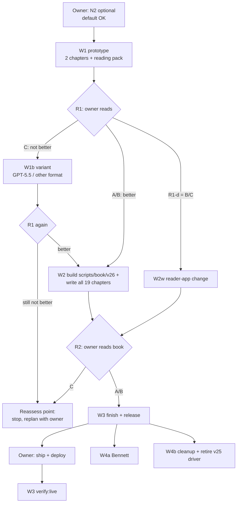

# v26 — finish Franklin with a writer, not a rulebook

Planning session 2026-09-27. Kit source: repo branch `claude/vibrant-ritchie-xaf7dm` → `docs/v26-plan/`. On the Mac it is
copied to `~/cf-wt/v26-plan/` by the first session (W1). Everything a session needs is in `BRIEF.md`, plus its prompt in `prompts/`.

## 1. In one paragraph
The v25 pipeline never wrote a chapter. Four blind section writers filled slots under a 150–190k-character rulebook at medium
effort. 138 section checks and several review loops then pushed the text toward compliance, and graders that cannot tell good
books from bad steered the work. The result was long, samey and a third wrong. This plan replaces the writing step with one
strong writer that writes each whole chapter from Franklin's own text. A second model checks every fact against that text. The
owner reads the result. Everything else stays out of the way. The planning probe already showed the core step working: one call,
3 minutes, $0.45, a whole ch01 with 44 verbatim Franklin quotations, accepted by the app validator. **Details and evidence:
`ANALYSIS.md`.**

## 2. The target design (v26)
| Stage | What happens | Model calls | Blocks? |
|---|---|---|---|
| 0. Source | Frozen source text + chapter map (reuse Franklin's from the v25 store; for a new book use the existing source-freeze code or a heading split) | 0 | — |
| 1. Book brief | One page per book: reader, voice, book type (memoir / how-to / argument) → chapter shape (counts, lengths) | 0 (a session writes it) | — |
| 2. Write | One call per chapter: brief + chapter source span (+ neighbours' titles) → v21 chapter JSON | 1 × Opus (5.5 if the CLI allows), effort high | — |
| 3. Check | Deterministic: JSON shape, app validator, verbatim quotations, key in range. Fact check: every claim vs the span (5 error kinds). Blind quiz solve. | 0 + 1 × Opus high + 1 × Sonnet medium | **Yes, only these three** (facts, keys, renders) |
| 4. Fix | Only if step 3 flagged something: find/replace edits for the flagged text, then re-check everything. At most 2 rounds. Leftovers go to the owner as open issues. | 0–2 × Opus | — |
| 5. Book report | Cross-chapter repetition, lengths, open issues, and an optional blind 3-reader panel on a few chapters | 0 (+3 advisory) | Advisory |
| 6. Owner reads | Reading pack in the app's order; notes per chapter → targeted fixes | — | **The owner's yes is the gate** |
| 7. Release | Assemble the v21 package (in the run dir) → `scripts/book/v26/cli.ts ship --dry-run` (session) → the real `ship` on a branch, PR, S3 upload, deploy and `register:api` (owner). The `publish-final` CLI is not used: it refuses a new Franklin package because of the tracked rev-6 sidecar. `ship` calls the same `publishFinal()` library with the app validator. | 0 | — |

Cost per book, estimated from the probe: about 3–5 calls per chapter at $0.05–0.50 each, so **$25–40 API-equivalent for 19
chapters**, and **1–2 hours of machine time** at concurrency 3. The v25 cost was $700–1,100 and 1.5–3 days per run.

**Bypassed (not deleted until Franklin ships; see DECISIONS E1):** research sidecars and the pinned research run, blueprint and
slot dealing, the four section writers and the 138 SEC checks, book-wide budgets and evictions, the chapter editor pass, the 3-seat
panel and the review-repair loop with successors, disputes and ordinals, fresh QC, the catalog rubric gate, the promotion state
machine, and the v25 driver and autoresume.
**Reused:** the frozen source + chapter map, the claude-CLI call conventions (`src/runtime/claudeRoute.ts`), the app validator,
the pipeline's release/verify/publish tooling, and the measurement ideas (planted-error recall, labelled errors).
**Second book:** Arnold Bennett, *How to Live on 24 Hours a Day* (a how-to): same stages. Its shape is 3–4 modern examples, a
stronger practice plan, and fewer quotations.

## 3. Waves
| Wave | Sessions (parallel where shown) | Model | Wall time | Quota cap (pipeline calls / session) | Exit | If it fails |
|---|---|---|---|---|---|---|
| **W1 Prototype** | `W1-prototype` | Opus 5.5 | 5–8 h | $25 / ~12 subagents | Reading pack; `RESULT: NEEDS-OWNER` → **R1: the owner reads (~1 h)** | R1 = C → `W1b-variant` (GPT-5.5 writer and/or another format), then R1 again |
| **W2 Build + write Franklin** | `W2-pipeline-and-book` ∥ `W2w-reader-app` (only if R1-d = B/C) | Opus 5.5 (both) | 1–1.5 days | $80 / ~25 subagents | `scripts/book/v26/` merged with tests in CI; all 19 chapters written + checked; `ship --dry-run` prints a plan for the book; reading pack → **R2: the owner reads the book (~2–3 h)** | Code: fix and re-run (tests are the gate). Book: failing chapters listed; the owner decides at R2 |
| **W3 Finish Franklin** | `W3-finish-franklin` | Opus 5.5 | 0.5 day | $30 / ~10 | Owner notes applied + re-checked; release package; ship, S3, deploy and `register:api` commands in `reading/W3/PUBLISH.md` → **the owner publishes** (P1) → Part B runs `verify:live` | R2 = C → reassess point |
| **W4 Next book + cleanup** | `W4a-second-book` ∥ `W4b-cleanup` | Opus 5.5 ∥ Sonnet 5 | 1–2 days | $40 / ~16 | Bennett reading pack + release commands (owner light read); v25 driver retired, CI runs the v26 tests, stale PRs, branches and worktrees cleaned, memory and docs updated | Bennett problems are recorded as brief/profile changes, never new rules |

**Timeline** (if W1 starts at the reset on Tue 09-29 23:00Z): R1 on 10-01, the Franklin book to read about 10-03, Franklin in the
app about **10-06/07**, and Bennett ready about 10-09 (W4a can start right after W3 Part A). Owner reading time in total: about 1 h (R1) + 2–3 h (R2) + about 1 h (Bennett).

## 4. Stop conditions and budget
- **Per-wave caps** are in the table. A session tracks pipeline spend from the envelopes' `total_cost_usd` and stops with
  `RESULT: NEEDS-OWNER — quota cap` before crossing its cap. Expected pipeline spend: about **$50–100** for Franklin plus
  Bennett, with hard caps adding up to $175. The Claude Code sessions themselves also draw on the weekly limit and are not
  estimated. In the heavy v25 week, sessions used as much as the pipeline. W2 is the heavy one, so start it early in a quota
  week.
- **Usage limit hit:** the session stops. It writes `RESULT: WAITING-FOR-RESET` if it still can; if the session itself shows a
  usage-limit message, that means the same thing. **Nothing restarts on its own.** After Tuesday's reset (7 pm Toronto), paste
  the same prompt into a fresh session. Every prompt has a resume clause that continues from the files on disk.
- **Reassess point (hard stop):** the owner does not find the prototype clearly better after W1 **and** W1b, or rejects the full
  book at R2. The plan then stops. A planning session reviews it with the owner. Nobody adds checks, rules or loops to rescue it.
- **Remove before you add:** a new blocking check needs a named reader-visible problem and evidence that the problem occurs in
  real output (BRIEF §4).

## 5. How to run
1. Optionally choose N2 (which two chapters). The default is ch01 + ch13. To change it, put a line at the top of the pasted W1 prompt, e.g. `Owner answers: N2 = B`.
2. After Tuesday's reset (2026-09-29 23:00Z, 7 pm Toronto), or earlier if your usage page shows about 20% or more of the weekly limit left, start a fresh Claude Code session in `~/cf-wt` as `caffeinate -dimsu claude` (Mac on power). Then paste `prompts/W1-prototype.md` (the text between `---PROMPT---` and `---END---`). The first time, accept the folder-trust prompt and use the same permission mode you used for the v25 sessions, so the session does not stop for approvals.
3. When a session ends, read its `status/<ID>.md`. `NEEDS-OWNER` means it is your turn: read the reading pack and answer the batch in DECISIONS.
4. Paste the next prompt per the graph. Sessions shown with ∥ can run at the same time (at most 3 at once).

| Prompt | When |
|---|---|
| `W1-prototype.md` | first |
| `W1b-variant.md` | only if R1 = C |
| `W2-pipeline-and-book.md` | after R1 = A/B |
| `W2w-reader-app.md` | with W2, only if R1-d = B or C |
| `W3-finish-franklin.md` | after R2 = A/B |
| `W4a-second-book.md`, `W4b-cleanup.md` | after W3 Part A (you do not need to have published Franklin); they can run together |

## 6. Files
`ANALYSIS.md` root causes + evidence · `BRIEF.md` shared facts · `DECISIONS.md` owner choices · `prompts/` one per session ·
`status/` session reports (empty at start) · `scan/` the planning scan's lens reports with adversarial verification ·
`evidence/probe/` the planning probe (brief, chapter draft, fact-check prompts and results, envelopes, `probe_tools.py`) ·
`memory/` the campaign memory note for `~/.claude/projects/-Users-radinsoltani-ChapterFlow/memory/` · `run-sheet.html`.
